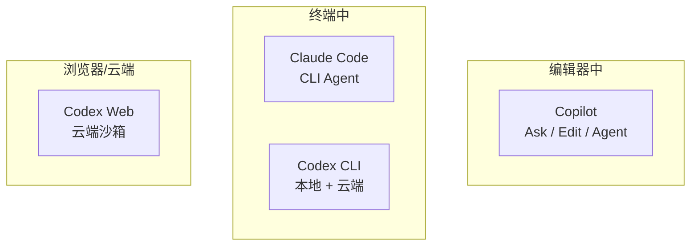
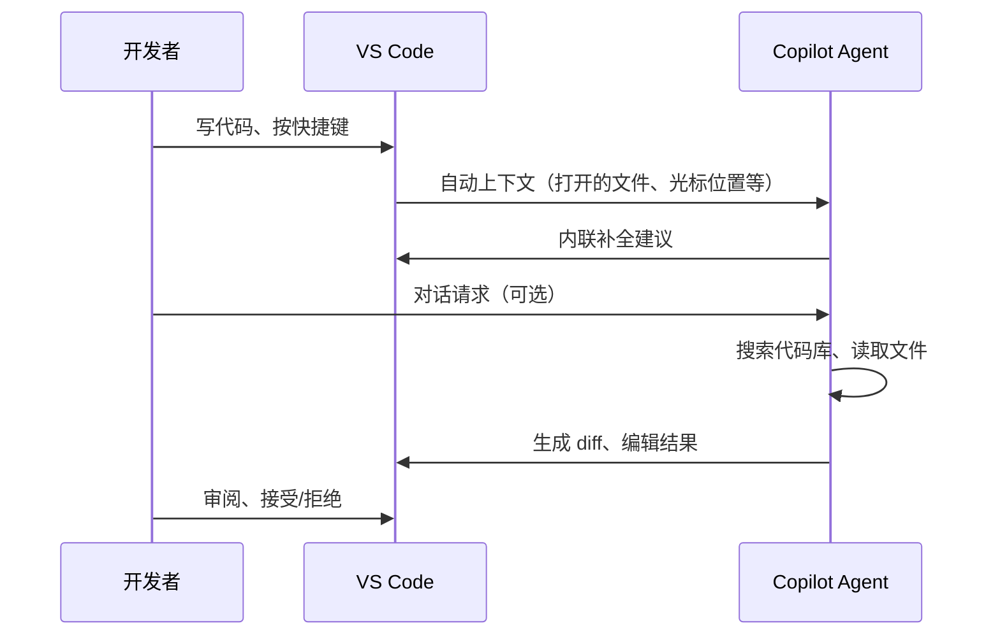
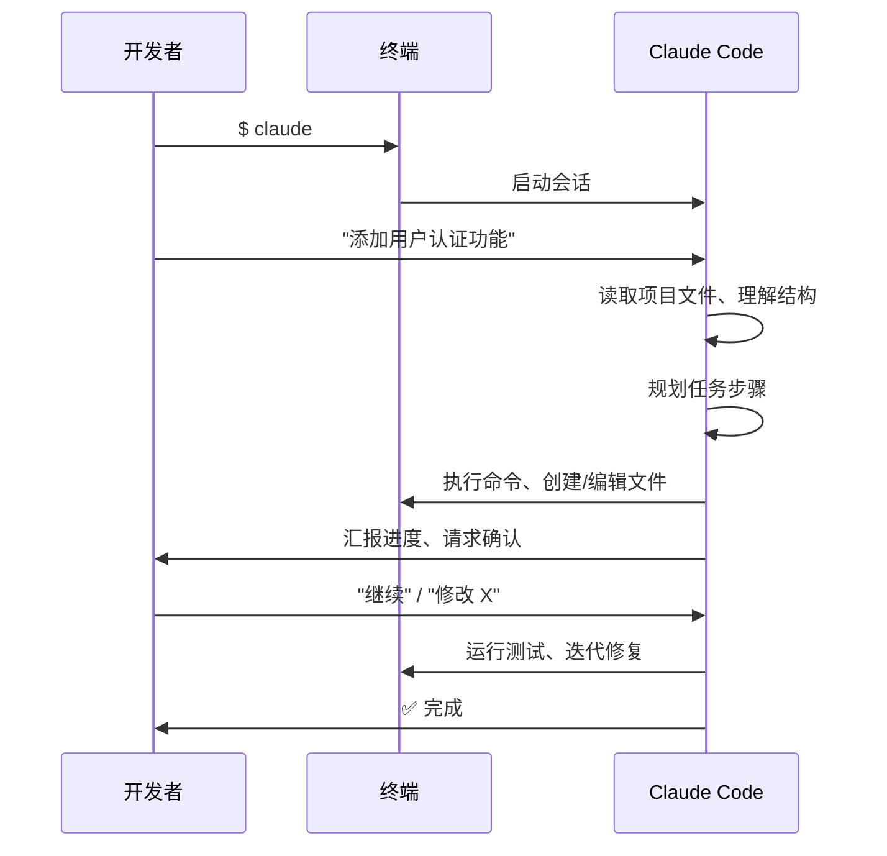
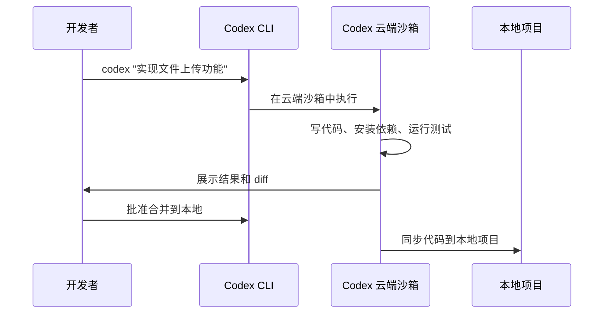
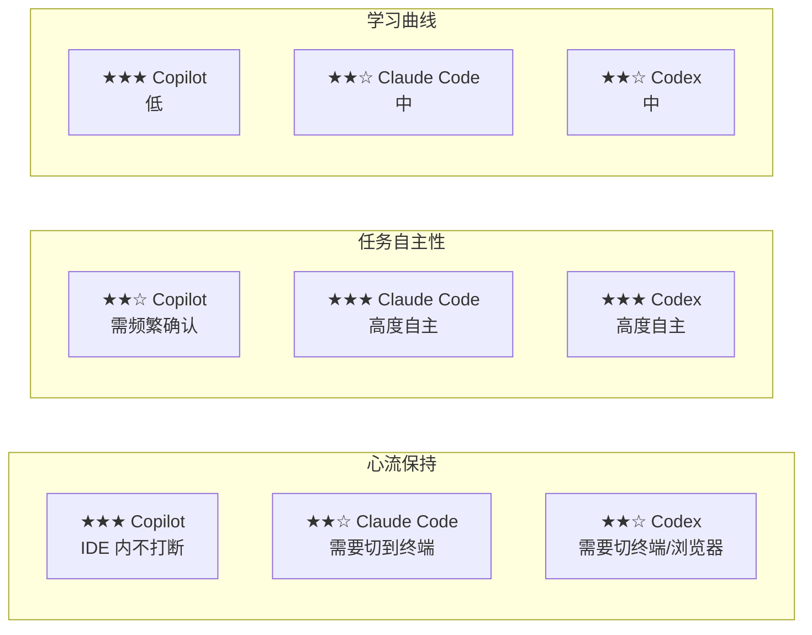
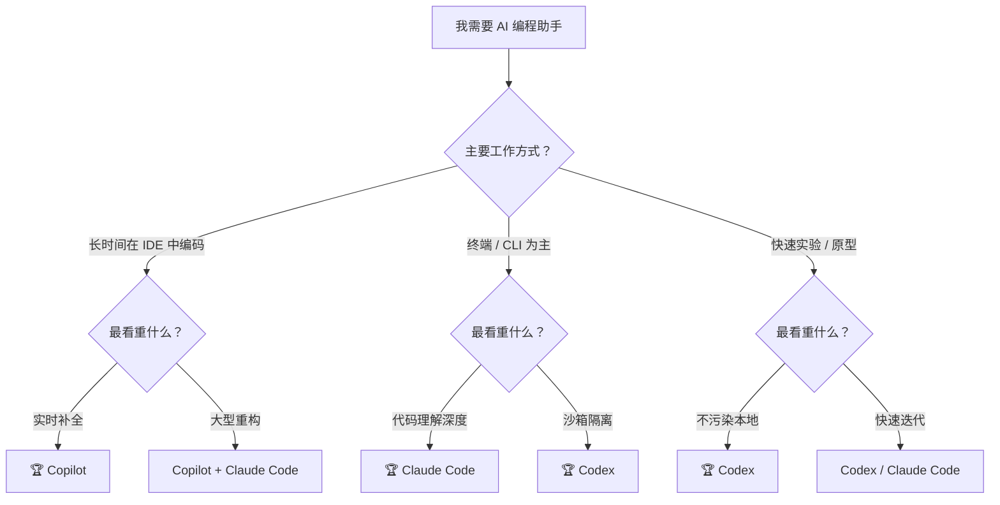

# AI 编程工具全面对比：Copilot vs Claude Code vs Codex

> **目标**：帮助你理解三大 AI 编程工具（GitHub Copilot、Claude Code、OpenAI Codex）的核心差异，做出明智选择。

---

## 目录

1. [概念定位：三大工具是什么](#1-概念定位三大工具是什么)
2. [核心能力对比](#2-核心能力对比)
3. [工作方式差异](#3-工作方式差异)
4. [适用场景分析](#4-适用场景分析)
5. [价格与生态](#5-价格与生态)
6. [实战体验对比](#6-实战体验对比)
7. [决策指南：如何选择](#7-决策指南如何选择)
8. [混合使用策略](#8-混合使用策略)

---

## 1. 概念定位：三大工具是什么

### 1.1 GitHub Copilot

```
类型：IDE 内嵌 AI 编程助手
出品：GitHub（Microsoft 子公司）
登场：2021 年（全球首个大规模 AI 编程产品）
```

Copilot 是**集成在编辑器内部的 AI 伙伴**，提供三种模式：

- **Ask（问答）**：在你思考时答疑解惑，解释代码、回答技术问题
- **Edit（编辑）**：原地修改代码，有 diff 预览可手动审阅
- **Agent（代理）**：自主执行多步骤任务——读取文件、编辑代码、运行终端命令、迭代修复

它的核心设计理念是"AI 参与到你的 IDE 工作流中"——不是替代你的开发环境，而是增强它。

### 1.2 Claude Code

```
类型：终端 CLI AI 编程代理
出品：Anthropic
登场：2025 年（基于 Claude 模型的原生编程 CLI）
```

Claude Code 是 Anthropic 推出的**终端原生编程代理**。它在 `tmux` / 终端中运行，通过命令行交互：

```bash
# 典型使用方式
$ claude
> 在这个项目中添加用户认证功能
```

它是一个"拿着终端权限的 AI 程序员"——直接在项目目录中工作，能深度阅读代码库、自主执行 Git 操作、运行测试、修复错误。

### 1.3 OpenAI Codex

```
类型：终端 CLI + 云端 AI 编程代理
出品：OpenAI
登场：2025 年（Codex CLI 公开）
```

Codex 是 OpenAI 推出的**编程专用代理**，有 CLI 和 Web 两种交互形式：

- **Codex CLI**：终端中的编程代理，支持本地和云端执行
- **Codex Web**：浏览器中的交互式编程环境

它的核心卖点是"云端沙箱执行"——你可以在隔离的云端环境中让 AI 写代码、运行、调试，不污染本地环境。

### 1.4 一言概之

| 工具 | 一句话定位 |
|------|-----------|
| **Copilot** | IDE 里的 AI 副驾驶，融入你的编码流程 |
| **Claude Code** | 终端里的 AI 程序员，直接在项目中工作 |
| **Codex** | 云端的 AI 编程代理，隔离沙箱中执行 |



---

## 2. 核心能力对比

### 2.1 功能矩阵

| 能力 | Copilot | Claude Code | Codex |
|------|---------|-------------|-------|
| **内联代码补全** | ✅ 标杆级 | ❌ 无 | ❌ 无 |
| **多文件编辑** | ✅ Edit/Agent 模式 | ✅ 强大 | ✅ 强大 |
| **终端命令执行** | ✅ Agent 模式 | ✅ 原生 | ✅ 原生+云端 |
| **自主任务规划** | ✅ Agent 模式 | ✅ 极强 | ✅ 极强 |
| **浏览器交互** | ✅ 可打开页面 | ❌ 无 | ❌ 无 |
| **Git 操作** | ✅ Agent 模式 | ✅ 深度集成 | ✅ 深度集成 |
| **语义代码搜索** | ✅ @workspace | ✅ 自动全库分析 | ✅ 自动全库分析 |
| **云端沙箱执行** | ❌ 无 | ❌ 无 | ✅ 核心卖点 |
| **LSP/诊断集成** | ✅ 原生 IDE 集成 | ❌ 无 | ❌ 无 |
| **调试器集成** | ✅ Java/Node 等 | ❌ 无 | ❌ 无 |

### 2.2 代码补全：Copilot 的独特护城河

这是 Copilot 与其他两者**最根本的区别**：

```
Copilot 内联补全：
你写 function calculateTotal(    ← AI 实时补全函数体
         ↓
    const subtotal = items.reduce((sum, item) => sum + item.price, 0);
    const tax = subtotal * TAX_RATE;
    ...
}
```

这种"幽灵文本"式的实时补全是**编码流体验**的核心——你不需要中断思考去描述需求，AI 自动在光标处给出建议。Claude Code 和 Codex 都没有这个能力，它们需要你主动"对话"才能产出代码。

### 2.3 长上下文处理

| 工具 | 上下文窗口 | 特点 |
|------|-----------|------|
| **Copilot** | 动态（根据模型） | IDE 多源上下文融合（打开文件、语义搜索、对话历史） |
| **Claude Code** | 200K tokens | 业界最长的稳定上下文窗口之一 |
| **Codex** | 取决于底层模型 | GPT-4o 级别上下文 |

Claude Code 在理解大型代码库方面表现突出——它可以一次性加载和关联大量文件上下文，在处理跨模块重构时特别有优势。

### 2.4 底层模型

| 工具 | 使用的模型 |
|------|-----------|
| **Copilot** | 多种模型动态切换，包括 GPT-4o、Claude 3.5/4 等 |
| **Claude Code** | Claude 系列模型（由 Anthropic 开发） |
| **Codex** | GPT 系列模型（由 OpenAI 开发），可使用 o 系列推理模型 |

Copilot 的一个独特优势是**模型无关**——它可以根据任务类型自动选择最合适的底层模型，你不需要关心具体是哪个模型在工作。

---

## 3. 工作方式差异

### 3.1 Copilot：IDE 中心化



**工作方式**：你在 IDE 中正常编码，Copilot 作为嵌入式助手无缝参与。

### 3.2 Claude Code：终端中心化



**工作方式**：你打开终端，给 Claude Code 一个高层指令，它自主完成所有工作。

### 3.3 Codex：云端 + 本地混合



**工作方式**：你在终端发起请求，AI 在云端工作，你在浏览器或终端中审阅结果。

---

## 4. 适用场景分析

### 4.1 日常编码场景

```
场景：你在写业务逻辑，需要实时代码建议

🏆 首选：Copilot
理由：内联补全是无摩擦的，不会打断心流。
      Claude Code / Codex 需要你打字描述需求，打断编码节奏。
```

### 4.2 大型重构场景

```
场景：将整个项目的认证系统从 JWT 迁移到 OAuth 2.0

🏆 首选：Claude Code（超大上下文）
备选：Copilot Agent / Codex

理由：Claude Code 的 200K 上下文窗口可以一次性理解
      所有相关文件，整体规划重构策略。
```

### 4.3 安全审查 / 实验性代码

```
场景：你想试一个新技术栈，但不想污染本地环境

🏆 首选：Codex（云端沙箱）
理由：代码在云端隔离环境中运行，不影响你的本地项目。
      确认可行后再合并回来。
```

### 4.4 学习新技术

```
场景：你初学 Rust，需要边写边问

🏆 首选：Copilot（Ask 模式）
理由：你可以 @workspace 问项目结构，选中代码按 ⌘I 问"这段什么意思"，
      在 IDE 内完成所有学习，不需要切到浏览器。
```

### 4.5 从头搭建项目

```
场景：从零开始创建一个全栈应用

🏆 首选：Codex（云端沙箱 + 模型能力）
      或 Claude Code（本地执行）

理由：GPT 系列在整体架构设计方面表现优异，
      云端沙箱可以一次性搭建好运行环境。
```

### 4.6 场景速查表

| 场景 | 推荐工具 | 次选 |
|------|---------|------|
| 日常编码（补全） | **Copilot** | — |
| 代码解释/学习 | **Copilot** | Claude Code |
| 小范围重构 | **Copilot Edit** | Claude Code |
| 大范围跨文件重构 | **Claude Code** | Copilot Agent |
| Bug 调试 | **Copilot**（IDE 集成） | Claude Code |
| 全项目生成 | **Codex** | Claude Code |
| 安全实验 | **Codex** | — |
| 代码审查 | **Copilot** | Claude Code |
| DevOps/CI 脚本 | **Claude Code** / **Codex** | — |
| 文档生成 | **Copilot** @workspace | Claude Code |

---

## 5. 价格与生态

### 5.1 价格

| 工具 | 免费层 | 付费方案 |
|------|--------|---------|
| **Copilot** | ✅ 免费层可用（有限额） | Copilot Pro $10/月<br/>Copilot Business $19/用户/月<br/>Copilot Enterprise $39/用户/月 |
| **Claude Code** | 有限免费 | Claude Pro $20/月<br/>Claude Max $100-$200/月<br/>API 按量计费 |
| **Codex** | 有限免费（ChatGPT 免费用户） | ChatGPT Plus $20/月<br/>ChatGPT Pro $200/月 |

### 5.2 生态集成

| 生态维度 | Copilot | Claude Code | Codex |
|----------|---------|-------------|-------|
| **支持 IDE** | VS Code, JetBrains, Neovim, Xcode 等 | 终端独立，不受 IDE 限制 | 终端 + Web，不受 IDE 限制 |
| **Git 集成** | 通过 VS Code GitLens | 深度原生集成 | 深度原生集成 |
| **CI/CD** | GitHub Actions 原生配合 | 通用 | 通用 |
| **团队协作** | GitHub 生态（PR、Issues、Copilot Chat 共享） | 有限 | 有限 |
| **扩展生态** | Skills、Agent、Custom Instructions | MCP 协议 | Plugins / MCP |

### 5.3 团队 vs 个人

```
个人开发者：
  → 单一工具通常足够，按主要需求选择即可

小团队：
  → Copilot 的 GitHub 生态集成有天然优势
  → 代码审查、PR 管理、知识共享都受益

大型企业：
  → Copilot Enterprise（管理后台、使用分析、策略控制）
  → 可与 Claude Code / Codex 互补
```

---

## 6. 实战体验对比

### 6.1 同一任务对比："为 Express 项目添加用户认证"

| 维度 | Copilot Agent | Claude Code | Codex |
|------|--------------|-------------|-------|
| **启动方式** | ⌘Shift+Enter 打开聊天，输入需求 | 终端 `claude` 启动 | 终端 `codex` 启动 |
| **项目理解** | 自动搜索相关文件 | 自动全量读取 | 自动全量读取 |
| **生成质量** | 好 | 非常好（长上下文优势） | 好 |
| **编辑体验** | 在 IDE 内 diff 预览 | 终端中逐文件展示 | Web UI 或终端 diff |
| **错误处理** | 读取 VS Code 诊断 | 运行测试并分析 | 云端运行测试 |
| **总耗时** | ~3-5 分钟 | ~3-5 分钟 | ~5-8 分钟（含沙箱启动） |

### 6.2 开发者体验维度



### 6.3 各工具的独特优势

**Copilot 独有**：
- 内联代码补全（无法替代的编码体验）
- IDE 深度集成（LSP 诊断、调试器、Git 可视化）
- `@workspace` / `#file` / `#selection` 等精确上下文控制
- Custom Instructions 项目级行为定制
- Memory 系统（跨会话知识持久化）

**Claude Code 独有**：
- 超长上下文窗口（一次理解大型代码库）
- 极度自主的任务执行（减少来回确认）
- 不依赖特定 IDE（你爱用什么编辑器都行）
- Anthropic 的安全性/对齐性理念

**Codex 独有**：
- 云端隔离沙箱（实验代码不污染本地）
- GPT 推理链优势（复杂逻辑场景强大）
- Web UI 提供可视化交互体验
- 默认使用最新最强 OpenAI 模型

---

## 7. 决策指南：如何选择

### 7.1 决策树



### 7.2 按角色推荐

| 角色 | 推荐 | 理由 |
|------|------|------|
| **全栈开发者**（IDE 重度用户） | **Copilot** | 内联补全 + IDE 集成是无价的 |
| **架构师**（大量阅读/设计） | **Claude Code** | 长上下文理解全局架构 |
| **后端开发者**（终端党/vim 用户） | **Claude Code** / **Copilot** | 取决于是否用 VS Code |
| **数据科学家**（Notebook 用户） | **Copilot**（Jupyter 支持）+ **Codex** | 各有场景 |
| **学生/初学者** | **Copilot**（免费层 + 学习曲线最低） | 入门最简单 |
| **安全研究员** | **Codex**（沙箱隔离） | 安全第一 |
| **DevOps / SRE** | **Claude Code** / **Codex** | 终端原生最顺手 |

### 7.3 按预算推荐

| 预算 | 推荐 |
|------|------|
| **$0** | Copilot 免费层 或 Claude Code 免费额度 |
| **$10-20/月** | Copilot Pro（最全面）或 ChatGPT Plus（含 Codex） |
| **$30-60/月** | Copilot Pro + Claude Pro（互补） |
| **$100+/月** | 三工具全订阅，按场景切换 |

---

## 8. 混合使用策略

### 8.1 最佳组合：Copilot + Claude Code

这是目前许多高级开发者的**推荐组合**：

```
Copilot（IDE 内）：
  日常编码补全 + 小范围编辑 + 代码解释 + 文档生成

Claude Code（终端中）：
  大型重构 + 项目初始化 + 深度代码审查 + 自动化脚本

为什么不是 Codex？
  Codex 的云端沙箱场景较窄，除非你频繁需要隔离实验环境，
  否则 Copilot + Claude Code 覆盖了 95% 的需求。
```

### 8.2 工作流示例

```markdown
## 典型的一天

上午 9:00  - 日常编码
  → VS Code + Copilot：内联补全 + Ask 模式答疑
  → 遇到一个函数需要优化 → Copilot Edit 模式原地重构

上午 11:00 - 跨模块重构
  → 保存所有文件，切换到终端
  → `claude` 启动 Claude Code
  → "将整个项目的错误处理从回调改为 async/await"
  → Claude Code 自主规划、执行、测试

下午 2:00  - Code Review
  → VS Code + Copilot：选中代码 → Ask "审查这段代码的安全性"
  → 同时 Claude Code：对整个 PR 做深度分析

下午 4:00  - 新功能原型
  → 先在 Claude Code 或 Codex 中快速搭建原型
  → 验证可行后，用 Copilot 在当前项目中正式实现
```

### 8.3 什么情况下只需要一个工具

```
✅ 只用 Copilot 就够了：
  - 你是 IDE 重度用户（大部分时间在 VS Code / JetBrains 中）
  - 工作以增量开发为主（不是整天重构）
  - 团队已用 GitHub 生态
  - 你需要的是"增强"，不是"替代"

✅ 只用 Claude Code 就够了：
  - 你主要用终端 + 简单编辑器（vim/emacs/nano）
  - 你的工作涉及大量跨文件逻辑分析
  - 你喜欢"下命令然后让 AI 干"的工作方式

✅ 只用 Codex 就够了：
  - 你经常实验危险/不确定的代码
  - 你需要云端环境隔离
  - 你重度依赖 OpenAI 生态
```

---

## 总结

| 维度 | Copilot | Claude Code | Codex |
|------|---------|-------------|-------|
| **核心价值** | IDE 内智能补全 + Agent | 终端中深度代码理解与执行 | 云端沙箱安全执行 |
| **不可替代处** | 内联补全 | 超长上下文 | 隔离环境 |
| **学习曲线** | ★☆☆ 最低 | ★★☆ 中等 | ★★☆ 中等 |
| **入门门槛** | 安装扩展即可 | 需配置 CLI | 需配置 CLI |
| **适合人群** | 所有 IDE 用户 | 高级开发者、架构师 | 实验型开发者 |
| **代表场景** | 日常编码 | 大型重构 | 安全实验 |

**最终建议**：

> 如果你是 VS Code 用户，**从 Copilot 开始**。它是覆盖面最广、与开发环境融合最深的选择。当你感觉 Copilot 的上下文不够长、或者 Agent 自主性不够时，再引入 **Claude Code** 作为大型任务的补充。Codex 可以等到你需要隔离实验环境时再考虑。
>
> 三个工具不是"选 A 弃 B"的关系，而是**工具箱里的不同工具**——根据任务选择最合适的那个。

---

> **参考资源**
> - [GitHub Copilot 官方文档](https://docs.github.com/copilot)
> - [Claude Code 官方文档](https://docs.anthropic.com/en/docs/claude-code)
> - [OpenAI Codex CLI](https://github.com/openai/codex)
