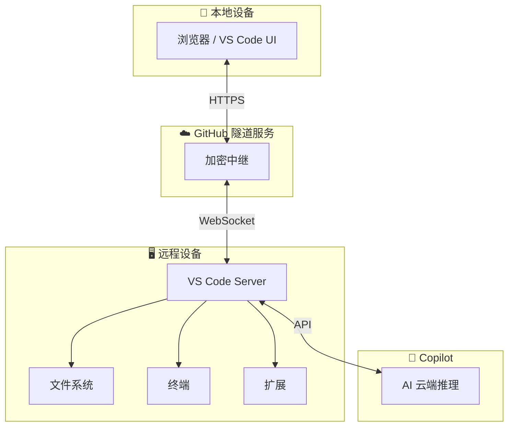
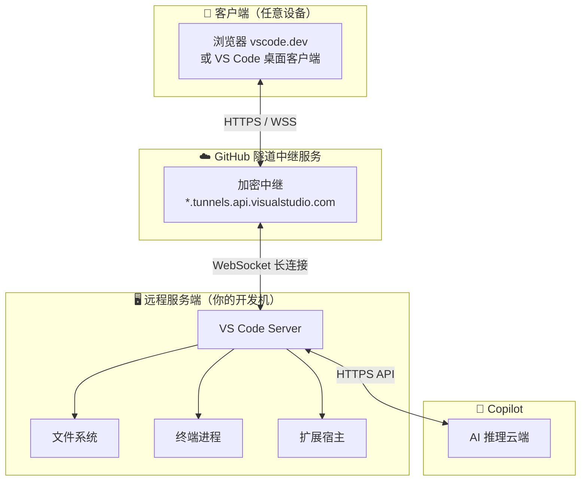
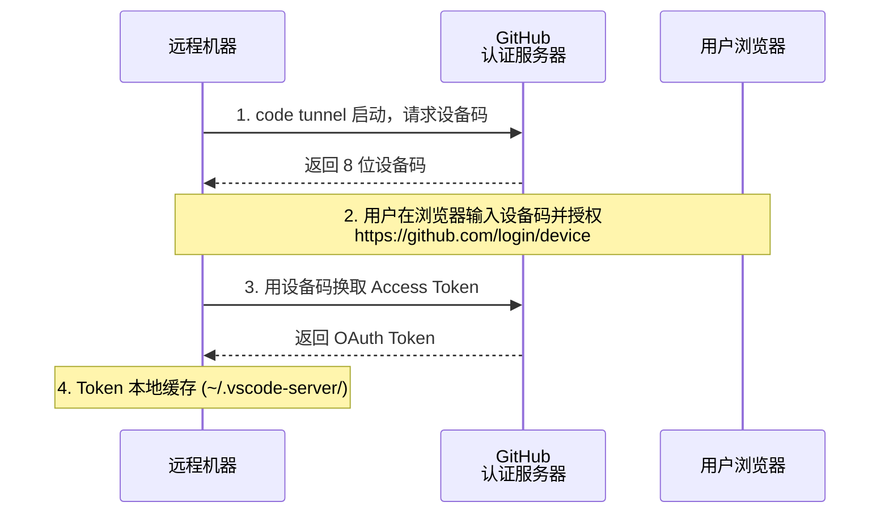
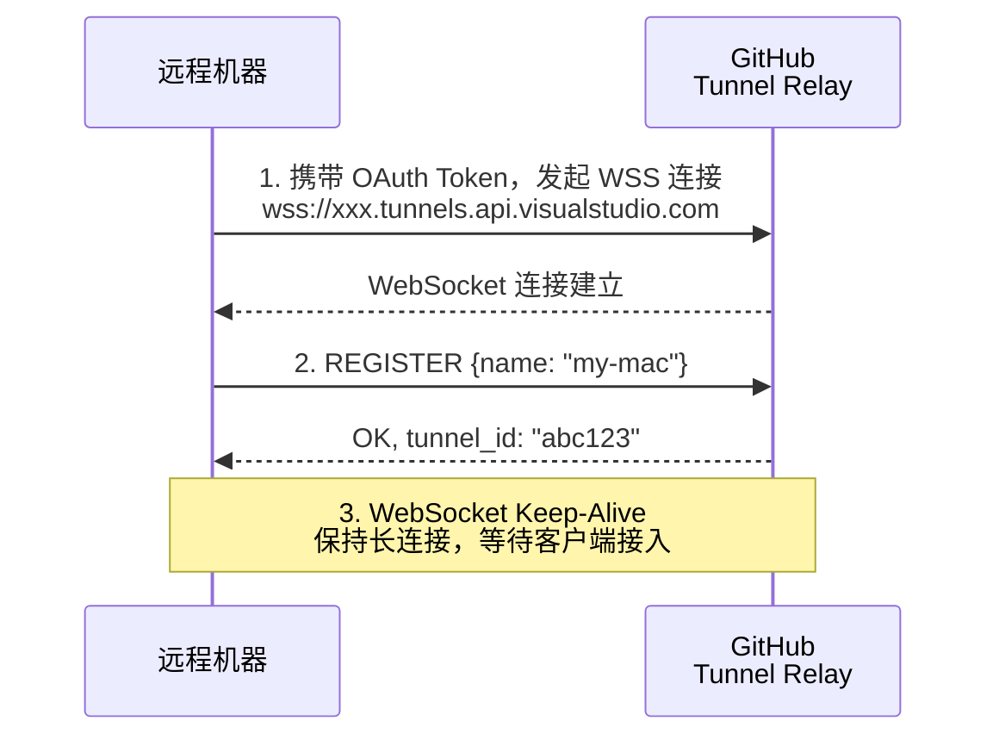
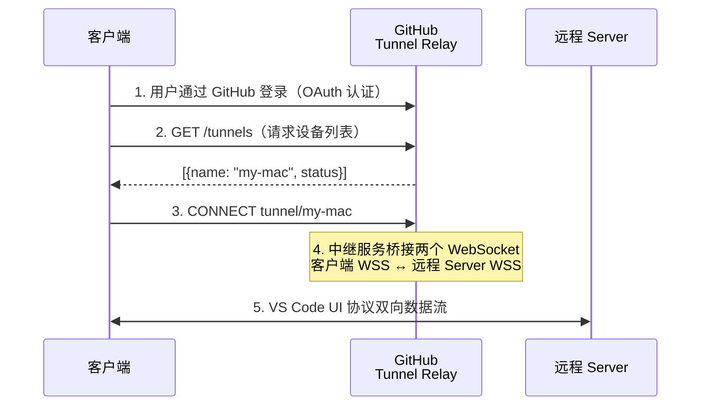
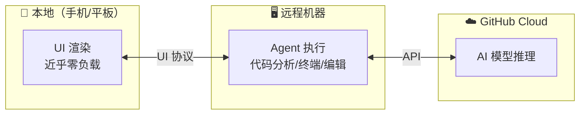

# VS Code Remote Tunnels 使用指南

> 一条命令，安全地从任何设备访问你的开发环境。无需 SSH，无需 VPN，无需公网 IP。

---

## 目录

1. [什么是 Remote Tunnels](#1-什么是-remote-tunnels)
   - [链接原理与数据流详解](#链接原理与数据流详解)
2. [环境准备：安装 code CLI](#2-环境准备安装-code-cli)
3. [快速上手](#3-快速上手)
4. [常用命令速查](#4-常用命令速查)
5. [从不同设备连接](#5-从不同设备连接)
6. [后台服务模式](#6-后台服务模式)
7. [管理与安全](#7-管理与安全)
8. [与 Copilot Agent 配合](#8-与-copilot-agent-配合)
    - [Agent 记忆与状态保存位置](#agent-记忆与状态保存位置)
9. [故障排查](#9-故障排查)
10. [最佳实践](#10-最佳实践)
    - [多台 Mac 的推荐分工](#多台-mac-的推荐分工)
    - [Tunnel 与直接使用的性能差异](#tunnel-与直接使用的性能差异)

---

## 1. 什么是 Remote Tunnels

Remote Tunnels 是 VS Code 内置的安全远程访问方案。它在你的远程机器上运行 VS Code Server，通过 GitHub 账号认证建立加密隧道，让你在任何地方的任何设备上，通过浏览器或 VS Code 连接到远程机器，获得**完整的 VS Code 开发体验**。

### 核心优势

| 特性 | 说明 |
|------|------|
| 🔐 安全 | 通过 GitHub 账号认证，端到端加密 |
| 🚫 无需公网 IP | 远程机器在 NAT/防火墙后面也能用 |
| 🚫 无需 SSH | 不需要配置 SSH key、端口转发 |
| 🌐 跨设备 | Windows/macOS/Linux 服务端，任意设备客户端 |
| 📱 手机友好 | 平板/手机通过 vscode.dev 连接 |
| ⚡ 完整体验 | 终端、扩展、Copilot、Agent 全部可用 |

### 与其他方案对比

| 方案 | 需 SSH | 需公网 IP | 需 VPN | 浏览器可用 | 手机可用 | 成本 |
|------|:---:|:---:|:---:|:---:|:---:|:---:|
| **Remote Tunnels** | ❌ | ❌ | ❌ | ✅ | ✅ | 免费 |
| Remote-SSH | ✅ | ✅ | ❌ | ❌ | ❌ | 免费 |
| GitHub Codespaces | ❌ | ❌ | ❌ | ✅ | ✅ | 付费 |
| 自建 VPN + SSH | ✅ | ✅ | ✅ | ❌ | ❌ | 需运维 |

### 架构原理



> 💡 **关键点**：所有计算（代码分析、终端命令、Agent 执行）都在远程设备上完成。Copilot AI 推理在 GitHub 云端。本地设备只做 UI 渲染，资源消耗极低。

### 链接原理与数据流详解

#### 整体架构：三层模型



核心思想：**客户端和服务端不直接通信**，而是通过 GitHub 托管的隧道中继（Tunnel Relay）进行中转。这使得双方都可以在 NAT/防火墙后面，无需公网 IP。

---

#### 链接建立原理（逐步拆解）

##### 第 1 步：认证 — GitHub OAuth Device Flow



- 使用的是 **OAuth 2.0 Device Authorization Grant**（RFC 8628）
- 设备码有效期短（通常 15 分钟），token 可长期缓存
- 这一步建立了 **"这台机器属于哪个 GitHub 用户"** 的绑定关系

##### 第 2 步：隧道注册 — 与中继服务建立 WebSocket



关键点：
- **远程机器主动向外发起连接**（出站连接），因此不需要公网 IP，也不需要防火墙入站规则
- 中继服务维护一个 **设备名 → WebSocket 连接** 的映射表
- 连接使用 **WSS（WebSocket Secure）**，即 WebSocket over TLS

##### 第 3 步：客户端连接



- 客户端可以是浏览器（vscode.dev）或 VS Code 桌面客户端
- 客户端同样使用 WSS 连接到中继服务
- **中继服务的核心工作**：将来自客户端 WebSocket 的数据帧转发到对应的远程机器 WebSocket，反之亦然

---

#### 数据流详解

##### 协议层次

```
┌─────────────────────────────┐
│     VS Code UI Protocol     │  ← 编辑器状态、光标、选区、文件变更
├─────────────────────────────┤
│     JSON-RPC / MessagePack  │  ← 序列化层
├─────────────────────────────┤
│     WebSocket (WSS)         │  ← 全双工传输
├─────────────────────────────┤
│     TLS 1.3                 │  ← 端到端加密（中继不解密）
└─────────────────────────────┘
```

##### 哪些数据走隧道？

| 数据类型 | 流向 | 说明 |
|---------|------|------|
| 编辑器 UI 状态 | 双向 | 光标位置、选区、滚动、标签页状态 |
| 文件内容 | 双向 | 打开/保存文件时传输文件内容 |
| 终端 I/O | 双向 | 终端输入命令 → 远程执行 → 输出回传 |
| 扩展 API 调用 | 双向 | 扩展运行在远程，UI 在本地 |
| 调试协议 (DAP) | 双向 | 断点、调用栈、变量查看 |
| Git 操作 | 远程→云端 | `git push/pull` 从远程机器直接发出 |
| Copilot AI 请求 | 远程→GitHub Cloud | AI 推理请求从远程 Server 直接发出 |

##### 计算位置分布

| 客户端（轻量） | 远程机器（重） | GitHub 云端（AI） |
|:---:|:---:|:---:|
| UI 渲染 | 文件读写 | Copilot 模型推理 |
| 输入事件 | 终端执行 | Code completion |
| 显示输出 | 扩展运行 | Chat/Agent 响应 |
| — | 代码分析 | — |
| — | 编译构建 | — |
| — | Git 操作 | — |
| — | LSP 语言服务 | — |

这就是为什么你可以用 iPad 甚至手机连接一台强大的开发服务器 —— 客户端只需要渲染 UI，几乎零计算负载。

---

#### 安全模型

> **🔐 身份认证：GitHub OAuth 2.0**
>
> 只有 Token 所属的 GitHub 用户能连接。

> **🔒 传输加密：TLS 1.3 (WSS)**
>
> 中继服务无法解密 payload。

> **🛡️ 访问控制：同一 GitHub 账号原则**
>
> A 用户的设备列表对 B 用户不可见。

> **⏹️ 即时终止：code tunnel kill / unregister**
>
> 随时可切断连接或注销设备。

**重要细节**：虽然中继服务负责转发数据，但 VS Code UI Protocol 本身就包含端到端加密，中继服务只看到加密后的二进制帧，无法读取你的代码或终端内容。

---

#### 断连与恢复机制

```
正常连接：
  客户端 ◄════ WSS ════► 中继 ◄════ WSS ════► 远程 Server

网络抖动（客户端断连）：
  客户端 ──╳── 中继 ◄════ WSS ════► 远程 Server
              ↑                            ↑
              等待重连              终端进程继续运行！
                                    Agent 任务继续执行！

客户端重连：
  客户端 ◄════ WSS ════► 中继 ◄════ WSS ════► 远程 Server
              ↑                            ↑
              桥接恢复              编辑器状态、终端输出
                                   自动恢复到断连前状态
```

这就是为什么断连期间远程终端进程、Agent 任务**继续执行，不会中止**。

---

#### 与 Remote-SSH 的本质区别

| 维度 | Remote Tunnels | Remote-SSH |
|------|:---:|:---:|
| **连接发起方** | 远程机器主动出站连接 | 客户端主动连接远程 SSH 端口 |
| **网络要求** | 双方都不需要公网 IP | 远程需要可达 IP + 开放 22 端口 |
| **中转机制** | GitHub 中继服务器桥接 | 直连 TCP |
| **NAT 穿透** | ✅ 天然支持（出站连接） | ❌ 需要端口映射/内网穿透 |
| **认证方式** | GitHub OAuth | SSH Key / 密码 |
| **延迟** | 略高（经过中继） | 较低（直连） |

---

#### 一句话总结

> **Remote Tunnels = 远程机器主动向 GitHub 中继服务建立 WebSocket 长连接 → 客户端也连接同一个中继服务 → 中继服务桥接两个 WebSocket，透明转发 VS Code UI Protocol → 实现"你的浏览器/VS Code 只是一个远程桌面"，所有计算都在远程机器上完成。**

---

## 2. 环境准备：安装 code CLI

### macOS

在 VS Code 中，按 **Cmd + Shift + P** → 搜索并执行 **`Shell Command: Install 'code' command in PATH`**。

或手动创建软链接：

```bash
ln -sf "/Applications/Visual Studio Code.app/Contents/Resources/app/bin/code" /usr/local/bin/code
```

### Windows

安装 VS Code 时勾选「添加到 PATH」，或通过命令面板安装。

### Linux

```bash
# 通过 snap 安装后自动可用
sudo snap install code --classic

# 或手动链接
sudo ln -s /usr/share/code/bin/code /usr/local/bin/code
```

### 验证

```bash
which code    # 应输出 code 的路径
code --version
```

---

## 3. 快速上手

### 3.1 在远程机器上启动隧道

```bash
# 最简单的方式
code tunnel
```

首次使用会提示用 GitHub 账号认证：
1. 终端会显示一个 8 位设备码
2. 打开 https://github.com/login/device
3. 输入设备码并授权
4. 认证成功后，隧道自动启动

启动成功后会显示：

```
Open this link in your browser: https://vscode.dev/tunnel/<机器名>
```

### 3.2 从另一台设备连接

- **浏览器**：打开 `https://vscode.dev/tunnel/<机器名>`
- **VS Code**：Cmd + Shift + P → **`Remote Tunnels: Connect to Tunnel...`** → 选择目标机器

连接成功后，你就拥有了远程机器的完整开发环境。

---

## 4. 常用命令速查

| 命令 | 用途 |
|------|------|
| `code tunnel` | 启动隧道（前台运行） |
| `code tunnel status` | 查看隧道运行状态、连接的客户端数 |
| `code tunnel kill` | 强制关闭隧道 |
| `code tunnel prune` | 清理旧的隧道连接记录 |
| `code tunnel unregister` | 从账号中注销当前设备 |
| `code tunnel service install` | 安装为系统后台服务（开机自启） |
| `code tunnel service uninstall` | 卸载系统后台服务 |
| `code tunnel --help` | 查看所有可用选项 |
| `code tunnel --name <名字>` | 以自定义名称启动 |
| `code tunnel --accept-server-license-terms` | 接受服务端许可条款 |

### 状态示例

```bash
$ code tunnel status

Service is running
  Connected clients: 1
  Service URL: https://abc123.tunnels.api.visualstudio.com
```

---

## 5. 从不同设备连接

### 5.1 通过浏览器（vscode.dev）

适合：手机、平板、临时电脑、不想装 VS Code 的场景。

1. 打开 https://vscode.dev
2. 登录 GitHub 账号
3. 点击左下角 → **`Connect to Tunnel...`**
4. 选择目标机器

### 5.2 通过 VS Code 客户端

适合：日常主力开发机。

1. Cmd + Shift + P → **`Remote Tunnels: Connect to Tunnel...`**
2. 选择目标机器
3. 新窗口自动打开，进入远程环境

### 5.3 通过 GitHub Mobile App

在 GitHub 手机 App 中，可以通过 Codespaces 入口连接到隧道机器（需同一 GitHub 账号）。

---

## 6. 后台服务模式

### 安装为系统服务

让隧道随系统启动自动运行，无需每次手动执行 `code tunnel`：

```bash
code tunnel service install
```

安装后：
- 系统启动 → 隧道自动启动
- 关闭终端不会影响隧道运行
- 等同于「开机自启隧道」

### 卸载服务

```bash
code tunnel service uninstall
```

### 查看服务日志

```bash
# macOS
cat ~/Library/Logs/Visual\ Studio\ Code/tunnel.log

# Linux
cat ~/.vscode-server/tunnel.log
```

---

## 7. 管理与安全

### 7.1 查看已注册设备

在任意 VS Code 中：
1. Cmd + Shift + P → **`Remote Tunnels: View Tunnel Log`** — 查看日志
2. 或在 https://vscode.dev 的连接菜单中查看你的设备列表

### 7.2 注销设备

彻底从你的 GitHub 账号中移除某台设备：

```bash
# 在要注销的设备上
code tunnel unregister
```

或在 VS Code 命令面板中选择 **`Remote Tunnels: Unregister Tunnel...`**。

### 7.3 关闭隧道自动连接

如果你设置了 VS Code 启动时自动开启隧道，在设置中关闭：

```json
{
  "remote.tunnels.access": false
}
```

### 7.4 安全注意事项

- ✅ 隧道通过 GitHub OAuth 认证，只有你的 GitHub 账号能连接
- ✅ 数据传输经过 TLS 加密
- ✅ 可以随时 `code tunnel kill` 或 `code tunnel unregister` 终止访问
- ⚠️ 不要在不受信任的网络中让隧道长期无人值守运行
- ⚠️ 注销设备后，所有已保存的认证信息将失效

---

## 8. 与 Copilot Agent 配合

### 8.1 性能模型

远程隧道模式下，Copilot Agent 的执行位置如下：



- 你的手机只负责显示界面
- 远程机器的 CPU 承担所有计算工作
- Copilot 的 AI 推理在云端完成

### 8.2 Agent 记忆与状态保存位置

这里的“记忆”不是单一的数据项，需要区分项目上下文、执行状态、聊天记录和客户端缓存：

| 内容 | 主要位置 | 说明 |
|------|------|------|
| 源码、Git 仓库、终端进程、构建产物 | 远程机器 | Agent 读取和修改的是远程工作区 |
| `copilot-instructions.md`、`.github/` 中的项目指令 | 远程机器 | 这些文件属于项目内容，跟随远程仓库保存 |
| 远程 VS Code Server、扩展和工作区状态 | 远程机器 | 服务器重装或清理相关数据后可能丢失 |
| 当前聊天界面和部分本地缓存 | 客户端或远程会话 | 取决于使用的是桌面 VS Code 还是浏览器客户端 |
| Copilot 账号认证信息 | 客户端和/或远程机器 | 取决于登录方式和 VS Code 的认证状态 |
| Copilot 云端会话及模型请求数据 | GitHub/Copilot 云端 | 具体保留范围受产品和账户策略影响 |

因此，通过 iPad 或另一台电脑连接同一个 Tunnel 时，远程项目、文件、终端和项目指令仍然在服务器上；客户端不会保存一份完整的 Agent 工作区。重新连接后能否恢复完整聊天上下文，则取决于会话是否已由 VS Code 或 Copilot 保存，不能把它简单理解为“全部保存在服务器”或“全部保存在客户端”。

对于长时间任务，建议让任务在远程终端或服务器上的独立进程中运行，并使用 `tmux`、`screen` 或后台服务管理。仅依赖当前客户端前台会话的任务，在客户端断开、VS Code Server 重启或认证失效时，可能无法继续。

### 8.3 典型场景

| 场景 | 方案 |
|------|------|
| iPad 在地铁上改代码 | iPad 浏览器 → vscode.dev → 隧道连办公室电脑 |
| 家里笔记本性能弱 | 轻薄本 → 隧道连公司高性能服务器 |
| 临时查看代码 | 手机浏览器 → vscode.dev → 隧道连开发机 |

### 8.4 网络不稳定时的表现

- **已独立运行的任务**：远程终端进程、后台服务或已脱离客户端的任务通常会继续执行
- **依赖前台会话的任务**：可能因客户端断开、Server 重启或进程退出而中止
- **恢复连接**：远程工作区仍在服务器上；编辑器标签页、终端输出和聊天上下文能否完整恢复，取决于具体客户端及会话保存状态
- **建议**：长时间任务先确认网络环境稳定

---

## 9. 故障排查

### 9.1 code 命令找不到

```bash
which code     # 若无输出，需要安装 code CLI（见第 2 章）
```

### 9.2 隧道无法启动

```bash
# 查看详细日志
code tunnel --verbose

# 检查是否有旧进程
ps aux | grep code-tunnel
kill <PID>          # 清理后重试
```

常见原因：
- 网络不通（需要能访问 `*.tunnels.api.visualstudio.com`）
- GitHub 认证过期（注销后重新认证）
- 旧版本 VS Code（更新到最新版）

### 9.3 客户端连接失败

- 确保使用**同一 GitHub 账号**连接
- 检查远程机器隧道是否在运行：`code tunnel status`
- 检查是否在同一账号下：在 vscode.dev 确认设备列表

### 9.4 更新 VS Code Server

```bash
# VS Code 客户端更新后，server 会自动更新
# 如需强制更新：
code tunnel prune    # 清理旧的 server
code tunnel          # 重新启动，自动下载最新 server
```

---

## 10. 最佳实践

### 多台 Mac 的推荐分工

如果同时拥有 Mac mini M4 Pro、iMac 2019 和 MacBook Pro 2019，建议采用“一台主服务器、一台兼容性服务器、多台客户端”的布局：

| 设备 | 推荐角色 | 适合用途 |
|------|------|------|
| Mac mini M4 Pro | 主力 Tunnel Server | 日常开发、Copilot Agent、编译、Docker、数据库和长时间任务 |
| iMac 2019 | Intel 兼容性 Server | Intel-only 工具、旧项目、x86 容器和 macOS Intel 兼容性测试 |
| MacBook Pro 2019 | 移动客户端 | 通过 Tunnel 操作远程工作区，减少本机依赖安装和重编译 |
| 另一台 MacBook Pro 2019 | 备用客户端或测试客户端 | 代码审查、文档处理、临时连接和不同客户端验证 |

在两台服务器上使用清晰且唯一的名称：

```bash
# 在 Mac mini M4 Pro 上
code tunnel --name mac-mini-m4

# 在 iMac 2019 上
code tunnel --name imac-intel
```

日常开发优先连接 `mac-mini-m4`；需要验证 Intel 行为或运行旧工具链时，再从 MacBook 连接 `imac-intel`。项目的主工作区尽量集中在 Mac mini 的 `~/Projects/` 下，不要在多台设备上同时维护正在编辑的副本，以免产生依赖、环境变量和未提交修改分叉。

### 远程主机的运行条件

作为主 Server 的 Mac mini 应保持联网和供电，优先使用有线网络，并在 macOS 的节能设置中避免自动睡眠。Server 进入睡眠后，Tunnel、远程终端和长时间 Agent 任务都可能暂停或断开。两台服务器都建议安装后台服务：

```bash
code tunnel service install
```

对于构建、测试、部署等长任务，使用 `tmux`、`screen` 或后台服务，使任务不依赖当前 MacBook 的前台连接：

```bash
tmux new -s project
# 在会话中运行构建或测试
tmux attach -t project
```

### Tunnel 与直接使用的性能差异

通过 Tunnel 连接 Mac mini 时，Mac mini 的 CPU、内存、SSD、编译和 Docker 性能不会因为远程连接而降低；主要增加的是输入、文件内容和终端输出在网络中的往返时间。直接使用 Mac mini 的延迟最低，Tunnel 的体验则取决于客户端网络、Mac mini 的上行带宽、网络抖动以及 Tunnel 中继路径。

| 操作 | 直接使用 Mac mini | 通过 Tunnel | 影响 |
|------|------|------|------|
| 编译、测试、打包 | 使用 Mac mini 本机性能 | 仍在 Mac mini 上执行 | 通常几乎没有差距 |
| Docker、数据库和脚本 | 本机执行 | 仍在 Mac mini 上执行 | 通常几乎没有差距 |
| 打开小文件、代码浏览 | 即时 | 有少量网络等待 | 通常可接受 |
| 终端输入和实时输出 | 即时 | 受往返延迟影响 | 高延迟时明显 |
| 大文件、超大日志和大量文件刷新 | 本地读取 | 需要通过网络传输 | 可能明显变慢 |
| 图形界面和交互式调试 | 最流畅 | 对延迟和丢包敏感 | 建议直接操作 |

可以用往返延迟（RTT）粗略判断交互体验：

| RTT | 体验参考 |
|------|------|
| 小于 50 ms | 接近本地使用 |
| 50 至 100 ms | 日常编码通常舒适 |
| 100 至 200 ms | 可以工作，但终端和滚动开始有延迟 |
| 大于 200 ms | 适合轻量修改和查看，不适合高频交互 |

即使客户端和 Mac mini 在同一局域网内，Remote Tunnel 也不应默认当作局域网直连；实际路径和延迟以连接环境为准。Mac mini 使用有线网络通常比 Wi-Fi 更稳定，但不会消除 Tunnel 中继带来的额外往返时间。

建议按工作类型选择连接方式：日常 Web、后端、脚本开发、Agent、编译和自动化测试优先使用 Tunnel；图形调试、大文件操作、USB/iOS 设备调试或网络质量不稳定时，直接使用 Mac mini。长任务启动后主要消耗 Mac mini 的计算资源，适合放入 `tmux`、`screen` 或后台服务中运行。

如需在自己的网络环境中比较，可分别直接在 Mac mini 和通过 Tunnel 执行同一个构建或测试命令，并记录两类时间：命令实际完成所需的“计算时间”，以及打开文件、输入终端和看到输出所需的“交互等待时间”。前者通常接近，后者才是 Tunnel 的主要差异。

### ✅ 推荐做法

1. **高性能机器做 Server**：把开发放在性能最好的机器上，用轻薄本/平板连接
2. **安装后台服务**：`code tunnel service install`，省去每次手动启动
3. **自定义机器名称**：`code tunnel --name office-mac`，方便多台机器识别
4. **定期清理**：`code tunnel prune` 清理过期连接
5. **长期不用就注销**：`code tunnel unregister` 保持设备列表整洁

### ⚠️ 注意事项

1. **不要在公共网络下无人值守**：虽然安全，但物理访问风险依然存在
2. **大文件操作注意**：远程文件操作走网络，大文件传输会比本地慢
3. **Git 操作在远程执行**：commit/push/pull 都在远程机器上运行
4. **保持 VS Code 更新**：客户端和远程 Server 版本匹配才能获得最佳体验
5. **网络要求**：建议上行带宽 ≥ 2 Mbps，延迟 < 200ms

### 🔄 工作流推荐

```bash
# 早晨到办公室
# 隧道已自动启动（已安装 service）

# 中午外出，用 iPad
# 打开 vscode.dev → Connect to Tunnel → 继续工作

# 回到家，用笔记本
# VS Code → Remote Tunnels → 连上继续写代码

# 周末关闭隧道
code tunnel kill        # 或用 Ctrl+C
# 或直接关机，隧道自动关闭
```

---

## 附录：快速参考卡片

| 操作 | 命令 |
|------|------|
| 启动隧道 | `code tunnel` |
| 自定义名称 | `code tunnel --name my-mac` |
| 查看状态 | `code tunnel status` |
| 强制关闭 | `code tunnel kill` |
| 注销设备 | `code tunnel unregister` |
| 安装后台服务 | `code tunnel service install` |
| 卸载后台服务 | `code tunnel service uninstall` |
| 清理旧记录 | `code tunnel prune` |
| 客户端连接 | `vscode.dev/tunnel/<name>` |
| VS Code 内连接 | `Remote Tunnels: Connect to Tunnel` |
| 关闭自动启动 | 设置 `remote.tunnels.access: false` |
