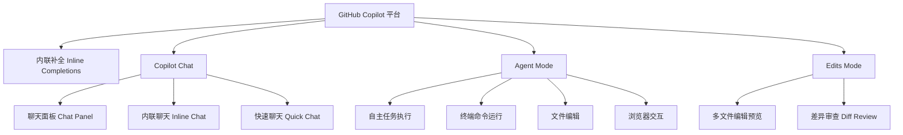
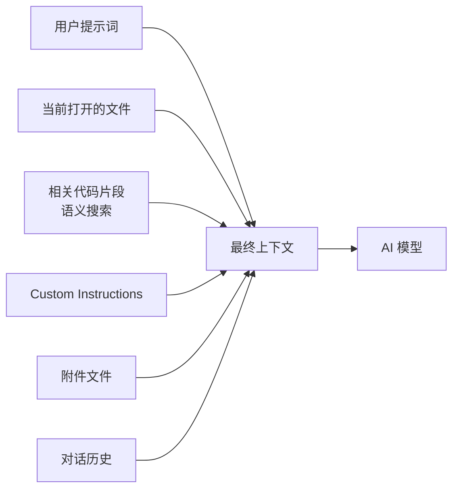
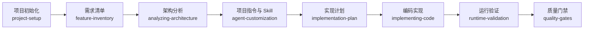
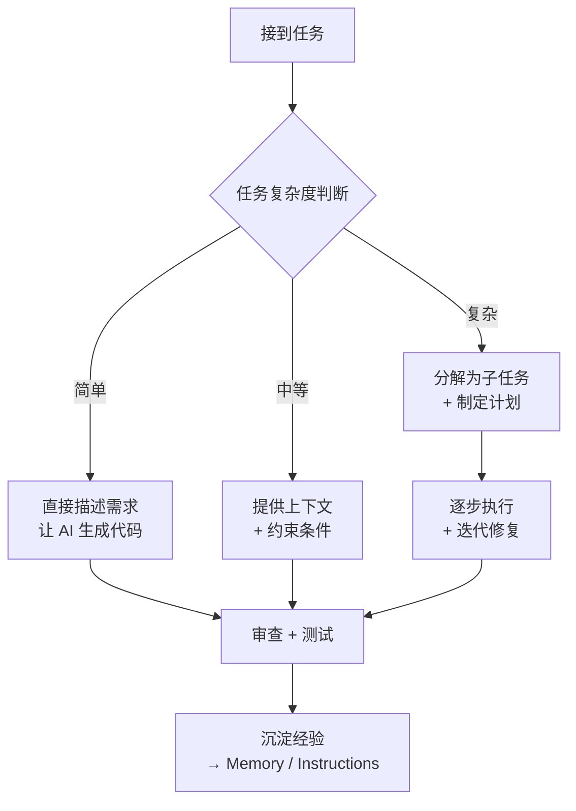
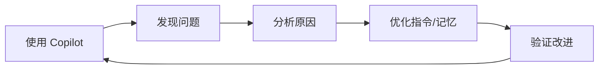

# VS Code Copilot 专家指南：从程序员到 AI 编程 Agent 专家

> **目标**：培养一名普通程序员成长为能驾驭 AI 编程的 Agent 专家，胜任复杂项目的 AI 辅助开发。

---

## 目录

1. [概念篇：理解 Copilot 生态](#1-概念篇理解-copilot-生态)
2. [入门篇：环境搭建与基础使用](#2-入门篇环境搭建与基础使用)
3. [核心篇：Copilot Chat 深度掌握](#3-核心篇copilot-chat-深度掌握)
4. [上下文篇：让 AI 真正理解你的项目](#4-上下文篇让-ai-真正理解你的项目)
5. [Agent 篇：从对话到自主执行](#5-agent-篇从对话到自主执行)
6. [指令篇：Custom Instructions 体系](#6-指令篇custom-instructions-体系)
7. [记忆篇：持久化知识与经验沉淀](#7-记忆篇持久化知识与经验沉淀)
8. [技能篇：Skills 扩展与领域知识](#8-技能篇skills-扩展与领域知识)
9. [工作流篇：实战场景与最佳实践](#9-工作流篇实战场景与最佳实践)
10. [进阶篇：成为 Agent 专家](#10-进阶篇成为-agent-专家)

---

## 1. 概念篇：理解 Copilot 生态

### 1.1 什么是 GitHub Copilot？

GitHub Copilot 是 AI 编程助手，深度集成在 VS Code 中。它不仅仅是"代码补全工具"，而是一个**多层次的 AI 编程平台**：



### 1.2 三种工作模式对比

| 模式 | 适用场景 | 特点 |
|------|----------|------|
| **Ask（问答）** | 阅读代码、学习概念、代码解释 | 只读，不修改文件 |
| **Edit（编辑）** | 单/多文件修改、重构 | 有预览 diff，需手动接受 |
| **Agent（代理）** | 复杂多步骤任务、自主执行 | 自动读写文件、运行命令、迭代修复 |

### 1.3 核心术语

- **Context（上下文）**：AI 能看到的信息，包括打开的文件、相关代码、对话历史等
- **Attachment（附件）**：手动提供给 AI 的额外文件和引用
- **Skill（技能）**：特定领域的知识包，可被 AI 按需加载
- **Memory（记忆）**：持久化的笔记系统，跨对话保留
- **Custom Instructions（自定义指令）**：项目级或用户级的 AI 行为规则
- **Agent（代理）**：可自主规划并执行多步骤任务的 AI 工作模式或执行者

### 1.4 Skill 与 Agent 的关系

可以把 Agent 理解为执行任务的程序员，把 Skill 理解为程序员在特定领域使用的专业手册。

| 概念 | 类比 | 主要作用 |
|------|------|----------|
| **Agent** | 程序员或项目执行者 | 理解目标、拆分任务、调用工具、修改文件、验证结果 |
| **Skill** | 专业手册或作业流程 | 提供特定领域的知识、步骤、规范和检查清单 |
| **Tool** | 工具箱 | 读取文件、搜索代码、运行命令、打开浏览器 |
| **Memory** | 工作笔记 | 保存可以复用的项目事实和经验 |

它们通常按照下面的关系协作：

```text
用户目标
    ↓
Agent 判断任务
    ↓
匹配合适的 Skill
    ↓
Agent 调用 Tool 执行动作
    ↓
Agent 根据 Skill 和执行结果继续决策
    ↓
输出结果并验证
```

例如，用户说“分析这个 Java 项目的架构”时，Agent 负责执行任务，
`analyzing-architecture` Skill 提供分析方法，代码搜索和文件读取工具负责获取实际项目内容。
Skill 本身不会独立修改文件或运行命令，它是 Agent 执行任务时参考的知识和流程。

不要把 Agent、Skill 和子代理混为一谈：Agent 是负责整体任务的执行者，Skill 是它可以使用的知识包，
子代理（subagent）则是 Agent 为了完成某个子任务而启动的专门执行者。

---

## 2. 入门篇：环境搭建与基础使用

### 2.1 安装与认证

```bash
# 1. 确保 VS Code 已安装（推荐最新版）
code --version

# 2. 安装 GitHub Copilot 扩展
# 在 VS Code 扩展商店搜索 "GitHub Copilot" 并安装
# 或通过命令行：
code --install-extension GitHub.copilot
code --install-extension GitHub.copilot-chat

# 3. 登录 GitHub 账号
# 在 VS Code 左下角账号图标点击，用 GitHub 账号登录
# 需要有有效的 Copilot 订阅
```

### 2.2 基础快捷键

| 快捷键 | 功能 |
|--------|------|
| `⌘I` (Mac) / `Ctrl+I` (Win) | 打开内联聊天 |
| `⌘Shift+I` (Mac) / `Ctrl+Shift+I` (Win) | 打开快速聊天 |
| `⌘Shift+Enter` (Mac) / `Ctrl+Shift+Enter` (Win) | 打开聊天面板 |
| `Tab` | 接受内联补全 |
| `Esc` | 拒绝内联补全 |
| `Option+]` (Mac) / `Alt+]` (Win) | 下一条补全建议 |
| `Option+[` (Mac) / `Alt+[` (Win) | 上一条补全建议 |
| `⌘Enter` | 在聊天中发送消息 |

### 2.3 第一个 Copilot 任务

在 VS Code 中打开任意项目，按 `⌘Shift+Enter` 打开聊天面板，尝试：

```
@workspace 解释这个项目的整体结构
```

你会发现 Copilot 自动搜索整个工作区，给出项目概述。这就是**上下文感知**的力量。

---

## 3. 核心篇：Copilot Chat 深度掌握

### 3.1 聊天参与者（Chat Participants）

参与者以 `@` 开头，决定 AI 的角色和可用上下文：

| 参与者 | 用途 | 示例 |
|--------|------|------|
| `@workspace` | 了解整个项目结构 | `@workspace 这个项目的入口在哪里？` |
| `@vscode` | VS Code 自身功能 | `@vscode 如何配置自动保存？` |
| `@terminal` | 终端命令相关 | `@terminal 解释这个错误是什么意思` |
| `@terminal` | 生成终端命令 | `@terminal 帮我找所有大于1MB的文件` |
| **无前缀** | 通用编程问题 | `这段代码的时间复杂度是多少？` |

### 3.2 聊天变量（Chat Variables）

变量以 `#` 开头，用于精确指定上下文：

| 变量 | 说明 | 示例 |
|------|------|------|
| `#file` | 引用特定文件 | `请优化 #file:src/index.ts 的导入` |
| `#selection` | 当前编辑器选中内容 | `将 #selection 改为 async/await` |
| `#editor` | 当前活动编辑器的全部内容 | `给 #editor 添加错误处理` |
| `#terminalLastCommand` | 终端上一条命令 | `#terminalLastCommand 为什么失败了？` |
| `#terminalSelection` | 终端中的选中内容 | `解释 #terminalSelection 中的错误` |

### 3.3 内联聊天（Inline Chat）

内联聊天让你在代码中原地与 AI 交互：

```
// 选中代码后按 ⌘I，输入：
把这个函数改为使用箭头函数
```

AI 会直接在代码位置生成修改，你可以预览 diff 后接受或拒绝。

### 3.4 提示词工程（Prompt Engineering）

#### 黄金法则：CLEAR 原则

- **C**ontext（上下文）：提供足够的项目背景
- **L**anguage（语言）：使用精确的技术术语
- **E**xamples（示例）：给出期望的输入输出
- **A**mbiguity-free（无歧义）：明确边界条件和约束
- **R**eview（审阅）：始终审查 AI 生成的代码

#### 示例对比

```markdown
# ❌ 差的提示词
帮我写个函数

# ✅ 好的提示词
在 src/utils/validation.ts 中创建一个名为 validateEmail 的导出函数，
接收 string 参数，返回 { valid: boolean; error?: string }。
要求：
- 使用 RFC 5322 标准正则
- 空字符串返回 valid: false, error: "邮箱不能为空"
- 添加 JSDoc 文档注释
```

### 3.5 代码引用与附件

你可以拖拽文件、文件夹到聊天框作为附件；也可以直接粘贴代码片段。AI 会读取这些内容作为上下文。

---

## 4. 上下文篇：让 AI 真正理解你的项目

### 4.1 上下文是如何工作的

Copilot 的上下文由以下层次组成：



### 4.2 最大化上下文质量

#### 策略 1：保持相关文件打开

AI 会自动将当前打开的编辑器标签页作为高优先级上下文。在开始复杂任务前，打开相关的源文件。

#### 策略 2：使用 `@workspace` 精确导航

```markdown
@workspace 在 src/services/ 目录下，有哪些文件导出了 createUser 函数？
```

#### 策略 3：善用 `#file` 变量

当你需要 AI 关注特定文件时：

```markdown
请对比 #file:src/old/auth.ts 和 #file:src/new/auth.ts，找出 API 差异
```

### 4.3 项目约定文件

创建以下文件帮助 AI 理解你的项目：

```
项目根目录/
├── .github/
│   └── copilot-instructions.md    ← 项目级 AI 指令
├── AGENTS.md                       ← Agent 行为规范
├── README.md                       ← 会被 AI 自动读取
└── CLAUDE.md / COPILOT.md          ← 额外的 AI 指导文件
```

---

## 5. Agent 篇：从对话到自主执行

### 5.1 什么是 Agent Mode？

Agent Mode 是 Copilot 的一种工作模式。在这种模式下，AI 不只是回答问题，而是作为任务执行者**自主规划并执行多步骤任务**：

- 读取项目文件以收集上下文
- 搜索代码库中的相关模式
- 创建、编辑、删除文件
- 在终端中运行命令（编译、测试、安装依赖）
- 分析终端输出和错误
- 迭代修复直到任务完成

### 5.2 启用 Agent Mode

在聊天面板中，将模式从 "Ask" 切换到 **"Agent"**。

### 5.3 Agent 的能力边界

Agent 可以：
- ✅ 读取任意项目文件
- ✅ 创建和编辑文件
- ✅ 运行终端命令（需用户批准）
- ✅ 搜索代码库（grep、语义搜索）
- ✅ 查看 VS Code 诊断错误
- ✅ 管理 Todo 列表跟踪进度
- ✅ 调用子代理处理子任务
- ✅ 与浏览器交互（打开页面、点击、截图）

Agent 不能：
- ❌ 访问外部网络（除非通过特定工具）
- ❌ 修改 VS Code 设置
- ❌ 安装扩展（除非用户明确要求）

### 5.4 终端命令执行

Agent 运行终端命令时需要你的批准。你会看到类似：

```
> 我需要在终端运行以下命令来安装依赖：
  npm install express
  [批准] [拒绝]
```

**安全原则**：始终审查 Agent 要运行的命令，特别是有副作用的命令（`rm`、`git push --force`、数据库操作等）。

### 5.5 子代理（Subagents）

Agent 可以启动专门的子代理来处理特定任务：

```markdown
# 你会看到 Agent 启动子代理：
正在启动 Explore 子代理搜索代码库中的认证逻辑...
```

**常见子代理类型**：
- `Explore`：只读代码库探索和研究
- 特定领域的迁移代理（Java、.NET 等）

### 5.6 浏览器交互

Agent 可以打开浏览器页面进行：
- 查看和验证前端 UI 变更
- 截图对比
- 点击交互测试
- 表单填写验证

```markdown
帮我修改登录页面样式，然后打开浏览器预览效果
```

---

### 5.7 默认 Agent 与自定义 Agent 的区别

在 Copilot 中，直接切换到 Agent 模式并开始对话，使用的是 Copilot 提供的**默认 Agent**。你也可以创建带有固定角色、说明、工具范围和工作流程的**自定义 Agent**，让某类任务始终按照同一套规则执行。自定义 Agent 通常以 `.agent.md` 文件保存，并可以放在项目配置目录或用户配置目录中；具体可用字段和存放位置以当前 VS Code / Copilot 版本为准。

#### 核心区别

| 对比项 | 默认 Agent | 自定义 Agent |
|--------|------------|--------------|
| 使用方式 | 直接选择 Agent 模式并输入任务 | 选择预先定义好的 Agent，再输入任务 |
| 配置成本 | 几乎为零 | 需要设计、编写和维护配置 |
| 适应范围 | 通用开发、探索、一次性任务 | 固定领域、固定流程、重复性任务 |
| 行为一致性 | 依赖当前提示词和上下文 | 可以固化角色、边界、步骤和输出格式 |
| 复用能力 | 主要依靠重新描述要求 | 团队成员可以反复复用同一配置 |
| 灵活性 | 高，适合临时改变方向 | 较低，过度约束时可能妨碍临场判断 |
| 维护责任 | 由 Copilot 平台维护通用能力 | 由个人或团队维护内容是否准确 |

#### 默认 Agent 的优势与不足

默认 Agent 的优势是启动快、认知负担低，不需要先设计角色。它适合探索陌生代码、修复单个问题、实现小功能、询问技术方案，以及需求还没有稳定下来的早期阶段。默认 Agent 也更容易利用当前工作区、打开的文件和即时提示词来调整策略。

它的不足是同类任务的输出可能不够一致。每次对话都需要重新说明代码规范、验证要求和安全边界；当任务跨多个文件或多人协作时，容易出现遗漏步骤、产出格式不统一或审查标准不一致的问题。默认 Agent 不是“低能力 Agent”，而是一个通用入口，项目约束仍然需要通过提示词、项目指令和 Skill 提供。

#### 自定义 Agent 的优势与不足

自定义 Agent 适合把稳定的专业流程固化下来，例如“只做代码审查”“负责前端可访问性验证”“按团队规范实现 API”“执行发布前检查”。它的主要优势包括：

- **职责清晰**：明确它负责什么、不负责什么，减少任务范围漂移
- **流程一致**：固定分析、实现、验证和汇报步骤，降低遗漏风险
- **结果可复用**：固定输出格式、检查清单和参考文件，方便团队协作
- **边界更明确**：可以限制可用工具或要求先给计划再修改文件
- **专业化更强**：可以与特定 Skill、项目指令和领域文档组合使用

自定义 Agent 也有成本和风险：

- 需要投入时间设计和测试，配置过长会增加上下文负担
- 项目技术栈或流程变化后，旧配置可能产生错误指导
- 角色边界写得过死时，Agent 可能机械执行，忽略当前任务的特殊情况
- 多个自定义 Agent 之间可能出现规则冲突，增加选择和维护成本
- 自定义 Agent 不能替代测试、代码审查或开发者对高风险变更的判断

#### 什么时候使用哪一种？

| 场景 | 推荐选择 | 原因 |
|------|----------|------|
| 第一次了解项目或验证想法 | 默认 Agent | 灵活、快速，不需要先准备配置 |
| 一次性修复一个明确 Bug | 默认 Agent | 任务边界小，临时提示词足够 |
| 创建新项目的第一轮探索 | 默认 Agent + 项目指令 | 先了解目标和技术栈，再固化约定 |
| 团队反复执行同一种审查 | 自定义 Agent | 审查维度和输出格式需要稳定 |
| 大型项目的架构、测试或部署 | 自定义 Agent | 需要明确职责、工具边界和验收步骤 |
| 多个项目共用一套工程流程 | 用户级自定义 Agent | 可以跨项目复用成熟工作流 |
| 需求仍在快速变化 | 默认 Agent | 避免过早把不稳定流程固化 |

#### 推荐的组合方式

默认 Agent 和自定义 Agent 不是二选一。新项目通常先使用默认 Agent 完成探索，再把反复出现的约束沉淀为项目指令或自定义 Agent：

```text
默认 Agent：探索目标、读取代码、验证假设
    ↓
项目指令：固化目录、命名、构建、测试和安全约定
    ↓
自定义 Agent：固化稳定的架构、实现、审查或部署流程
    ↓
默认 Agent：处理例外情况和未预料到的问题
```

判断是否值得创建自定义 Agent，可以问自己三个问题：

1. 这类任务是否会重复执行至少两三次？
2. 是否存在必须保持一致的步骤、检查项或输出格式？
3. 是否能清楚写出它的职责边界、输入、产出和验证方式？

如果三个问题大多回答“否”，先使用默认 Agent；如果大多回答“是”，再创建自定义 Agent，并用真实任务验证它是否确实减少了重复说明和遗漏。Skill 负责提供领域知识，项目指令负责提供仓库约定，自定义 Agent 负责组织角色和工作流程，三者可以叠加使用，但不应重复维护同一条规则。

### 5.8 从零启动项目时，应该准备哪些 Agent？

Skill 是 Agent 使用的专业知识，Agent 则是负责推进任务的执行角色。开始一个新项目时，不需要创建很多彼此独立的 Agent，也不需要为每个文件夹配置一个 Agent。更实用的做法是先准备一组职责清晰的角色，再根据项目规模和技术栈启用其中的一部分。

#### 第一层：所有项目都建议具备的角色

| Agent 角色 | 主要职责 | 典型产出 |
|------------|----------|----------|
| **项目引导 Agent** | 确认目标、范围、用户和成功标准，识别未知信息 | 项目简述、假设清单、验收标准 |
| **架构 Agent** | 分析技术栈、模块边界、数据流、接口和关键依赖 | 架构说明、目录结构、技术决策 |
| **实现 Agent** | 按任务计划编写业务代码，遵循项目指令和既有模式 | 源代码、配置、数据库迁移 |
| **测试验证 Agent** | 设计并执行单元、集成、启动和端到端检查 | 测试代码、运行证据、失败分析 |
| **审查 Agent** | 从正确性、安全性、可维护性和需求覆盖率审查变更 | 审查意见、风险清单、改进建议 |

这五类角色可以由同一个 Agent 在不同阶段承担，也可以在复杂项目中交给不同的子代理。这里的“准备”是明确职责和工作边界，不是把它们全部安装成独立扩展。

#### 第二层：按项目需要补充的角色

| 项目情况 | 建议补充的 Agent | 重点职责 |
|----------|------------------|----------|
| 前端或全栈项目 | **体验验证 Agent** | 检查页面流程、响应式布局、可访问性和浏览器交互 |
| 有数据库或复杂 API | **数据与契约 Agent** | 维护数据模型、迁移策略、接口契约和兼容性 |
| 多人协作或大型项目 | **任务协调 Agent** | 拆分任务、管理依赖、分配子代理、汇总进度 |
| 云部署或基础设施项目 | **部署 Agent** | 容器、环境变量、IaC、CI/CD 和运行配置 |
| 有安全与合规要求 | **安全 Agent** | 依赖漏洞、身份认证、输入校验、敏感信息和权限边界 |
| 需要持续维护的项目 | **知识沉淀 Agent** | 更新项目指令、架构文档、仓库记忆和故障经验 |

#### 推荐的启动顺序


新项目的第一轮不要直接让实现 Agent 大规模开发功能。先让项目引导 Agent 和架构 Agent 确认入口、构建命令、测试命令、环境变量和验收方式，再由实现 Agent 创建最小可运行骨架；测试验证 Agent 应尽早介入，这样后续每一步都有可重复的检查。

#### 按规模选择配置

```text
小型项目：项目引导 + 实现 + 测试验证 + 审查
中型项目：项目引导 + 架构 + 实现 + 测试验证 + 审查
大型项目：项目引导 + 架构 + 任务协调 + 实现 + 测试验证 + 审查
生产系统：在大型项目配置上增加部署、安全和知识沉淀 Agent
```

可以用下面的提示词启动一个新项目：

```markdown
我要从零创建一个 [技术栈] 项目，目标是 [一句话描述]。
请按项目引导、架构、实现、测试验证、审查的顺序工作：
1. 先确认目标、范围、用户流程、非功能要求和验收标准
2. 分析技术栈、目录结构、数据模型、接口和本地开发命令
3. 创建最小可运行骨架，不要提前实现未确认的业务功能
4. 为启动、构建和核心流程添加最小测试并实际运行
5. 审查安全性、可维护性和需求覆盖率
6. 将构建命令、测试命令、项目约定和已确认的决策写入项目指令或仓库记忆
每个阶段请先说明发现、假设、产出和验证方式；遇到关键决策不明确时先暂停询问。
```

关键原则是：一个 Agent 可以承担多个角色，但每个阶段必须有明确的负责人、输入、产出和验证方式。只有当任务需要并行处理、不同专业判断或独立审查时，才值得启动多个子代理。

---

## 6. 指令篇：Custom Instructions 体系

### 6.1 指令文件的作用

Custom Instructions 让你定义 AI 的**行为规则、项目约定和自动工作流**。

### 6.2 指令文件位置

| 文件 | 作用域 | 用途 |
|------|--------|------|
| `.github/copilot-instructions.md` | 项目级 | 项目特定的 AI 行为规则 |
| 用户设置中的 Instructions | 全局 | 个人偏好和习惯 |

### 6.3 编写项目指令

```markdown
---
description: "项目级 AI 指令"
---

# 项目指令

## 代码风格
- 使用 TypeScript 严格模式
- 优先使用 `async/await` 而非 Promise 链
- 导出使用 named export，避免 default export

## 测试要求
- 每个新功能必须包含单元测试
- 测试文件放在 `__tests__/` 目录下
- 使用 Vitest 作为测试框架

## 命名规范
- 文件名使用 kebab-case（如 `user-service.ts`）
- React 组件使用 PascalCase（如 `UserProfile.tsx`）
- 变量和函数使用 camelCase

## 自动操作
- 修改任何 API 路由后，自动更新 `docs/api.md`
- 添加新依赖后，运行 `pnpm audit` 检查安全漏洞
```

### 6.4 示例：文档自动转 PDF

一个实际的自定义指令示例（已在当前项目中生效）：

```markdown
---
description: "项目级 Agent 指令 — 文档创建后自动转换为 PDF"
---

## 文档自动转 PDF

当在 `docs/` 目录下创建或修改任何 Markdown（`.md`）文件后，**必须**自动调用
`~/md_to_pdf.sh` 将其转换为 PDF。

### 规则
1. 触发条件：在 `docs/` 目录下新建或编辑 `.md` 文件
2. 执行命令：`bash ~/md_to_pdf.sh docs/<subdir>/<filename>.md`
3. 输出位置：PDF 自动生成到 `pdfdocs/` 目录下
```

### 6.5 指令设计原则

1. **具体而非笼统**：`使用 2 空格缩进` 优于 `保持代码整洁`
2. **可操作**：每一条指令应能直接指导 AI 行为
3. **加示例**：提供正反例帮助 AI 理解
4. **分层组织**：用 Markdown 标题组织不同类别规则
5. **定期迭代**：根据实际效果调整指令

---

## 7. 记忆篇：持久化知识与经验沉淀

### 7.1 Memory 系统架构

Copilot 有三层记忆系统：

```
/memories/
├── *.md                   ← 用户级记忆（跨项目持久化）
├── session/               ← 会话级记忆（当前对话）
│   └── plans.md
└── repo/                  ← 仓库级记忆（当前项目）
    └── conventions.md
```

### 7.2 三层记忆对比

| 层级 | 生命周期 | 用途 | 加载方式 |
|------|----------|------|----------|
| **用户记忆** | 跨项目跨会话持久 | 个人偏好、常用命令、经验教训 | 自动加载（前 200 行） |
| **会话记忆** | 当前对话期间 | 任务计划、临时状态 | 按需读取 |
| **仓库记忆** | 当前项目持久 | 项目约定、构建命令、架构事实 | 按需读取 |

### 7.3 记忆管理操作

你可以让 Agent 管理记忆：

```markdown
# 记录一条用户记忆
记住：我的项目默认使用 pnpm 而不是 npm

# 记录仓库记忆
在项目记忆中记录：构建命令是 pnpm build，测试命令是 pnpm test

# 查看已有记忆
列出我所有的用户记忆
```

### 7.4 记忆最佳实践

1. **保持简短**：每条记忆 1-3 行，使用要点格式
2. **分类存储**：按主题分文件（如 `github.md`、`tooling.md`）
3. **及时更新**：发现过时信息立即修正
4. **避免冗余**：如果信息已在项目文件中（如 `package.json`），不需要记忆

---

## 8. 技能篇：Skills 扩展与领域知识

### 8.1 什么是 Skills？

Skills 是特定领域的**知识包**，AI 在需要时自动加载。它们提供了：
- 特定框架的代码模式
- 迁移规则和转换指南
- 项目初始化模板
- 质量检查清单

### 8.2 Skills 触发方式

Skills 通常会根据用户请求、任务上下文和 Skill 的描述进行匹配。关键词有帮助，但不是唯一条件，
也不保证每次出现关键词时都会加载对应 Skill。例如，当你问：

```markdown
帮我分析这个项目的架构
```

AI 可能会根据“分析架构”这一请求匹配并加载 `analyzing-architecture` 技能。

Skill 不是一个单独运行的程序，也不是必须由用户手动逐个启动的工具。它更像一份按需提供给 Agent
的专业说明，具体是否加载、如何使用，取决于当前任务和运行环境。

### 8.3 常用 Skills 分类

| 类别 | Skills | 触发关键词 |
|------|--------|-----------|
| **项目管理** | `project-setup`, `project-recon` | 新建项目、评估项目规模 |
| **代码分析** | `analyzing-architecture`, `building-java-knowledge-graph` | 分析架构、依赖图 |
| **迁移升级** | `typescript-upgrade`, `modernize-java` | 升级依赖、迁移框架 |
| **测试** | `runtime-validation`, `modernization-integration-tests` | 测试策略、集成测试 |
| **质量** | `quality-gates` | 质量检查、完整性审查 |
| **文档** | `feature-inventory`, `guidelines` | 功能清单、迁移指南 |

这些分类用于快速定位适合的 Skill，不代表每个项目都要全部使用。先根据项目技术栈和当前阶段筛选，再查看具体 Skill 的输入、输出和验收要求。

### 8.4 从零开始新项目时，应该准备哪些 Skills？

新项目不应该一开始就准备一大堆 Skill。这里的“准备”包括了解适用的内置 Skill，或在确有重复需求时创建自定义 Skill，
并不意味着要把所有 Skill 都下载安装。更稳妥的做法是按照项目生命周期准备一组**基础 Skill**，再根据技术栈和业务领域补充**专业 Skill**。
基础 Skill 解决“项目怎么建、怎么验证、怎么维护”的问题，专业 Skill 解决“这个项目具体怎么实现”的问题。

#### 第一层：所有新项目都建议准备

| 阶段 | 推荐 Skill | 解决的问题 | 典型触发词 |
|------|------------|------------|------------|
| 项目初始化 | `project-setup-info-local` | 创建完整项目结构、配置工具链、安装依赖 | 新建项目、从零搭建、初始化项目 |
| 需求与功能 | `feature-inventory` | 把用户目标拆成页面、流程、接口和验收标准 | 功能清单、需求分析、编写规格 |
| 架构设计 | `analyzing-architecture` | 明确模块边界、技术栈、数据流和依赖关系 | 架构设计、分析系统、模块划分 |
| 代码规范 | `agent-customization` | 创建或完善 `copilot-instructions.md`、`AGENTS.md` 和领域 Skill | 配置 Agent、创建 Skill、项目指令 |
| 测试策略 | `runtime-validation` | 设计启动检查、单元测试、集成测试和端到端验证 | 测试策略、冒烟测试、E2E |
| 质量门禁 | `quality-gates` | 检查需求、计划、任务和实现是否完整可追踪 | 质量检查、完整性审查、最终验收 |
| 项目规模 | `project-recon` | 识别语言、统计代码量，帮助决定是否需要拆分任务 | 项目规模、代码量、语言统计 |

对于小型项目，前五项通常已经足够；`quality-gates` 和 `project-recon` 可以在项目变大或多人协作时再启用。

#### 第二层：按照项目类型补充

| 项目类型 | 建议准备的 Skill | 重点覆盖内容 |
|----------|------------------|--------------|
| Java / Spring | `building-java-knowledge-graph`、`api-service-contracts`、`data-architecture` | JVM 依赖、服务契约、持久化模型 |
| Java 迁移或升级 | `guidelines`、`creating-implementation-plan`、`implementing-code` | 转换规则、任务分解、源代码实现 |
| TypeScript / Node.js | `typescript-dependencies-upgrade`、`runtime-validation` | 依赖管理、编译和运行时验证 |
| Python | `python-fact-grounded-coding`、`pylance-refactoring` | 类型和诊断事实、可靠重构 |
| 前端 / 全栈 | `feature-inventory`、`runtime-validation`、`analyzing-architecture` | 页面流程、浏览器验证、前后端边界 |
| Azure 部署 | `configuration-inventory`、`dependency-map` | 配置清单、依赖关系和部署准备 |
| 有安全要求的项目 | `cve-remediation`、`quality-gates` | 依赖漏洞、交付前安全门禁 |

上表中的 Skill 是按场景选择，不要求全部安装或同时加载。例如，纯前端项目不需要 Java 知识图谱；只有在使用 Python 并希望依据 Pylance 诊断进行修改时，才需要 Python 专用 Skill。

#### 第三层：团队或复杂项目再准备

当项目需要多人协作、跨模块并行或分阶段迁移时，再增加以下 Skill：

- `creating-implementation-plan`：把功能规格拆成有依赖关系的实现任务
- `project-decomposition`：按模块依赖、代码量和拓扑结构拆分大型项目
- `dag-generation`：生成并执行任务 DAG，控制复杂任务的先后顺序
- `sharing-learnings`：把阶段性经验记录下来，供后续 Agent 使用
- `team-charters`：明确架构、实现、测试和部署角色的责任边界
- `appmod-hooks`：为现代化流程配置阶段钩子和自动动作

#### 推荐的准备顺序



每一步都应该产出可被下一步使用的结果：初始化产出可运行的骨架，需求分析产出功能规格，架构分析产出模块边界，指令配置产出团队约定，测试 Skill 产出验证证据。不要在项目还没有明确入口、构建命令和验收标准时直接让 Agent 大规模写业务代码。

#### 一套可直接采用的最小 Skill 包

如果不知道从哪里开始，可以先准备下面 6 项：

```text
project-setup-info-local  # 创建项目骨架和工具链
feature-inventory         # 整理需求和功能边界
analyzing-architecture    # 设计模块、依赖和数据流
agent-customization       # 固化项目级指令与 Skill
runtime-validation        # 验证项目能启动、能测试、能运行
quality-gates             # 在交付前检查完整性和可追踪性
```

启动新项目时，可以这样向 Agent 提问：

```markdown
我要从零创建一个 [技术栈] 项目，目标是 [一句话描述]。
请按以下顺序工作：
1. 使用项目初始化 Skill 创建最小可运行骨架
2. 使用功能清单 Skill 整理核心用户流程和验收标准
3. 使用架构分析 Skill 确认模块边界、数据模型和接口
4. 创建项目级 `copilot-instructions.md`，写入构建、测试和代码规范
5. 使用运行验证 Skill 启动项目并执行最小测试
请先输出发现、假设和计划，确认入口、构建命令与测试命令后再实现业务功能。
```

这里的关键不是 Skill 数量，而是让每个 Skill 都有清晰的输入、输出和验收方式。项目成熟后，再把实际遇到的重复问题沉淀为仓库级 Skill，而不是把所有通用知识都塞进项目指令文件。

### 8.5 如何创建自定义 Skill

Skills 是 `.md` 文件，放在特定目录下：

```markdown
---
name: my-react-patterns
description: 我的团队 React 最佳实践和代码模式
---

# React 编码规范

## 组件结构
1. 每个组件一个文件
2. 使用函数组件 + Hooks
3. Props 使用 TypeScript 接口定义

## 状态管理
- 局部状态用 useState
- 跨组件状态用 Context
- 服务端状态用 React Query

## 触发条件
当用户询问 React 组件、状态管理、React 最佳实践时，加载此技能。
```

---

## 9. 工作流篇：实战场景与最佳实践

### 9.1 场景一：新功能开发

```mermaid
sequenceDiagram
    participant U as 你（开发者）
    participant C as Copilot Agent
    U->>C: 我要在 Express 项目中添加用户认证功能
    C->>C: 搜索项目结构、已有路由、数据库模型
    C->>C: 规划任务列表
    C->>U: 我已了解项目，计划：
           1. 创建 user 模型和数据迁移
           2. 创建 auth 中间件 (JWT)
           3. 创建 注册/登录 路由
           4. 添加单元测试
           开始执行？
    U->>C: 批准
    C->>C: 依次执行每个任务
    C-->>U: 遇到问题：bcrypt 未安装
    U->>C: 安装 bcrypt
    C->>C: 继续执行并完成所有任务
    C->>U: ✅ 功能完成，所有测试通过
```

**实际提示词**：

```markdown
@workspace 我要在这个 Express + TypeScript 项目中添加用户认证功能。
要求：
1. 使用 JWT 令牌认证
2. 密码使用 bcrypt 加密
3. 创建 POST /api/auth/register 和 POST /api/auth/login
4. 创建 auth 中间件验证令牌
5. 创建对应的单元测试
请先分析项目结构，制定计划后执行。
```

### 9.2 场景二：代码重构

```markdown
@workspace 将 src/services/ 目录下所有使用回调风格的函数
重构为 async/await 风格。要求：
1. 保持函数签名兼容
2. 同步更新所有调用方
3. 更新相关测试
4. 确保所有测试通过
```

### 9.3 场景三：Bug 修复

```markdown
# 结合终端错误信息
#terminalLastCommand 这个测试失败了。请在 #file:src/services/order.ts 
中找出导致空指针的原因并修复。
```

### 9.4 场景四：代码审查

```markdown
请审查 #file:src/components/UserProfile.tsx，关注：
- 性能问题（不必要的重渲染）
- 安全漏洞（XSS、注入）
- 可访问性（a11y）
- TypeScript 类型安全
给出具体修改建议。
```

### 9.5 场景五：文档生成

```markdown
@workspace 为 src/api/ 目录下的所有路由端点生成 API 文档，
输出到 docs/api-reference.md，包含：
- 端点路径和方法
- 请求参数说明
- 响应格式示例
- 错误码说明
```

### 9.6 Todo 列表驱动开发

Agent Mode 会自动创建和管理 Todo 列表：

```markdown
请完成以下任务：
1. 添加用户资料编辑功能
2. 添加头像上传功能
3. 添加密码修改功能
4. 更新相关测试
```

Agent 会：
1. 创建 4 个 todo 项
2. 逐个标记为 `in-progress` → `completed`
3. 在每个任务完成后汇报进度
4. 遇到阻塞时暂停并询问

---

## 10. 进阶篇：成为 Agent 专家

### 10.1 Agent 专家的思维模型



### 10.2 高效提示词的层次

| 层次 | 描述 | 示例 |
|------|------|------|
| L1：基础 | 简单问答 | `这段代码做什么？` |
| L2：定向 | 指定文件和目标 | `优化 src/utils.ts 中的 sort 函数` |
| L3：约束 | 带具体约束条件 | `用 O(n log n) 算法，保持 API 兼容` |
| L4：上下文 | 利用项目上下文 | `@workspace 按照项目现有模式实现` |
| L5：工作流 | 多步骤自动化 | `创建功能 → 写测试 → 运行验证 → 修复` |
| L6：元认知 | 让 AI 自我反思 | `审查你的方案，有没有更简洁的实现？` |

### 10.3 任务分解策略

复杂任务不要一次性扔给 AI，按以下步骤分解：

```markdown
# ❌ 一次扔太多
我要一个完整的电商系统，包括用户、商品、订单、支付、物流...

# ✅ 逐步推进
1. 先设计数据模型
   → "设计电商系统的核心数据模型（用户、商品、订单），输出 ER 图"
2. 确认后，实现用户模块
   → "在 src/modules/user/ 下实现用户注册和登录"
3. 逐个模块实现
4. 集成测试
```

### 10.4 常见陷阱与对策

| 陷阱 | 表现 | 对策 |
|------|------|------|
| **幻觉** | AI 编造不存在的 API | 要求引用文档链接，验证代码 |
| **过度工程** | 生成不需要的抽象层 | 明确要求"保持简单"、"不要过度设计" |
| **上下文丢失** | 长对话后 AI 遗忘前文 | 定期总结关键信息重新提供 |
| **不一致** | 不同文件的代码风格差异 | 用好 Custom Instructions + Memory |
| **安全盲区** | 忽略安全最佳实践 | 在指令中明确安全检查项 |
| **测试缺失** | 生成代码但没有测试 | 在提示中明确要求写测试 |

### 10.5 终端联动技巧

```markdown
# 1. 让 AI 解释错误
#terminalLastCommand 这个 TypeScript 编译错误怎么修复？

# 2. 让 AI 生成命令
@terminal 找所有超过 100 行的 TypeScript 文件，按行数排序

# 3. 让 AI 分析日志
#terminalSelection 分析这些日志，找出性能瓶颈
```

### 10.6 创建你的 Agent 工具链

```
项目/
├── .github/
│   └── copilot-instructions.md    # AI 行为规则
├── .vscode/
│   ├── tasks.json                 # 预定义任务（构建、测试等）
│   └── settings.json              # 编辑器配置
├── docs/
│   ├── architecture.md            # AI 可读取的架构文档
│   └── api.md                     # API 文档
├── AGENTS.md                      # Agent 规范
└── README.md                      # 项目说明
```

### 10.7 持续改进循环



每次发现 AI 输出不理想时，问自己：
1. 我的提示词是否足够清晰？
2. 是否提供了足够的上下文？
3. 是否需要在 Custom Instructions 中添加规则？
4. 这个经验是否值得记入 Memory？

---

## 附录

### A. 速查表

| 需求 | 命令/操作 |
|------|----------|
| 解释代码 | 选中代码 → `⌘I` → `解释这段代码` |
| 修复错误 | `#file:xxx.ts 修复这个错误` |
| 生成测试 | `@workspace 为 #file:src/foo.ts 生成单元测试` |
| 重构函数 | 选中函数 → `⌘I` → `改为 async/await` |
| 了解项目 | `@workspace 概述项目结构` |
| 生成文档 | `@workspace 为 src/api/ 生成 API 文档` |
| 终端帮助 | `@terminal 如何找到占用8080端口的进程？` |

### B. 推荐 VS Code 扩展

| 扩展 | 用途 |
|------|------|
| GitHub Copilot | 核心 AI 编程助手 |
| GitHub Copilot Chat | 对话式 AI 交互 |
| GitLens | Git 增强，与 Copilot 深度集成 |
| ESLint / Prettier | 代码质量保障 |

### C. 参考资源

- [GitHub Copilot 官方文档](https://docs.github.com/copilot)
- [VS Code Copilot 使用指南](https://code.visualstudio.com/docs/copilot/overview)
- [Prompt Engineering Guide](https://www.promptingguide.ai/)

---

> **最后的话**：成为一个 Agent 专家不是一蹴而就的。关键是**多实践、多反思、多优化**。每一次与 AI 的交互都是一次学习机会。记录你的经验，优化你的指令，逐步建立属于你自己的 AI 编程工作流。
