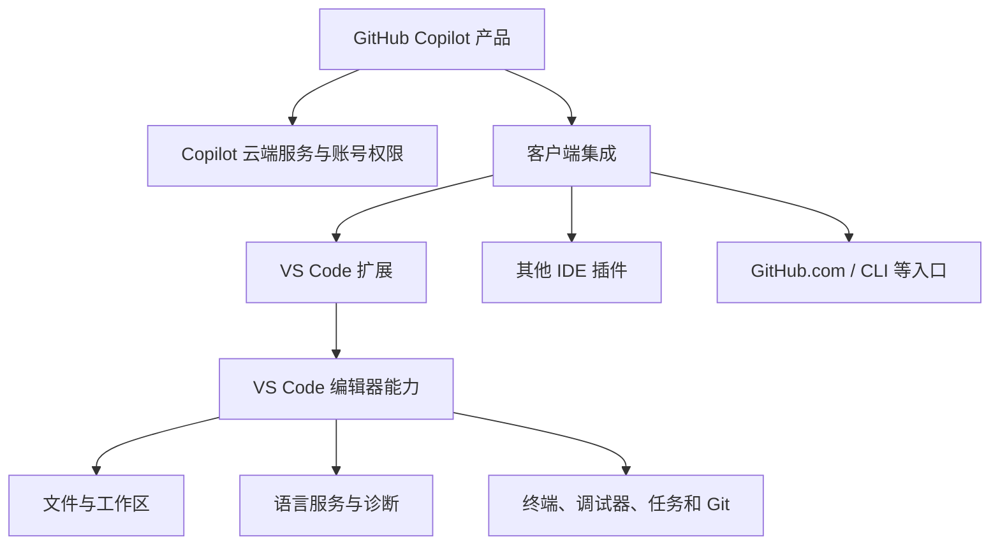
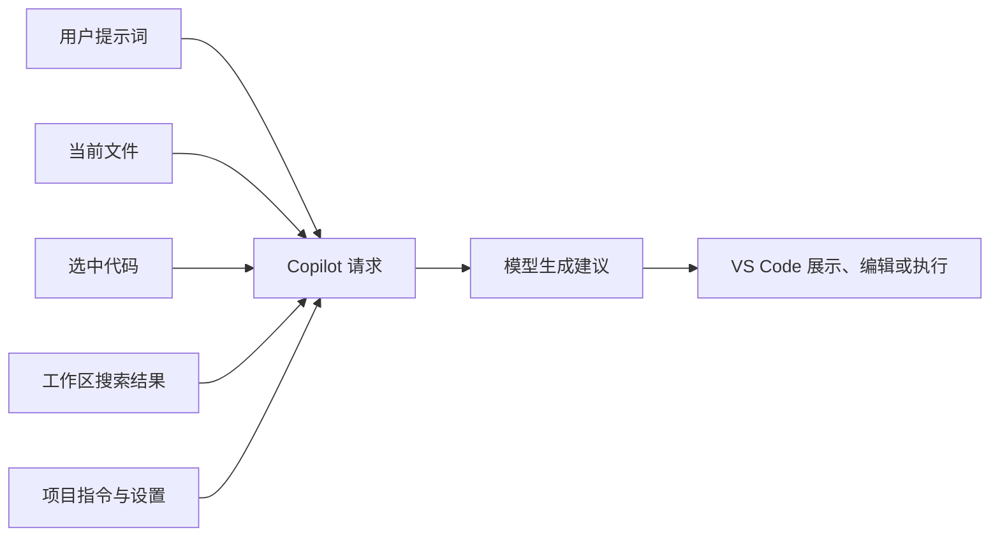
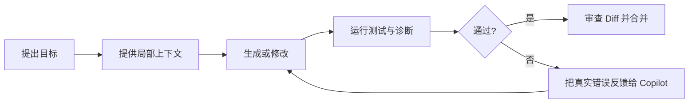

# GitHub Copilot 与 VS Code Copilot 使用区别指南

> **目标**：准确区分 GitHub Copilot 这一 AI 编程产品与 VS Code 中的 Copilot 使用体验，理解二者的关系、能力边界、账号权限和适用场景，建立一套可复用的选择与排错方法。

---

## 目录

1. [先给结论：它们到底是什么关系](#1先给结论它们到底是什么关系)
2. [概念拆解：产品、服务、扩展与编辑器](#2概念拆解产品服务扩展与编辑器)
3. [能力边界：哪些能力属于 Copilot，哪些属于 VS Code](#3能力边界哪些能力属于-copilot哪些属于-vs-code)
4. [功能对比：在 VS Code 中能做什么](#4功能对比在-vs-code-中能做什么)
5. [账号、订阅与组织管理](#5账号订阅与组织管理)
6. [上下文、指令与数据流](#6上下文指令与数据流)
7. [典型工作流：从补全到 Agent](#7典型工作流从补全到-agent)
8. [不同场景下如何选择](#8不同场景下如何选择)
9. [安装、配置与验证](#9安装配置与验证)
10. [常见误区与排错清单](#10常见误区与排错清单)
11. [团队落地建议](#11团队落地建议)
12. [速查表](#12速查表)

---

## 1. 先给结论：它们到底是什么关系

### 1.1 一句话说明

**GitHub Copilot 是产品和云端服务，VS Code Copilot 通常是指 GitHub Copilot 在 Visual Studio Code 中通过扩展和编辑器界面提供的使用体验。**

因此，二者通常不是两个互相竞争、需要二选一的 AI 产品：

```text
GitHub Copilot 产品与服务
    ├── VS Code 中的 Copilot 扩展与 Chat 界面
    ├── Visual Studio 中的 Copilot 体验
    ├── JetBrains IDE 中的 Copilot 插件
    ├── GitHub.com 上的 Copilot 能力
    └── 终端、移动端及其他支持的开发入口
```

### 1.2 为什么会出现“GitHub Copilot”和“VS Code Copilot”两个说法？

因为人们经常用不同层次的名称描述同一套体验：

| 说法 | 更准确的含义 | 关注重点 |
|------|--------------|----------|
| **GitHub Copilot** | GitHub 提供的 AI 编程产品、模型调用、订阅和组织管理体系 | 账号、套餐、策略、跨工具能力 |
| **VS Code Copilot** | Copilot 在 VS Code 中的集成方式和操作界面 | 编辑器、代码补全、Chat、Agent、扩展 |
| **Copilot Chat** | Copilot 的对话式功能 | 解释、生成、修改、规划和问答 |
| **Copilot Agent** | Copilot 的代理工作模式 | 多步骤执行、工具调用、终端和验证 |
| **GitHub Copilot CLI** | Copilot 的终端使用入口 | Shell 命令、仓库操作和终端工作流 |

### 1.3 最重要的判断

- 只有 VS Code，并不代表自动拥有 Copilot；通常仍需要安装相关扩展、登录账号并拥有可用权限。
- 有 GitHub Copilot 订阅，也不代表所有 VS Code 功能都一定可用；功能会受到套餐、组织策略、地区、版本和实验性设置影响。
- VS Code 是编辑器，Copilot 是 AI 服务与产品。VS Code 的调试器、语言服务器、Git 面板和任务系统本身不是 Copilot 提供的。
- Copilot 在 VS Code 中能够调用编辑器提供的上下文和工具，所以“同一个 Copilot”在不同客户端的操作方式和能力表现会不同。

---

## 2. 概念拆解：产品、服务、扩展与编辑器

### 2.1 四个层次

理解下面四层，可以避免大多数概念混淆：



**第一层：产品层**

GitHub Copilot 定义了产品品牌、订阅方案、模型访问、组织治理和跨客户端能力。

**第二层：服务层**

云端服务负责处理模型请求、身份认证、配额、策略和相关的隐私与数据控制。具体模型、限额和可用功能会随时间和套餐变化。

**第三层：客户端层**

VS Code 扩展把 Copilot 接入编辑器，负责收集适当的上下文、展示补全和聊天界面，并根据用户确认调用编辑器或终端工具。

**第四层：宿主能力层**

VS Code 自己提供文件系统访问、语言服务器、诊断、调试、任务、终端和源代码管理等能力。Copilot 可以在允许的情况下使用这些能力，但它们不属于 Copilot 产品本身。

### 2.2 类比理解

可以把它类比成：

```text
GitHub Copilot = 云端 AI 服务 + 产品账号 + 订阅和治理
VS Code       = 开发工作台
Copilot 扩展  = 把 AI 服务接入工作台的适配层
```

这个类比解释了为什么：

- 同一个 Copilot 账号可以在不同客户端使用，但界面和工具不同。
- 升级 VS Code 可能改变交互入口，但不等于升级了 Copilot 订阅。
- 更换模型或套餐可能改变回答与额度，但不等于更换了 VS Code。

---

## 3. 能力边界：哪些能力属于 Copilot，哪些属于 VS Code

### 3.1 责任边界表

| 能力或对象 | 主要归属 | 说明 |
|------------|----------|------|
| AI 代码补全 | Copilot + 客户端集成 | Copilot 生成建议，VS Code 负责在编辑器中呈现和接受 |
| Chat 问答 | Copilot + 客户端集成 | Copilot 负责生成回答，VS Code 提供文件、选择区和工作区上下文 |
| Agent 规划与工具调用 | Copilot Agent + VS Code 工具 | Copilot 决定下一步，VS Code 承载文件编辑、终端和诊断操作 |
| 语法高亮 | VS Code / 语言扩展 | 与是否订阅 Copilot 无关 |
| IntelliSense 类型补全 | VS Code 语言服务 / 语言扩展 | Copilot 补全和语言服务补全可以同时存在，但来源不同 |
| 编译、测试和调试 | VS Code、语言工具链和项目脚本 | Copilot 可以建议或运行命令，但不替代编译器和测试框架 |
| Git 提交与差异查看 | VS Code + Git | Copilot 可以生成提交信息或辅助操作，Git 仍负责版本控制 |
| 账号、订阅、组织政策 | GitHub | VS Code 不能决定用户是否有 Copilot 使用权限 |
| 模型可用性和配额 | GitHub Copilot 服务 | 客户端通常只能显示当前可用选项和状态 |

### 3.2 Copilot 不等于 IDE 全部智能功能

下面几类功能经常被误认为是 Copilot：

1. **语言服务器补全**：例如 TypeScript、Pylance、Java Language Server 提供的类型、符号和参数提示。
2. **代码诊断**：红色波浪线、类型错误、Lint 错误和编译错误主要由语言工具链产生。
3. **自动格式化**：Prettier、Black、Ruff、gofmt 等工具负责格式化。
4. **调试器**：断点、变量查看、调用栈和单步执行由调试适配器提供。
5. **Git 操作**：提交、分支、合并和冲突处理由 Git 与 VS Code Git 集成负责。

Copilot 可以解释这些结果、提出修复方案，甚至在 Agent 模式下执行命令，但它不会替代这些底层工具。

### 3.3 Copilot 的输出也不是编译结果

Copilot 生成的是概率性建议。即使代码看起来合理，也可能存在：

- 不符合当前项目 API 的调用
- 忽略边界条件或异常路径
- 与当前依赖版本不兼容
- 安全、性能或并发问题
- 没有同步修改调用方和测试

所以“Copilot 接受了代码”与“项目验证通过”是两件不同的事。可靠工作流必须包含编译、测试、Lint、Diff 审查和必要的人工判断。

---

## 4. 功能对比：在 VS Code 中能做什么

### 4.1 主要能力矩阵

| 功能 | GitHub Copilot 产品能力 | VS Code 中的具体体验 | 是否依赖 VS Code |
|------|-------------------------|----------------------|------------------|
| 内联补全 | 提供 AI 生成建议 | 在编辑器光标处显示灰色建议，按 `Tab` 接受 | 是，体验高度依赖编辑器 |
| Chat | 提供对话模型能力 | Chat 面板、内联 Chat、快速 Chat | 否，其他客户端也可能有类似入口 |
| 文件引用 | 提供上下文理解 | 使用当前文件、选择内容、`#file` 等引用 | 客户端决定具体语法 |
| 工作区理解 | 提供代码语义分析能力 | 通过 `@workspace`、搜索和相关文件获取项目上下文 | VS Code 提供工作区边界 |
| Edit | 提供代码变更生成 | 预览多文件 Diff，逐项接受或拒绝 | 是，VS Code 提供编辑器预览 |
| Agent | 提供任务规划和工具调用能力 | 读取文件、修改文件、运行终端、查看诊断并迭代 | 是，工具权限由宿主提供 |
| 代码解释 | 生成自然语言说明 | 解释选中代码、函数、错误和架构 | 否，但 VS Code 上下文更方便 |
| 测试辅助 | 生成和修复测试建议 | 读取测试文件并运行项目测试命令 | 运行结果由项目工具链提供 |
| 浏览器或调试辅助 | 取决于当前客户端和扩展能力 | 可结合浏览器工具、调试器和终端验证 | 部分依赖 VS Code 环境 |
| 组织策略 | 套餐和企业策略控制 | 客户端显示或执行允许的功能 | 否，策略来源于 GitHub |

### 4.2 三种常用交互模式

#### 内联补全：写一行，补下一段

适合低延迟、连续编码：

```text
你输入：function calculateTotal(items) {
Copilot：建议函数体和后续代码
你操作：Tab 接受，Esc 忽略，继续编辑
```

它通常最适合：

- 重复性代码
- 类型和参数已经明确的函数
- 测试样板、序列化代码和简单映射
- 根据已有注释生成局部实现

#### Chat：先问清楚，再决定是否修改

适合解释和局部决策：

```markdown
请解释当前函数的错误处理路径，并指出它在空数组和网络超时情况下的行为。
先不要修改文件。
```

Chat 的优势是可以明确限制范围，例如“只分析”“只给方案”“不要修改文件”。

#### Agent：把目标交给任务执行者

适合跨文件、多步骤工作：

```markdown
请分析现有认证流程，添加刷新令牌支持，更新相关 API、测试和文档。
先查看项目约定和测试命令，再制定计划；每次修改后运行最小相关测试。
```

Agent 可能会：

1. 搜索入口、路由、服务和测试。
2. 生成任务列表或实施计划。
3. 编辑多个文件。
4. 请求运行依赖安装、构建或测试命令。
5. 读取错误并继续修复。
6. 汇总修改内容和验证结果。

Agent 能力越强，越需要审查工具调用、Diff 和测试结果。自主执行不等于无需确认。

---

## 5. 账号、订阅与组织管理

### 5.1 三个身份不要混淆

使用 VS Code 中的 Copilot 时，至少要区分：

| 身份 | 作用 |
|------|------|
| VS Code 登录身份 | 访问编辑器同步、设置或扩展相关能力 |
| GitHub 登录身份 | 认证 GitHub Copilot 服务和相关账号权限 |
| 组织或企业身份 | 应用企业订阅、策略、模型、内容排除和审计规则 |

在个人环境中，这些身份可能由同一个人使用；在公司环境中，它们可能对应不同的组织和策略。

### 5.2 订阅决定“能不能用”，客户端决定“怎么用”

当 Copilot 功能不可用时，应按以下顺序判断：

```text
GitHub 账号是否正确
    ↓
账号是否有有效 Copilot 计划或组织席位
    ↓
组织是否允许该功能或模型
    ↓
VS Code 与 Copilot 扩展是否已更新并登录
    ↓
当前网络、代理和证书是否允许服务连接
    ↓
当前文件类型、工作区信任和设置是否满足条件
```

只升级 VS Code，不能解决账号没有席位的问题；只购买订阅，也不能修复扩展损坏或网络代理问题。

### 5.3 个人用户与组织用户

**个人使用**通常重点关注：

- 个人 GitHub 账号是否登录正确
- Copilot 计划是否有效
- 月度或模型相关配额
- 是否启用了所需的功能设置
- 代码和提示词是否包含不应发送的敏感信息

**组织使用**还要关注：

- 席位分配和成员离职回收
- 可用模型与功能策略
- 内容排除规则
- 企业数据、隐私和合规要求
- 审计、采购和合同约束
- 仓库可见性、组织权限和 SSO

组织策略优先级可能高于个人设置。遇到“别人能用、我不能用”，先检查席位和组织政策，不要直接判断为 VS Code 故障。

---

## 6. 上下文、指令与数据流

### 6.1 VS Code 为什么会让 Copilot 更懂当前代码？

Copilot 本身提供模型和服务，VS Code 可以提供更丰富的本地工作上下文：



常见上下文包括：

- 当前打开的文件和光标位置
- 当前选中的代码
- 相关文件、符号和工作区搜索结果
- 项目级 Copilot 指令
- 对话历史
- 终端输出和诊断信息
- 用户显式添加的文件、目录或代码引用

上下文越多不一定越好。无关文件、过长历史和模糊要求会降低输出的可控性。应优先提供能决定行为的文件、接口、测试和约束。

### 6.2 指令文件属于项目协作层，不是订阅配置

项目可以使用 `.github/copilot-instructions.md` 等文件描述：

- 构建和测试命令
- 目录与命名规范
- API 和数据库约定
- 安全边界
- 修改前后的验证要求
- 文档或发布流程

这些指令由客户端在适当场景下提供给 Copilot，不能替代 GitHub 管理员设置，也不会给账号增加套餐权限。

一个实用的项目指令示例：

```markdown
# 项目开发约定

- 修改 API 后运行 `pnpm test:api`。
- 优先复用 `src/services/` 中已有服务，不新增重复抽象。
- 涉及数据库结构时必须同时添加迁移和回滚说明。
- Agent 修改文件后先查看 Diff，再运行最小相关测试。
```

### 6.3 数据流的实际边界

在使用 Copilot 时应遵守组织的隐私和安全政策：

- 不要把密钥、令牌、生产数据库密码粘贴到提示词中。
- 不要因为 Agent 请求上下文就无差别附加整个仓库。
- 对包含客户信息、医疗信息、财务信息或内部凭证的文件设置适当排除策略。
- 检查组织关于代码、提示词、日志、模型训练和保留期限的规定。
- 对 Copilot 生成的第三方代码和许可证风险进行必要审查。

具体数据处理行为可能随产品、套餐、组织策略和时间变化。涉及合规的项目应以当前官方条款和管理员策略为准，而不是只依据旧教程。

---

## 7. 典型工作流：从补全到 Agent

### 7.1 小范围编码：使用内联补全

```text
1. 先写清函数名、参数类型和注释
2. 观察 Copilot 建议
3. 只接受理解并检查过的片段
4. 立即运行格式化、类型检查或单元测试
```

### 7.2 复杂问题分析：先用 Chat

```markdown
请只分析当前错误，不修改文件。
请说明：
1. 触发条件
2. 直接原因
3. 受影响的调用方
4. 最小修复方案
5. 应补充的测试
```

这样可以先建立共同理解，减少 Agent 在错误假设上连续修改多个文件。

### 7.3 跨文件功能：使用 Agent

```markdown
请在当前工作区实现订单取消功能。

约束：
- 先搜索已有订单状态和权限检查逻辑
- 保持现有 API 风格和错误格式
- 不修改数据库结构，除非现有模型无法支持
- 添加成功、重复取消、无权限和不存在订单的测试
- 修改后运行相关测试，并报告未运行的检查
```

### 7.4 失败后的闭环



关键是把真实的编译器、测试和运行时输出反馈给 Copilot，而不是只说“还是不对”。

---

## 8. 不同场景下如何选择

### 8.1 如果你的问题是“我要不要用 GitHub Copilot？”

这是产品、订阅和团队治理问题，应比较：

- 使用的 IDE 和终端入口
- 代码补全、Chat、Agent 的需求
- 个人或组织预算
- 隐私、合规和数据策略
- 可接受的模型、配额和网络条件
- 团队是否需要统一指令、审计和管理

### 8.2 如果你的问题是“我在 VS Code 里怎么用 Copilot？”

这是客户端工作流问题，应关注：

- 安装并登录 Copilot 扩展
- 选择 Ask、Edit 或 Agent 模式
- 使用文件、选择区和工作区上下文
- 配置项目级指令
- 审查工具调用和 Diff
- 运行项目自己的构建、测试和安全检查

### 8.3 场景选择表

| 任务 | 推荐入口 | 原因 |
|------|----------|------|
| 生成几行局部代码 | VS Code 内联补全 | 延迟低，干扰小 |
| 解释当前函数 | VS Code Chat | 可以直接使用当前文件和选区 |
| 设计模块边界 | Chat + 工作区搜索 | 先分析再修改，便于控制范围 |
| 跨文件实现功能 | VS Code Agent | 能连续读取、编辑和验证 |
| 查看 GitHub 上的仓库问题 | GitHub.com Copilot 能力 | 上下文在 GitHub 平台上 |
| 终端驱动的构建和发布 | CLI 或 VS Code Agent | 取决于团队的权限和审核流程 |
| 团队统一治理 | GitHub 组织管理 + 项目指令 | 分别控制平台政策和仓库约定 |

### 8.4 选择原则

```text
需要连续写代码       → 内联补全
需要理解和讨论       → Chat
需要谨慎生成变更     → Edit
需要跨文件完成任务   → Agent
需要统一组织治理     → GitHub 管理控制台
需要贴近终端工作流   → CLI 或 VS Code 终端
```

---

## 9. 安装、配置与验证

### 9.1 最小准备清单

1. 安装较新的 VS Code。
2. 安装 GitHub Copilot 和 Copilot Chat 相关扩展；扩展拆分和名称可能随版本调整。
3. 在 VS Code 中登录正确的 GitHub 账号。
4. 确认账号有个人计划或组织席位。
5. 打开一个受信任的项目工作区。
6. 确认项目本身可以运行基础命令，例如构建、测试或类型检查。

### 9.2 五分钟验证流程

```markdown
1. 在一个普通源文件中输入函数声明，确认出现内联建议。
2. 选中一个函数，请 Copilot 解释它，确认 Chat 能读取选区。
3. 让 Chat 只分析一个明确的错误，确认不会误改文件。
4. 对一个小任务使用 Edit 或 Agent，先查看生成的 Diff。
5. 运行项目已有的最小测试，确认 Copilot 之外的工具链正常。
```

### 9.3 建议的基础设置检查项

设置名称会随 VS Code 和扩展版本变化，建议通过设置搜索框搜索 `Copilot`、`Chat`、`inline suggest` 和 `editor`，重点检查：

- 是否启用内联建议
- 是否允许当前语言使用 Copilot
- 是否启用或禁用特定 Chat 功能
- 是否处于受信任工作区
- 是否配置代理、证书或企业网络
- 是否有内容排除或组织策略影响当前文件

不要直接复制旧教程中的完整 `settings.json`。先确认当前版本实际提供的设置名称和说明。

---

## 10. 常见误区与排错清单

### 10.1 “我安装了 VS Code，为什么没有 Copilot？”

VS Code 本身不自动等于 Copilot。检查：

- Copilot 扩展是否安装并启用
- 是否登录 GitHub，而不是只登录了 VS Code 同步账号
- 账号是否有有效计划或组织席位
- 扩展是否被组织策略禁用

### 10.2 “我有 Copilot 订阅，为什么 VS Code 里不能用？”

按四层排查：

```text
账号与席位 → 组织策略 → 扩展与 VS Code 版本 → 网络和工作区设置
```

先查看 Copilot 状态图标、扩展输出日志和登录账号，再决定是否重装。重装扩展无法修复账号席位或组织策略问题。

### 10.3 “VS Code 的灰色补全和 Copilot 建议冲突了”

可能同时存在：

- Copilot 内联建议
- 语言服务器补全
- 其他代码补全扩展

应分别确认建议来源，必要时逐个暂时禁用扩展进行对比。不要把语言服务器关闭作为长期方案，因为类型和符号能力通常仍然需要它。

### 10.4 “Agent 改了很多文件，但功能仍然不对”

常见原因是：

- 目标和验收标准不明确
- 没有指定现有模式或限制修改范围
- Agent 没有运行正确的测试命令
- 测试本身没有覆盖真实业务路径
- 只检查了 Diff，没有检查运行结果

修复方式是缩小任务、提供真实错误、明确测试命令和成功标准，并在每个阶段检查 Diff。

### 10.5 “Copilot 说测试通过，但我找不到证据”

要求它报告：

- 实际执行的完整命令
- 命令退出状态
- 测试数量和失败数量
- 未执行的检查
- 环境限制或跳过原因

最终以终端输出、CI 结果和项目工具链为准，不以自然语言总结代替证据。

### 10.6 “为什么不同人的 Copilot 表现不一样？”

可能不同于：

- Copilot 计划或组织席位
- 可选模型和配额
- VS Code、扩展和语言插件版本
- 项目指令和工作区上下文
- 账号权限、代理和网络
- 提示词、打开的文件和对话历史

团队排查时，应先固定版本、仓库、分支、指令文件、任务描述和测试命令，再比较结果。

---

## 11. 团队落地建议

### 11.1 把三类规则分开维护

| 规则类型 | 放在哪里 | 示例 |
|----------|----------|------|
| 平台和账号治理 | GitHub 组织或企业设置 | 席位、模型、隐私、内容排除 |
| 仓库开发约定 | `.github/copilot-instructions.md` 等 | 测试命令、目录结构、代码风格 |
| 任务临时要求 | 当前 Chat 提示词 | 本次功能范围、验收标准、禁止修改的文件 |

不要把组织政策全部写进项目指令，也不要把一次性任务要求永久写入全局设置。

### 11.2 为 Agent 规定最低验收标准

建议团队要求每个 Agent 任务至少报告：

1. 修改了哪些文件以及为什么。
2. 执行了哪些命令。
3. 哪些测试、构建或检查通过。
4. 哪些检查没有执行以及原因。
5. 还存在什么风险、假设或需要人工确认的内容。

### 11.3 建立“人审边界”

以下变更不应只依赖 Copilot 自动接受：

- 身份认证、授权和支付逻辑
- 数据库迁移和删除数据的操作
- 密钥、凭证和生产配置
- 公共 API 的兼容性变更
- 依赖升级和许可证敏感代码
- 部署、CI/CD 和基础设施变更

Copilot 可以帮助分析和生成方案，但高风险变更仍需人工审查、自动化测试和必要的审批流程。

### 11.4 推荐的团队工作流

```text
GitHub 管理员：配置账号、套餐、组织政策和数据边界
项目维护者：维护项目指令、构建命令和测试入口
开发者：在 VS Code 中使用补全、Chat、Edit 和 Agent
审查者：检查 Diff、测试证据、安全性和需求覆盖
CI：重新执行不可由本地 Copilot 代替的质量门禁
```

---

## 12. 速查表

### 12.1 概念速查

| 你的问题 | 应该看哪里 |
|----------|------------|
| Copilot 是什么产品？ | GitHub Copilot 的产品、套餐和组织管理 |
| VS Code 里的 Copilot 是什么？ | Copilot 扩展提供的编辑器集成体验 |
| 为什么没有权限？ | GitHub 账号、计划、席位和组织策略 |
| 为什么没有补全？ | VS Code 设置、扩展状态、语言范围和网络 |
| 为什么 Agent 改错了？ | 上下文、任务边界、工具调用、测试和 Diff |
| 谁负责编译和测试？ | 项目工具链、VS Code 任务和 CI |
| 谁负责代码审查？ | 开发者、审查者和团队质量流程 |

### 12.2 最短工作口诀

```text
GitHub Copilot 管“服务、账号和治理”
VS Code 管“编辑器、上下文和工具”
内联补全管“写得快”
Chat 管“想得清”
Agent 管“做得多”
测试和审查管“交付可靠”
```

### 12.3 最终结论

把 GitHub Copilot 和 VS Code Copilot 当成两个完全独立的产品，会导致错误的安装、订阅和排错判断。更准确的理解是：**GitHub Copilot 提供 AI 编程服务和产品能力，VS Code 提供其中一种深度集成的开发工作台体验。**

当你需要判断某个问题由谁负责时，可以先问：它属于“账号与服务”“编辑器与上下文”还是“项目工具链”？这个三分法通常能快速定位问题，也能帮助团队把平台治理、项目约定和开发者操作分开管理。

---

## 参考资源

- [GitHub Copilot 官方文档](https://docs.github.com/copilot)
- [Visual Studio Code Copilot 概览](https://code.visualstudio.com/docs/copilot/overview)
- [Visual Studio Code Copilot Chat](https://code.visualstudio.com/docs/copilot/chat/copilot-chat)
- [Visual Studio Code 自定义指令](https://code.visualstudio.com/docs/copilot/customization/overview)

> 产品名称、套餐、模型、设置项和功能入口会持续更新。涉及账号权限、组织政策、隐私和合规的结论，应以当前 GitHub 与 VS Code 官方文档及组织管理员配置为准。