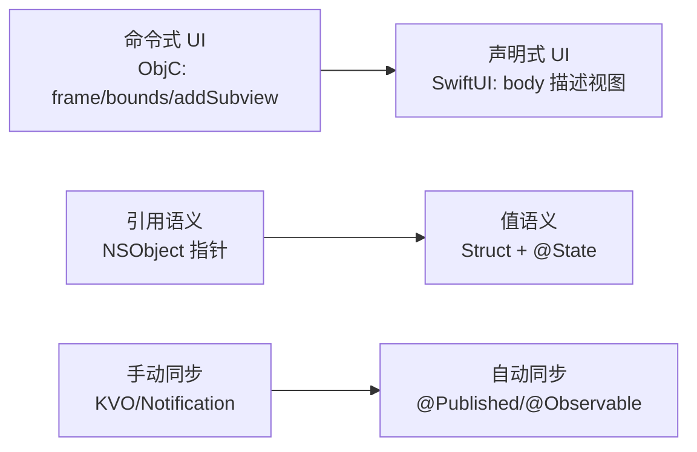

# SwiftUI 5 macOS 开发专家指南

> **目标读者**：具有 macOS/iOS Objective-C 开发经验，但无 SwiftUI 经验的工程师
> **目标**：从零到一成为 SwiftUI 5 + AppKit 桥接 + GRDB.swift 全栈 macOS 开发专家
> **版本**：v1.0 | 2026 年 6 月
> **技术栈**：SwiftUI 5 · AppKit 桥接 · GRDB.swift · Swift Package Manager · Sparkle 2

---

## 目录

1. [前言：从 ObjC 到 SwiftUI —— 你的转型优势](#1-前言从-objc-到-swiftui--你的转型优势)
2. [Swift 语言速成：ObjC 开发者视角](#2-swift-语言速成objc-开发者视角)
3. [SwiftUI 5 核心心智模型](#3-swiftui-5-核心心智模型)
4. [视图与布局系统深度解析](#4-视图与布局系统深度解析)
5. [状态管理与数据流](#5-状态管理与数据流)
6. [导航与窗口管理](#6-导航与窗口管理)
7. [SwiftUI 5 新特性全景](#7-swiftui-5-新特性全景)
8. [AppKit 桥接实战完全指南](#8-appkit-桥接实战完全指南)
9. [GRDB.swift 数据库层精讲](#9-grdbswift-数据库层精讲)
10. [Swift Package Manager 包管理专家篇](#10-swift-package-manager-包管理专家篇)
11. [Sparkle 2 自动更新框架](#11-sparkle-2-自动更新框架)
12. [网络层与数据获取](#12-网络层与数据获取)
13. [Swift Concurrency：async/await 与 Actors](#13-swift-concurrencyasyncawait-与-actors)
14. [Combine 框架与响应式编程](#14-combine-框架与响应式编程)
15. [测试策略与工程质量](#15-测试策略与工程质量)
16. [性能优化与 Instruments](#16-性能优化与-instruments)
17. [架构模式与项目组织](#17-架构模式与项目组织)
18. [macOS 特有功能集成](#18-macos-特有功能集成)
19. [SwiftData 与 Core Data 演进](#19-swiftdata-与-core-data-演进)
20. [Xcode 工作流与调试进阶](#20-xcode-工作流与调试进阶)
    - [20.5 SwiftUI 项目结构 vs 传统 ObjC 项目](#205-swiftui-项目结构-vs-传统-objc-项目)
21. [Fastlane 与 App Store 发布](#21-fastlane-与-app-store-发布)
22. [实战：构建完整 macOS 待办应用](#22-实战构建完整-macos-待办应用)
23. [附录A：ObjC → Swift/SwiftUI 速查表](#23-附录aobjc--swiftswiftui-速查表)
24. [附录B：大企业面试题精编](#24-附录b大企业面试题精编)

---

## 1. 前言：从 ObjC 到 SwiftUI —— 你的转型优势

### 1.1 你的背景资产

作为 macOS/iOS Objective-C 开发者，你不是从零开始。以下是你已经掌握、可以直接迁移的知识资产：

| 已有 ObjC 能力 | 在 SwiftUI/Swift 中的映射 | 迁移难度 |
|:---|:---|:---:|
| MVC 架构思维 | MVVM + `@Observable` / `@StateObject` | ⭐⭐ |
| delegate 回调模式 | Closure / Combine Publisher / async 回调 | ⭐ |
| KVO 观察者 | `@Published` + `onReceive` / Combine | ⭐ |
| `NSNotificationCenter` | Combine `NotificationCenter.Publisher` | ⭐ |
| GCD / `dispatch_async` | `Task { }` / `async/await` / Actors | ⭐⭐ |
| `NSOperationQueue` | `OperationQueue` (Swift 原生) + `TaskGroup` | ⭐ |
| Core Data 栈 | SwiftData / GRDB.swift / Core Data with `@FetchRequest` | ⭐⭐⭐ |
| `NSView` / `UIView` 体系 | SwiftUI `View` protocol + `NSViewRepresentable` | ⭐⭐⭐⭐ |
| Auto Layout / frame 布局 | SwiftUI 声明式布局：`HStack` / `VStack` / `Grid` | ⭐⭐⭐ |
| `NSViewController` 生命周期 | `@Environment(\.scenePhase)` / `onAppear` / `onDisappear` | ⭐⭐ |
| `NSUserDefaults` | `@AppStorage` | ⭐ |

### 1.2 核心范式转变

从 ObjC 到 SwiftUI，你需要完成三个心智模型的转变：



### 1.3 SwiftUI 5 生态系统全景

```
┌─────────────────────────────────────────────────────────┐
│                   SwiftUI 5 App                          │
├─────────────────────────────────────────────────────────┤
│  UI 层        │ SwiftUI Views · AppKit Bridge · Charts  │
├───────────────┼─────────────────────────────────────────┤
│  状态管理     │ @State · @Binding · @Observable · TCA   │
├───────────────┼─────────────────────────────────────────┤
│  数据层       │ GRDB.swift · SwiftData · Core Data      │
├───────────────┼─────────────────────────────────────────┤
│  网络/并发    │ URLSession · AsyncAlgorithms · Combine  │
├───────────────┼─────────────────────────────────────────┤
│  基础设施     │ SPM · Sparkle 2 · Fastlane · Xcode      │
└─────────────────────────────────────────────────────────┘
```

---

## 2. Swift 语言速成：ObjC 开发者视角

### 2.1 类型系统对比

**从 `NSObject` 到值类型**

```swift
// ObjC: 一切皆 NSObject 子类
@interface Person : NSObject
@property (nonatomic, copy) NSString *name;
@property (nonatomic, assign) NSInteger age;
@end

// Swift: 优先使用 Struct（值类型）
struct Person {
    let name: String
    var age: Int
}

// Struct = 值语义：每次赋值/传参会复制
var p1 = Person(name: "Alice", age: 30)
var p2 = p1              // p2 是 p1 的独立副本
p2.age = 31              // p1.age 仍然是 30
```

### 2.2 Optional：告别 nil 崩溃

```swift
// ObjC: nil 消息发送不崩溃，但容易产生未定义行为
NSString *name = nil;
NSLog(@"%lu", [name length]); // 输出 0，很难调试

// Swift: 可选类型，编译期保证安全
var name: String? = nil

// 安全的链式调用
let count = name?.count    // 返回 nil，类型是 Int?

// 强制解包（危险，类似 ObjC 的不做 nil 检查）
// let count = name!.count  // 崩溃！

// nil 合并运算符
let displayName = name ?? "Unknown"   // "Unknown"

// if-let 安全解包
if let unwrappedName = name {
    print(unwrappedName.count)
}

// guard-let 提前退出
func process(name: String?) {
    guard let name = name else {
        print("name 不能为空")
        return
    }
    // 此后 name 是 String，不是 String?
    print(name.uppercased())
}
```

### 2.3 协议（Protocol）vs ObjC Protocol

```swift
// ObjC: Protocol 只是方法声明
// Swift: Protocol 可以包含默认实现（Protocol Extension）

protocol Identifiable {
    var id: String { get }
    func displayName() -> String
}

// 协议扩展提供默认实现 —— ObjC 没有这个能力
extension Identifiable {
    func displayName() -> String {
        return "ID: \(id)"
    }
}

struct User: Identifiable {
    let id: String
    let name: String

    // 可以覆写默认实现
    func displayName() -> String {
        return name
    }
}

// 面向协议编程（POP）的核心：通过协议组合行为
protocol Flyable {
    func fly()
}
protocol Swimmable {
    func swim()
}
struct Duck: Flyable, Swimmable {
    func fly() { print("Duck flying") }
    func swim() { print("Duck swimming") }
}
```

### 2.4 闭包 vs Block

```swift
// ObjC Block
void (^completion)(BOOL success) = ^(BOOL success) {
    NSLog(@"done");
};

// Swift Closure
let completion: (Bool) -> Void = { success in
    print("done")
}

// 尾随闭包语法（Swift 特有）
func fetch(completion: (Bool) -> Void) {
    completion(true)
}

fetch { success in
    print("fetched: \(success)")
}

// 捕获列表（对应 ObjC 的 __weak dance）
class ViewController {
    func setup() {
        Network.fetch { [weak self] result in
            guard let self = self else { return }
            self.updateUI(with: result)
        }
    }
}
```

### 2.5 枚举 vs ObjC NS_ENUM

```swift
// Swift 枚举 = ObjC 枚举 + 关联值 + 模式匹配
enum Result<T, E: Error> {
    case success(T)
    case failure(E)
}

let result: Result<Data, Error> = .success(data)

// switch 是穷尽的（编译器会检查所有 case）
switch result {
case .success(let data):
    print("Got \(data.count) bytes")
case .failure(let error):
    print("Error: \(error)")
}

// 带原始值的枚举 = ObjC NS_ENUM
enum HTTPStatus: Int {
    case ok = 200
    case notFound = 404
    case serverError = 500
}

// 可选值本质是枚举！
// Optional<T> = .some(T) | .none
```

### 2.6 属性包装器（Property Wrapper）的概念预览

在深入 SwiftUI 之前，理解属性包装器至关重要——它是 SwiftUI 状态管理的基石：

```swift
// @ 开头的都是属性包装器
@State private var count = 0        // 视图内部状态
@Binding var isPresented: Bool      // 双向绑定
@Environment(\.colorScheme) var cs  // 环境值注入

// 本质上，属性包装器就是一个带 wrappedValue 的 struct
@propertyWrapper
struct Clamped<Value: Comparable> {
    private var value: Value
    let range: ClosedRange<Value>

    var wrappedValue: Value {
        get { value }
        set { value = min(max(newValue, range.lowerBound), range.upperBound) }
    }

    init(wrappedValue: Value, _ range: ClosedRange<Value>) {
        self.range = range
        self.value = min(max(wrappedValue, range.lowerBound), range.upperBound)
    }
}

// 使用
@Clamped(0...100) var percentage = 50
percentage = 150          // 实际会被限制为 100
```

---

## 3. SwiftUI 5 核心心智模型

### 3.1 View 协议：一切皆视图描述

SwiftUI 的核心不是「视图对象」，而是「视图描述」——`body` 属性返回的是对 UI 的声明式描述，而非一个实际的 view 实例：

```swift
// SwiftUI 的 View 是一个协议，不是类！
public protocol View {
    associatedtype Body: View
    @ViewBuilder var body: Self.Body { get }
}

// 你的视图是这个协议的具体实现
struct ContentView: View {
    var body: some View {   // some View = 不透明返回类型
        VStack {
            Text("Hello, SwiftUI!")
                .font(.largeTitle)
                .foregroundColor(.blue)
            Button("Tap Me") {
                print("Tapped")
            }
        }
        .padding()
    }
}
```

### 3.2 声明式 vs 命令式

| 对比维度 | ObjC 命令式 | SwiftUI 声明式 |
|:---|:---|:---|
| 创建视图 | `[[UILabel alloc] initWithFrame:...]` | `Text("Hello")` |
| 设置属性 | `label.textColor = .blue` | `.foregroundColor(.blue)` |
| 添加子视图 | `[view addSubview:label]` | 嵌套在 body 中 |
| 更新 UI | 手动调用 setter 或 `setNeedsDisplay` | 修改 `@State`，自动重绘 |
| 条件显示 | `label.hidden = YES` | `if condition { Text(...) }` |
| 列表 | `UITableViewDataSource` | `List(data) { item in ... }` |

### 3.3 ViewBuilder：组合视图的 DSL

```swift
// @ViewBuilder 让你在 body 中像写普通代码一样组合视图
@ViewBuilder
func greeting(isLoggedIn: Bool) -> some View {
    if isLoggedIn {
        Text("Welcome back!")
        Divider()
        DashboardView()
    } else {
        LoginButton()
    }
}

// 本质上，@ViewBuilder 将多个 View 语句转换成 TupleView 或 _ConditionalContent
// 你不需要手动理解这些内部类型，但要知道：
// SwiftUI 最多支持 10 个直接子视图（TupleView<T0, T1, ..., T9>）
// 超过 10 个需要用 Group 包裹
```

### 3.4 Modifier 链：视图修饰的本质

```swift
// 每个 modifier 返回一个新的 View 结构体
Text("Hello")
    .font(.title)          // 返回 ModifiedContent<Text, _FontModifier>
    .foregroundColor(.red) // 返回 ModifiedContent<...>
    .padding()             // 返回 ModifiedContent<...>

// Modifier 顺序很重要！
Text("Hello")
    .padding()              // 先 padding
    .background(.blue)      // 背景覆盖 padding 区域

Text("Hello")
    .background(.blue)      // 先背景（只覆盖文本区域）
    .padding()              // 后 padding（透明的）
```

### 3.5 视图标识与 diffing

```swift
// SwiftUI 使用 view identity 来决定更新、移除还是动画过渡

// 显式标识：ForEach 的 id
ForEach(items, id: \.id) { item in
    ItemRow(item: item)
}

// 隐式标识：视图在视图树中的位置
// 问题：条件渲染会导致隐式标识变化
// 解决：使用 transition 或显式 id
```

---

## 4. 视图与布局系统深度解析

### 4.1 布局三步骤

SwiftUI 的布局算法是三步协商式协议，理解它能写出高性能 UI：

```swift
// 第一步：父视图提议（propose）尺寸给子视图
// 第二步：子视图根据提议返回自己的尺寸
// 第三步：父视图将子视图放在自己坐标系的某个位置

// 用 Layout 协议实现自定义布局（iOS 16+ / macOS 13+）
struct EqualWidthLayout: Layout {
    func sizeThatFits(proposal: ProposedViewSize, subviews: Subviews, cache: inout ()) -> CGSize {
        let maxWidth = subviews.map { $0.sizeThatFits(.unspecified).width }.max() ?? 0
        let totalHeight = subviews.map { $0.sizeThatFits(.init(width: maxWidth, height: nil)).height }.reduce(0, +)
        return CGSize(width: maxWidth, height: totalHeight)
    }

    func placeSubviews(in bounds: CGRect, proposal: ProposedViewSize, subviews: Subviews, cache: inout ()) {
        var y = bounds.minY
        let maxWidth = subviews.map { $0.sizeThatFits(.unspecified).width }.max() ?? 0
        for subview in subviews {
            let size = subview.sizeThatFits(.init(width: maxWidth, height: nil))
            subview.place(at: CGPoint(x: bounds.midX - size.width / 2, y: y), proposal: .init(size))
            y += size.height
        }
    }
}
```

### 4.2 核心布局容器

```swift
// HStack: 水平排列
HStack(alignment: .center, spacing: 8) {
    Image(systemName: "person.circle")
        .font(.largeTitle)
    VStack(alignment: .leading) {
        Text("John Doe")
            .font(.headline)
        Text("john@example.com")
            .font(.subheadline)
            .foregroundColor(.secondary)
    }
}

// LazyVStack: 延迟加载（类似 UITableView 复用机制）
ScrollView {
    LazyVStack {
        ForEach(0..<10000) { i in
            Text("Row \(i)")
                .frame(height: 44)
        }
    }
}

// Grid: iOS 16+ / macOS 13+ 的网格布局
Grid(horizontalSpacing: 10, verticalSpacing: 10) {
    GridRow {
        Text("Name")
            .gridColumnAlignment(.trailing)
        TextField("Enter name", text: $name)
    }
    GridRow {
        Text("Email")
        TextField("Enter email", text: $email)
    }
}

// ViewThatFits: 自动选择最适合的视图变体
ViewThatFits(in: .horizontal) {
    HStack { icon; longLabel }     // 首选：水平布局
    VStack { icon; shortLabel }    // 备选：垂直布局
    iconOnly                        // 最小：只显示图标
}
```

### 4.3 Frame 与布局优先级

```swift
// frame 不是 ObjC 的直接 frame 设置，而是「提案修改器」
Text("Hello")
    .frame(width: 200, height: 100)    // 提议 200x100
    .background(.yellow)

// layoutPriority 控制空间分配
HStack {
    Text("Short")
        .layoutPriority(1)       // 优先满足它的尺寸
    Text("Long text that might be truncated...")
        .layoutPriority(0)       // 在空间不足时先被截断
}
```

### 4.4 GeometryReader 与坐标空间

```swift
// GeometryReader: 获取父视图分配的尺寸
GeometryReader { geometry in
    Rectangle()
        .fill(.blue)
        .frame(
            width: geometry.size.width * 0.8,
            height: geometry.size.height * 0.8
        )
        .position(x: geometry.size.width / 2, y: geometry.size.height / 2)
}

// 自定义坐标空间
ScrollView {
    GeometryReader { geo in
        let offset = geo.frame(in: .named("scroll")).minY
        Text("Offset: \(offset)")
            .foregroundColor(offset < 0 ? .red : .green)
    }
    .frame(height: 100)
}
.coordinateSpace(name: "scroll")
```

### 4.5 Safe Area 与 IgnoresSafeArea

```swift
// macOS 上 Safe Area 的处理与 iOS 类似，但通常更简单
VStack {
    // 内容
}
.ignoresSafeArea(.all)      // 扩展到整个窗口
// macOS 常用：.ignoresSafeArea(.containerRelative)
```

---

## 5. 状态管理与数据流

### 5.1 状态属性包装器全景对比

| 属性包装器 | 用途 | 存储位置 | 作用域 |
|:---|:---|:---|:---|
| `@State` | 视图私有状态 | View 内部 | 当前 View |
| `@Binding` | 读写外部状态 | 外部 | 父传子 |
| `@StateObject` | 创建并持有 ObservableObject | View 内部 | 当前 View |
| `@ObservedObject` | 观察外部 ObservableObject | 外部传入 | 子 View |
| `@EnvironmentObject` | 从环境获取 ObservableObject | 环境 | 视图树 |
| `@Environment` | 读取系统/自定义环境值 | 环境 | 视图树 |
| `@AppStorage` | UserDefaults 绑定 | 磁盘 | 全局 |
| `@SceneStorage` | 场景级别的持久化 | 磁盘 | 当前 Scene |
| `@FetchRequest` | Core Data 查询 | 内存+磁盘 | 当前 View |
| `@Query` | SwiftData 查询 | 内存+磁盘 | 当前 View |

### 5.2 @State 与 @Binding：最基础的搭档

```swift
struct ParentView: View {
    @State private var text = ""          // 数据源

    var body: some View {
        ChildView(text: $text)            // $ 获取 Binding
    }
}

struct ChildView: View {
    @Binding var text: String             // 读写接口

    var body: some View {
        TextField("Enter text", text: $text)
    }
}
```

### 5.3 ObservableObject 与 @StateObject（传统方案）

```swift
// 定义一个可观察的数据模型
class UserViewModel: ObservableObject {
    @Published var name = "Alice"         // @Published 自动通知变更
    @Published var age = 30
    @Published private(set) var isLoading = false

    var displayName: String {             // 计算属性
        "\(name) (\(age))"
    }

    func fetch() {
        isLoading = true
        // async work...
        isLoading = false
    }
}

struct UserProfile: View {
    @StateObject private var viewModel = UserViewModel() // 创建并持有

    var body: some View {
        VStack {
            Text(viewModel.displayName)
            TextField("Name", text: $viewModel.name)   // 注意不能直接 $viewModel.name
            Button("Fetch") { viewModel.fetch() }
        }
    }
}

// 如果 viewModel 从外部传入
struct UserDetail: View {
    @ObservedObject var viewModel: UserViewModel    // 不持有

    var body: some View {
        Text(viewModel.displayName)
    }
}
```

### 5.4 @Observable 宏：iOS 17+ / macOS 14+ 新方式

```swift
import Observation

@Observable                           // 零开销的宏，替代 ObservableObject
class UserViewModel {
    var name = "Alice"                // 不需要 @Published
    var age = 30
    fileprivate var isLoading = false // fileprivate 不触发观察

    var displayName: String {
        "\(name) (\(age))"
    }
}

struct UserProfile: View {
    @State private var viewModel = UserViewModel()  // 注意是 @State 不是 @StateObject

    var body: some View {
        VStack {
            Text(viewModel.displayName)
            TextField("Name", text: $viewModel.name)  // 现在可以 $ 绑定
        }
    }
}

// 观察粒度更细：只重绘使用了变化属性的视图
```

### 5.5 @Environment 与自定义环境值

```swift
// 系统环境值
struct MyView: View {
    @Environment(\.colorScheme) var colorScheme
    @Environment(\.locale) var locale
    @Environment(\.managedObjectContext) var moc  // Core Data
    @Environment(\.modelContext) var modelContext  // SwiftData

    var body: some View {
        Text(colorScheme == .dark ? "Dark Mode" : "Light Mode")
    }
}

// 自定义环境值
struct ThemeKey: EnvironmentKey {
    static let defaultValue = Theme.light
}

extension EnvironmentValues {
    var theme: Theme {
        get { self[ThemeKey.self] }
        set { self[ThemeKey.self] = newValue }
    }
}

// 使用
ContentView()
    .environment(\.theme, .dark)     // 注入到整个视图树
```

### 5.6 TCA（The Composable Architecture）简介

对于复杂应用，Apple 官方风格的 `@Observable` 可能在深层依赖管理上不够用。TCA 是 Point-Free 出品的函数式架构：

```swift
// TCA 核心理念：State, Action, Reducer 三元组
import ComposableArchitecture

@Reducer
struct CounterFeature {
    @ObservableState
    struct State: Equatable {
        var count = 0
        var isLoading = false
    }

    enum Action {
        case incrementButtonTapped
        case decrementButtonTapped
        case fetchFact
        case factResponse(String)
    }

    @Dependency(\.numberFact) var numberFact   // 依赖注入

    var body: some Reducer<State, Action> {
        Reduce { state, action in
            switch action {
            case .incrementButtonTapped:
                state.count += 1
                return .none
            case .fetchFact:
                state.isLoading = true
                return .run { [count = state.count] send in
                    let fact = try await numberFact.fetch(count)
                    await send(.factResponse(fact))
                }
            case let .factResponse(fact):
                state.isLoading = false
                // display fact
                return .none
            }
        }
    }
}
```

---

## 6. 导航与窗口管理

### 6.1 NavigationStack：iOS 16+ / macOS 13+ 新导航

```swift
struct ContentView: View {
    @State private var path = NavigationPath()

    var body: some View {
        NavigationStack(path: $path) {
            List(items) { item in
                NavigationLink(value: item) {
                    ItemRow(item: item)
                }
            }
            .navigationDestination(for: Item.self) { item in
                ItemDetail(item: item)
            }
            .navigationTitle("Items")
            .toolbar {
                ToolbarItem {
                    Button("Deep Link") {
                        path.append(items.first!)
                        path.append(items.last!)
                    }
                }
            }
        }
    }
}
```

### 6.2 macOS 多窗口管理

```swift
@main
struct MyApp: App {
    var body: some Scene {
        // 主窗口
        Window("Main", id: "main") {
            ContentView()
        }
        .defaultSize(width: 800, height: 600)
        .windowResizability(.contentMinSize)

        // 设置窗口
        Settings {
            SettingsView()
        }
        .windowResizability(.contentSize)

        // 工具窗口
        Window("Inspector", id: "inspector") {
            InspectorView()
        }
        .defaultPosition(.trailing)

        // 菜单命令
        .commands {
            CommandGroup(replacing: .newItem) {
                Button("New Document") {
                    // open new window
                }
                .keyboardShortcut("n")
            }
            SidebarCommands()
        }
    }
}

// 使用 openWindow 环境值打开窗口
struct ContentView: View {
    @Environment(\.openWindow) var openWindow

    var body: some View {
        Button("Open Inspector") {
            openWindow(id: "inspector")
        }
    }
}
```

### 6.3 Sheet / Popover / Alert

```swift
struct DetailView: View {
    @State private var showSheet = false
    @State private var showPopover = false
    @State private var showAlert = false
    @State private var item: Item?

    var body: some View {
        VStack {
            // Sheet（模态）
            Button("Show Sheet") { showSheet = true }
                .sheet(isPresented: $showSheet) {
                    SheetContent()
                        .frame(minWidth: 400, minHeight: 300)
                }

            // Sheet 带数据
            Button("Show Item") { item = Item(name: "Test") }
                .sheet(item: $item) { item in
                    ItemSheet(item: item)
                }

            // Popover（浮动弹窗）
            Button("Show Popover") { showPopover = true }
                .popover(isPresented: $showPopover) {
                    PopoverContent()
                }

            // Alert
            Button("Show Alert") { showAlert = true }
                .alert("Title", isPresented: $showAlert) {
                    Button("OK") { }
                    Button("Cancel", role: .cancel) { }
                } message: {
                    Text("This is a message")
                }
        }
    }
}
```

### 6.4 TabView 与侧边栏

```swift
// macOS 侧边栏风格（NavigationSplitView）
struct SidebarView: View {
    @State private var selection: Panel? = .dashboard

    var body: some View {
        NavigationSplitView {
            List(Panel.allCases, selection: $selection) { panel in
                Label(panel.title, systemImage: panel.icon)
            }
            .navigationSplitViewColumnWidth(min: 180, ideal: 200)
        } detail: {
            switch selection {
            case .dashboard: DashboardView()
            case .settings:  SettingsView()
            case nil:        Text("Select an item")
            }
        }
    }
}
```

---

## 7. SwiftUI 5 新特性全景

### 7.1 自定义动画与 PhaseAnimator

```swift
// PhaseAnimator: 多阶段动画（iOS 17+ / macOS 14+）
struct AnimatedBadge: View {
    @State private var isAnimating = false

    var body: some View {
        PhaseAnimator([0, 1, 2], trigger: isAnimating) { phase in
            Circle()
                .fill(phase == 0 ? .blue : phase == 1 ? .green : .orange)
                .scaleEffect(phase == 0 ? 1.0 : phase == 1 ? 1.2 : 0.8)
                .frame(width: 50, height: 50)
        } animation: { phase in
            switch phase {
            case 0: .easeIn(duration: 0.5)
            case 1: .spring(duration: 0.3, bounce: 0.5)
            case 2: .easeOut(duration: 0.3)
            }
        }
    }
}

// KeyframeAnimator: 关键帧动画
struct KeyframeBadge: View {
    var body: some View {
        KeyframeAnimator(initialValue: AnimationValues()) { content, value in
            Circle()
                .fill(.blue)
                .scaleEffect(value.scale)
                .offset(y: value.verticalOffset)
        } keyframes: { _ in
            KeyframeTrack(\.scale) {
                LinearKeyframe(1.0, duration: 0.2)
                SpringKeyframe(1.5, duration: 0.3)
                LinearKeyframe(1.0, duration: 0.2)
            }
            KeyframeTrack(\.verticalOffset) {
                LinearKeyframe(0, duration: 0.2)
                SpringKeyframe(-40, duration: 0.3)
                LinearKeyframe(0, duration: 0.2)
            }
        }
    }

    struct AnimationValues {
        var scale = 1.0
        var verticalOffset = 0.0
    }
}
```

### 7.2 Swift Charts 图表框架

```swift
import Charts

struct SalesChart: View {
    @State private var data: [Sale] = [
        Sale(month: "Jan", revenue: 1200),
        Sale(month: "Feb", revenue: 2100),
        Sale(month: "Mar", revenue: 1800),
        Sale(month: "Apr", revenue: 2900),
        Sale(month: "May", revenue: 3200),
        Sale(month: "Jun", revenue: 2500),
    ]

    var body: some View {
        Chart(data) { sale in
            BarMark(
                x: .value("Month", sale.month),
                y: .value("Revenue", sale.revenue)
            )
            .foregroundStyle(.blue.gradient)

            // 叠加折线
            LineMark(
                x: .value("Month", sale.month),
                y: .value("Revenue", sale.revenue)
            )
            .foregroundStyle(.red)
            .symbol(Circle())
        }
        .chartXAxis {
            AxisMarks(values: .automatic)
        }
        .chartYAxis {
            AxisMarks(position: .leading)
        }
        .frame(height: 300)
        .padding()
    }
}
```

### 7.3 TipKit 提示系统

```swift
import TipKit

struct ShortcutTip: Tip {
    var title: Text { Text("Save Time with Shortcuts") }
    var message: Text { Text("Press ⌘S to quickly save your document.") }
    var image: Image? { Image(systemName: "keyboard") }
    var actions: [Action] {
        Action(id: "learn-more", title: "Learn More")
    }
}

struct EditorView: View {
    let tip = ShortcutTip()

    var body: some View {
        VStack {
            TextEditor(text: $text)
            TipView(tip, arrowEdge: .top)
        }
    }
}
```

---

## 8. AppKit 桥接实战完全指南

### 8.1 为什么需要 AppKit 桥接

SwiftUI 在 macOS 上仍有许多能力空白，需要 AppKit 补充：

| 场景 | SwiftUI 状态 | AppKit 方案 |
|:---|:---|:---|
| 系统托盘（Menu Bar Extra） | ❌ 不支持 | `NSStatusBar` |
| 全局快捷键 | ❌ 不支持 | `NSEvent.addGlobalMonitorForEvents` |
| 自定义 `NSTextView` 行为 | ⚠️ 有限 | `NSTextViewDelegate` |
| 文件拖放（Finder 级别） | ⚠️ 有限的 `.onDrop` | `NSDraggingDestination` |
| 窗口层级控制 | ⚠️ `.windowLevel` | `NSWindow.level` 完全控制 |
| `NSTableView` 高性能列表 | ⚠️ `Table` 有限 | `NSTableView` + 复用 |
| 自定义光标区域 | ❌ | `NSTrackingArea` |

### 8.2 NSViewRepresentable：NSView → SwiftUI

```swift
import SwiftUI
import AppKit

// 基础模式：将 NSView 包装为 SwiftUI View
struct AppKitTextView: NSViewRepresentable {
    @Binding var text: String
    var font: NSFont = .systemFont(ofSize: 14)

    // 创建 NSView
    func makeNSView(context: Context) -> NSScrollView {
        let scrollView = NSScrollView()
        let textView = NSTextView()

        textView.delegate = context.coordinator
        textView.font = font
        textView.string = text
        textView.isEditable = true
        textView.isRichText = false

        scrollView.documentView = textView
        scrollView.hasVerticalScroller = true
        return scrollView
    }

    // 更新 NSView（当 SwiftUI 状态变化时调用）
    func updateNSView(_ scrollView: NSScrollView, context: Context) {
        guard let textView = scrollView.documentView as? NSTextView else { return }
        if textView.string != text {
            textView.string = text
        }
    }

    // 协调器：处理 delegate 回调和双向通信
    func makeCoordinator() -> Coordinator {
        Coordinator(self)
    }

    class Coordinator: NSObject, NSTextViewDelegate {
        var parent: AppKitTextView

        init(_ parent: AppKitTextView) {
            self.parent = parent
        }

        func textDidChange(_ notification: Notification) {
            guard let textView = notification.object as? NSTextView else { return }
            parent.text = textView.string
        }
    }
}

// 使用
struct ContentView: View {
    @State private var text = ""

    var body: some View {
        AppKitTextView(text: $text)
            .frame(minWidth: 400, minHeight: 300)
    }
}
```

### 8.3 NSViewControllerRepresentable：NSViewController → SwiftUI

```swift
struct AppKitViewController: NSViewControllerRepresentable {
    typealias NSViewControllerType = MyViewController

    func makeNSViewController(context: Context) -> MyViewController {
        let vc = MyViewController()
        vc.delegate = context.coordinator
        return vc
    }

    func updateNSViewController(_ vc: MyViewController, context: Context) {
        // 更新 ViewController
    }

    func makeCoordinator() -> Coordinator {
        Coordinator()
    }

    class Coordinator: NSObject, MyViewControllerDelegate {
        func viewControllerDidFinish(_ vc: MyViewController) {
            // 处理回调
        }
    }
}
```

### 8.4 系统托盘（Menu Bar App）实战

这是 AppKit 桥接最常用的场景：

```swift
// AppDelegate.swift — 使用 NSApplicationDelegateAdaptor 桥接
class AppDelegate: NSObject, NSApplicationDelegate {
    private var statusItem: NSStatusItem!
    private var popover: NSPopover!

    func applicationDidFinishLaunching(_ notification: Notification) {
        // 创建状态栏项目
        statusItem = NSStatusBar.system.statusItem(withLength: NSStatusItem.variableLength)

        if let button = statusItem.button {
            button.image = NSImage(systemSymbolName: "menubar.rectangle", accessibilityDescription: nil)
            button.action = #selector(togglePopover)
        }

        // 创建 Popover
        popover = NSPopover()
        popover.contentSize = NSSize(width: 320, height: 400)
        popover.behavior = .transient
        popover.contentViewController = NSHostingController(rootView: PopoverContentView())
    }

    @objc func togglePopover() {
        guard let button = statusItem.button else { return }
        if popover.isShown {
            popover.performClose(nil)
        } else {
            popover.show(relativeTo: button.bounds, of: button, preferredEdge: .minY)
        }
    }
}

// 在 SwiftUI App 入口注册
@main
struct MenuBarApp: App {
    @NSApplicationDelegateAdaptor(AppDelegate.self) var appDelegate

    var body: some Scene {
        Settings {
            SettingsView()
        }
    }
}
```

### 8.5 全局快捷键 / 键盘监听

```swift
class KeyboardMonitor {
    private var monitor: Any?

    func start() {
        monitor = NSEvent.addGlobalMonitorForEvents(matching: .keyDown) { event in
            // 处理全局按键（注意：后台应用才需要 global）
            if event.modifierFlags.contains(.command) && event.characters == "p" {
                print("⌘P pressed globally")
            }
        }

        // 本地键盘事件（前台也需要）
        NSEvent.addLocalMonitorForEvents(matching: .keyDown) { event in
            if event.modifierFlags.contains(.command) && event.keyCode == 1 {
                print("⌘S pressed")
                return nil    // 消费事件，不传递给后续响应链
            }
            return event      // 继续传递
        }
    }

    func stop() {
        if let monitor = monitor {
            NSEvent.removeMonitor(monitor)
        }
    }
}
```

### 8.6 窗口透明度与层级控制

```swift
// 在 AppDelegate 或 View 的 onAppear 中访问 NSWindow
struct FloatingPanelView: View {
    @State private var window: NSWindow?

    var body: some View {
        Text("Floating Panel")
            .background(WindowAccessor(window: $window))
            .onAppear {
                window?.level = .floating
                window?.isOpaque = false
                window?.backgroundColor = NSColor.clear
                window?.hasShadow = true
                window?.isMovableByWindowBackground = true
            }
    }
}

// 辅助 View 获取 NSWindow 引用
struct WindowAccessor: NSViewRepresentable {
    @Binding var window: NSWindow?

    func makeNSView(context: Context) -> NSView {
        let view = NSView()
        DispatchQueue.main.async {
            self.window = view.window
        }
        return view
    }

    func updateNSView(_ nsView: NSView, context: Context) {}
}
```

---

## 9. GRDB.swift 数据库层精讲

### 9.1 为什么选择 GRDB.swift

| 对比维度 | Core Data | SwiftData | GRDB.swift |
|:---|:---|:---|:---|
| 数据库 | SQLite | SQLite | SQLite |
| API 风格 | ORM（对象图管理） | ORM（声明式） | SQL 优先 + 轻量 ORM |
| 性能 | 中等 | 中等 | 极高（接近原生 SQLite） |
| 线程安全 | 复杂（私有上下文） | 自动 | `DatabaseQueue` / `DatabasePool` |
| 迁移 | 复杂（mapping model） | 自动 schema | 手动 SQL + 迁移注册 |
| 原始 SQL | 不推荐 | 不支持 | 一等公民 |
| Observation | `@FetchRequest` / NSFetchedResultsController | `@Query` | `ValueObservation` / `@Query` |
| 学习曲线 | 陡峭 | 平缓 | 中等 |

**选择 GRDB.swift 的理由**：需要高性能 SQL、复杂查询、线程安全的大数据量应用。

### 9.2 表定义与迁移

```swift
import GRDB

// 定义表结构（Codable + FetchableRecord + PersistableRecord）
struct Player: Codable, FetchableRecord, PersistableRecord {
    var id: Int64?
    var name: String
    var score: Int
    var createdAt: Date

    // 表名
    static let databaseTableName = "player"

    // 如果需要自动递增主键
    mutating func didInsert(_ inserted: InsertionSuccess) {
        id = inserted.rowID
    }

    // 关联关系定义
    static let team = belongsTo(Team.self)
    var team: QueryInterfaceRequest<Team> {
        request(for: Player.team)
    }
}

// 迁移注册
struct AppDatabase {
    static func makeMigrator() -> DatabaseMigrator {
        var migrator = DatabaseMigrator()

        migrator.registerMigration("v1_create_player") { db in
            try db.create(table: "player") { t in
                t.autoIncrementedPrimaryKey("id")
                t.column("name", .text).notNull()
                t.column("score", .integer).notNull().defaults(to: 0)
                t.column("createdAt", .datetime).notNull()
            }

            try db.create(table: "team") { t in
                t.autoIncrementedPrimaryKey("id")
                t.column("name", .text).notNull()
            }
        }

        migrator.registerMigration("v2_add_team_fk") { db in
            try db.alter(table: "player") { t in
                t.add(column: "teamId", .integer)
                    .references("team", onDelete: .setNull)
            }
        }

        return migrator
    }
}
```

### 9.3 数据库连接与设置

```swift
import GRDB

class DatabaseManager: ObservableObject {
    static let shared = DatabaseManager()
    private var dbQueue: DatabaseQueue?

    func setup() throws {
        // 文档目录中的数据库文件路径
        let fileURL = try FileManager.default
            .url(for: .documentDirectory, in: .userDomainMask, appropriateFor: nil, create: true)
            .appendingPathComponent("app.sqlite")

        // DatabaseQueue: 串行读写（大多数场景）
        // DatabasePool: 并发读、串行写（高并发读场景）
        dbQueue = try DatabaseQueue(path: fileURL.path)

        guard var migrator = AppDatabase.makeMigrator() else { return }

        try migrator.migrate(dbQueue!)
    }

    // 写操作
    func insertPlayer(name: String, score: Int) throws {
        guard let dbQueue = dbQueue else { return }
        var player = Player(name: name, score: score, createdAt: Date())
        try dbQueue.write { db in
            try player.insert(db)
        }
    }

    // 读操作
    func fetchAllPlayers() throws -> [Player] {
        guard let dbQueue = dbQueue else { return [] }
        return try dbQueue.read { db in
            try Player.fetchAll(db)
        }
    }

    // 带条件的查询
    func topPlayers(limit: Int = 10) throws -> [Player] {
        guard let dbQueue = dbQueue else { return [] }
        return try dbQueue.read { db in
            try Player
                .order(Column("score").desc)
                .limit(limit)
                .fetchAll(db)
        }
    }
}
```

### 9.4 ValueObservation：实时监听数据库变化

这是 GRDB.swift 的核心竞争力——将数据库变化自动转换为 SwiftUI 的 `@Published`：

```swift
import Combine
import GRDB

class PlayerStore: ObservableObject {
    @Published var players: [Player] = []
    @Published var topPlayer: Player?

    private var cancellables = Set<AnyCancellable>()
    private let dbQueue: DatabaseQueue

    init(dbQueue: DatabaseQueue) {
        self.dbQueue = dbQueue
        startObservation()
    }

    func startObservation() {
        // ValueObservation: 自动追踪数据库变化
        let playersObservation = ValueObservation.tracking { db in
            try Player
                .order(Column("score").desc)
                .fetchAll(db)
        }

        // 发布到 Combine Publisher
        playersObservation
            .publisher(in: dbQueue)
            .sink { completion in
                if case .failure(let error) = completion {
                    print("Observation error: \(error)")
                }
            } receiveValue: { [weak self] players in
                self?.players = players
            }
            .store(in: &cancellables)
    }
}

// 在 SwiftUI 中使用
struct PlayerListView: View {
    @StateObject private var store: PlayerStore

    var body: some View {
        List(store.players) { player in
            HStack {
                Text(player.name)
                Spacer()
                Text("\(player.score)")
                    .foregroundColor(.secondary)
            }
        }
    }
}
```

### 9.5 原始 SQL 与 QueryInterface 混合

```swift
// QueryInterface（推荐：类型安全）
let request = Player
    .filter(Column("score") > 100)
    .filter(Column("name").like("A%"))
    .order(Column("score").desc)
    .limit(10)

// 原始 SQL（复杂查询时用）
struct PlayerStats: Decodable, FetchableRecord {
    var averageScore: Double
    var playerCount: Int
}

func fetchStats() throws -> PlayerStats {
    return try dbQueue.read { db in
        try PlayerStats.fetchOne(db, sql: """
            SELECT AVG(score) AS averageScore, COUNT(*) AS playerCount
            FROM player
        """)!
    }
}

// 带参数的原始 SQL
func search(name: String, minScore: Int) throws -> [Player] {
    return try dbQueue.read { db in
        try Player.fetchAll(db, sql: """
            SELECT * FROM player
            WHERE name LIKE ? AND score >= ?
            ORDER BY score DESC
        """, arguments: ["%\(name)%", minScore])
    }
}
```

### 9.6 事务与批处理

```swift
// 事务
func transferScore(from: Player, to: Player, amount: Int) throws {
    try dbQueue.write { db in
        guard var sender = try Player.fetchOne(db, key: from.id),
              var receiver = try Player.fetchOne(db, key: to.id) else {
            throw AppError.playerNotFound
        }
        guard sender.score >= amount else {
            throw AppError.insufficientScore
        }

        sender.score -= amount
        receiver.score += amount

        try sender.update(db)
        try receiver.update(db)
    } // 自动回滚或提交
}

// 批量插入
func importPlayers(_ players: [Player]) throws {
    try dbQueue.write { db in
        for var player in players {
            try player.insert(db)
        }
    }
}
```

---

## 10. Swift Package Manager 包管理专家篇

### 10.1 SPM 与 CocoaPods / Carthage 对比

| 特性 | SPM | CocoaPods | Carthage |
|:---|:---|:---|:---|
| 与 Xcode 集成 | 原生（Xcode 11+） | 需要 plugin | 手动集成 |
| 版本解析 | Swift 工具链内置 | Ruby gem 依赖 | 手动 |
| 工作区修改 | 无需修改 | 修改 `.xcworkspace` | 手动 link |
| Swift 包分发 | GitHub / 任意 git 仓库 | Trunk / 私有源 | GitHub |
| 二进制分发 | XCFramework（5.6+） | 支持 | 原生支持 |
| 资源管理 | `.package.resources` 及 `.xcassets` | 手动 | 手动 |
| 跨平台 | 所有 Apple 平台 + Linux | Apple 平台 | Apple 平台 |

### 10.2 Package.swift 清单文件

```swift
// swift-tools-version:5.9
import PackageDescription

let package = Package(
    name: "MyAppKit",
    platforms: [
        .macOS(.v14),       // 最低支持 macOS 14
        .iOS(.v17)
    ],
    products: [
        // 对外暴露的库
        .library(
            name: "MyAppKit",
            targets: ["MyAppKit"]
        ),
        // 可执行产品
        .executable(
            name: "MyCLI",
            targets: ["MyCLI"]
        )
    ],
    dependencies: [
        // GitHub 上的包
        .package(url: "https://github.com/groue/GRDB.swift.git", from: "6.29.0"),
        .package(url: "https://github.com/sparkle-project/Sparkle.git", from: "2.6.0"),
        .package(url: "https://github.com/pointfreeco/swift-composable-architecture.git", from: "1.9.0"),

        // 内部包（相对路径）
        .package(path: "../SharedKit"),
    ],
    targets: [
        .target(
            name: "MyAppKit",
            dependencies: [
                .product(name: "GRDB", package: "GRDB.swift"),
                .product(name: "ComposableArchitecture", package: "swift-composable-architecture"),
                "SharedKit",
            ],
            resources: [
                .process("Resources"),   // 保持目录结构
                .copy("Data/default.json") // 原样复制
            ]
        ),
        .executableTarget(
            name: "MyCLI",
            dependencies: ["MyAppKit"]
        ),
        .testTarget(
            name: "MyAppKitTests",
            dependencies: ["MyAppKit"]
        )
    ]
)
```

### 10.3 使用 XCFramework 二进制依赖

```swift
// 引用预编译的二进制包（如闭源 SDK）
targets: [
    .binaryTarget(
        name: "ClosedSourceSDK",
        url: "https://example.com/ClosedSourceSDK.xcframework.zip",
        checksum: "sha256-abc123..."  // Swift package compute-checksum 生成
    ),
    .target(
        name: "MyApp",
        dependencies: ["ClosedSourceSDK"]
    )
]
```

### 10.4 模块化架构与 SPM

```
MyApp/
├── Package.swift
├── Sources/
│   ├── AppCore/              ← 纯逻辑，不依赖 UI 框架
│   │   ├── Models/
│   │   ├── Services/
│   │   └── Protocols/
│   ├── AppUI/                ← SwiftUI 组件
│   │   ├── Components/
│   │   ├── Screens/
│   │   └── Theme/
│   ├── AppDatabase/          ← GRDB 数据库层
│   │   ├── Migrations/
│   │   ├── Models/
│   │   └── Store/
│   ├── AppNetworking/        ← 网络层
│   │   ├── API/
│   │   └── Middleware/
│   └── MyApp/                ← 主应用入口
│       └── App.swift
├── Tests/
│   ├── AppCoreTests/
│   ├── AppUITests/
│   └── AppDatabaseTests/
└── Plugin/
    └── CodeGenPlugin/        ← Swift Package Plugin
```

### 10.5 Swift Package Plugin：代码生成

```swift
// 作为 Build Tool 插件的代码生成器
import PackagePlugin

@main
struct CodeGenPlugin: BuildToolPlugin {
    func createBuildCommands(context: PluginContext, target: Target) throws -> [Command] {
        let input = target.directory.appending("schema.json")
        let output = context.pluginWorkDirectory.appending("Generated.swift")

        return [
            .buildCommand(
                displayName: "Generating code from schema",
                executable: try context.tool(named: "CodeGen").path,
                arguments: [input.string, output.string],
                inputFiles: [input],
                outputFiles: [output]
            )
        ]
    }
}
```

---

## 11. Sparkle 2 自动更新框架

### 11.1 Sparkle 2 简介

Sparkle 是 macOS 应用的事实标准更新框架。Sparkle 2 完全使用 Swift 重写，支持：

- **安全更新**：EdDSA（Ed25519）签名验证
- **增量更新**：只下载变更部分，减少带宽
- **Delta 更新**：二进制差异更新
- **后台自动更新**：用户无感知
- **沙盒兼容**：完全支持 App Sandbox
- **SwiftUI 原生 UI**：`SPUStandardUpdaterController`

### 11.2 App 集成（非沙盒）

```swift
import SwiftUI
import Sparkle

@main
struct MyApp: App {
    private let updaterController: SPUStandardUpdaterController

    init() {
        updaterController = SPUStandardUpdaterController(
            startingUpdater: true,    // 启动应用时开始检查更新
            updaterDelegate: nil,
            userDriverDelegate: nil
        )
    }

    var body: some Scene {
        WindowGroup {
            ContentView()
        }
        .commands {
            CommandGroup(after: .appInfo) {
                // 手动检查更新菜单项
                CheckForUpdatesView(updater: updaterController.updater)
            }
        }
    }
}

// 检查更新按钮
struct CheckForUpdatesView: View {
    let updater: SPUUpdater

    var body: some View {
        Button("Check for Updates...") {
            updater.checkForUpdates()
        }
    }
}
```

### 11.3 Sandbox 集成（App Store 外分发）

沙盒环境下，Sparkle 需要 XPC Service 来执行安装：

```swift
// 在 App 的 Entitlements 中：
// com.apple.security.app-sandbox = true
// com.apple.security.files.user-selected.read-write = true

// 在 Info.plist 中配置：
// SUEnableAutomaticChecks = YES
// SUFeedURL = https://your-server.com/appcast.xml
// SUScheduledCheckInterval = 86400  // 24 小时

// 使用 SPUStandardUpdaterController 的沙盒兼容初始化
let updaterController = SPUStandardUpdaterController(
    startingUpdater: true,
    updaterDelegate: nil,
    userDriverDelegate: nil
)
```

### 11.4 Appcast 配置与签名

```xml
<!-- appcast.xml -->
<?xml version="1.0" encoding="utf-8"?>
<rss version="2.0" xmlns:sparkle="http://www.andymatuschak.org/xml-namespaces/sparkle">
    <channel>
        <title>MyApp Updates</title>
        <item>
            <title>Version 2.0</title>
            <sparkle:version>200</sparkle:version>
            <sparkle:shortVersionString>2.0</sparkle:shortVersionString>
            <sparkle:releaseNotesLink>
                https://your-server.com/release-notes/2.0.html
            </sparkle:releaseNotesLink>
            <pubDate>Mon, 01 Jan 2026 00:00:00 +0000</pubDate>
            <enclosure
                url="https://your-server.com/downloads/MyApp-2.0.zip"
                sparkle:version="200"
                sparkle:edSignature="..."
                length="12345678"
                type="application/octet-stream"
            />
        </item>
    </channel>
</rss>
```

签名生成命令：
```bash
# 生成密钥对
./Sparkle/bin/generate_keys

# 签名更新包
./Sparkle/bin/sign_update MyApp-2.0.zip
```

### 11.5 自定义更新 UI

```swift
class CustomUpdaterDelegate: NSObject, SPUUpdaterDelegate {
    // 允许用户选择是否安装更新
    func updater(_ updater: SPUUpdater, shouldPostponeRelaunchForUpdate item: SUAppcastItem,
                 untilInvokingBlock installHandler: @escaping () -> Void) -> Bool {
        // 显示自定义提示
        DispatchQueue.main.async {
            let alert = NSAlert()
            alert.messageText = "Update Ready"
            alert.informativeText = "Version \(item.displayVersionString) is ready."
            alert.addButton(withTitle: "Install Now")
            alert.addButton(withTitle: "Later")
            if alert.runModal() == .alertFirstButtonReturn {
                installHandler()
            }
        }
        return true  // 我们手动处理安装
    }

    // 自定义 release notes 窗口
    func updater(_ updater: SPUUpdater, willShowModalAlert alert: SPUStandardUpdaterAlertController) {
        // 可以自定义 alert 的外观和行为
    }
}
```

---

## 12. 网络层与数据获取

### 12.1 async URLSession

```swift
// 基础网络层设计
protocol APIEndpoint {
    associatedtype Response: Decodable
    var path: String { get }
    var method: HTTPMethod { get }
    var queryItems: [URLQueryItem]? { get }
    var body: Data? { get }
}

enum HTTPMethod: String {
    case get = "GET"
    case post = "POST"
    case put = "PUT"
    case delete = "DELETE"
}

class APIClient {
    static let shared = APIClient()
    private let session: URLSession
    private let decoder: JSONDecoder
    private let baseURL: URL

    init(baseURL: URL = URL(string: "https://api.example.com")!) {
        self.baseURL = baseURL
        self.decoder = JSONDecoder()

        let config = URLSessionConfiguration.default
        config.timeoutIntervalForRequest = 30
        config.waitsForConnectivity = true
        self.session = URLSession(configuration: config)
    }

    func request<E: APIEndpoint>(_ endpoint: E) async throws -> E.Response {
        var components = URLComponents(url: baseURL.appendingPathComponent(endpoint.path), resolvingAgainstBaseURL: true)!
        components.queryItems = endpoint.queryItems

        var request = URLRequest(url: components.url!)
        request.httpMethod = endpoint.method.rawValue
        request.httpBody = endpoint.body
        request.addValue("application/json", forHTTPHeaderField: "Content-Type")
        request.addValue("application/json", forHTTPHeaderField: "Accept")

        let (data, response) = try await session.data(for: request)

        guard let httpResponse = response as? HTTPURLResponse else {
            throw APIError.invalidResponse
        }

        switch httpResponse.statusCode {
        case 200...299:
            return try decoder.decode(E.Response.self, from: data)
        case 401:
            throw APIError.unauthorized
        case 404:
            throw APIError.notFound
        case 500...599:
            throw APIError.serverError(httpResponse.statusCode)
        default:
            throw APIError.unexpectedStatusCode(httpResponse.statusCode)
        }
    }
}
```

### 12.2 带重试与缓存的网络层

```swift
actor NetworkCache {
    private var cache: [URL: (data: Data, timestamp: Date)] = [:]
    private let ttl: TimeInterval

    init(ttl: TimeInterval = 300) { self.ttl = ttl }

    func get(_ url: URL) -> Data? {
        guard let entry = cache[url],
              Date().timeIntervalSince(entry.timestamp) < ttl else {
            cache[url] = nil
            return nil
        }
        return entry.data
    }

    func set(_ url: URL, data: Data) {
        cache[url] = (data, Date())
    }
}

func fetchWithRetry<T: Decodable>(
    url: URL,
    maxRetries: Int = 3,
    cache: NetworkCache
) async throws -> T {
    // 先检查缓存
    if let cached = await cache.get(url) {
        return try JSONDecoder().decode(T.self, from: cached)
    }

    for attempt in 1...maxRetries {
        do {
            let (data, _) = try await URLSession.shared.data(from: url)
            let decoded = try JSONDecoder().decode(T.self, from: data)
            await cache.set(url, data: data)
            return decoded
        } catch {
            if attempt == maxRetries { throw error }
            try await Task.sleep(nanoseconds: UInt64(pow(2.0, Double(attempt)) * 1_000_000_000))
        }
    }
    fatalError("unreachable")
}
```

### 12.3 WebSocket 集成

```swift
import Network

class WebSocketManager: ObservableObject {
    @Published var messages: [String] = []
    private var webSocketTask: URLSessionWebSocketTask?
    private let session = URLSession(configuration: .default)

    func connect(url: URL) {
        webSocketTask = session.webSocketTask(with: url)
        webSocketTask?.resume()
        receiveMessage()
    }

    func send(_ text: String) async throws {
        try await webSocketTask?.send(.string(text))
    }

    private func receiveMessage() {
        webSocketTask?.receive { [weak self] result in
            switch result {
            case .success(let message):
                switch message {
                case .string(let text):
                    DispatchQueue.main.async {
                        self?.messages.append(text)
                    }
                case .data(let data):
                    print("Received binary: \(data.count) bytes")
                @unknown default:
                    break
                }
                self?.receiveMessage()  // 继续监听
            case .failure(let error):
                print("WebSocket error: \(error)")
            }
        }
    }

    func disconnect() {
        webSocketTask?.cancel(with: .goingAway, reason: nil)
    }
}
```

---

## 13. Swift Concurrency：async/await 与 Actors

### 13.1 ObjC 并发模型 → Swift 并发模型

| ObjC 概念 | Swift 现代等价 |
|:---|:---|
| `dispatch_async(queue, ^{ ... })` | `Task { ... }` 或 `Task.detached { ... }` |
| `dispatch_sync(queue, ^{ ... })` | 通常不需要（Actor 内部串行） |
| `dispatch_group` | `TaskGroup` / `withTaskGroup` |
| `dispatch_semaphore` | `AsyncStream` / `AsyncChannel`（尽量避免信号量） |
| `@synchronized(self)` | `actor` |
| `dispatch_once` | `static let`（Swift 保证只初始化一次） |
| `NSOperationQueue` | `TaskGroup` / `OperationQueue`（仍可用） |

### 13.2 Task 与结构化并发

```swift
// Task: 在同步上下文中开启异步工作
Task {
    let data = await fetchData()
    // 主线程更新 UI
    await MainActor.run {
        self.data = data
    }
}

// 结构化并发: 父子任务关系
func loadAll() async throws -> (User, [Post]) {
    async let user = fetchUser(id: 1)
    async let posts = fetchPosts(for: 1)
    return try await (user, posts)   // 同时等待两个结果
}

// TaskGroup: 动态数量并发
func fetchAllUsers(ids: [Int]) async throws -> [User] {
    try await withThrowingTaskGroup(of: User.self) { group in
        for id in ids {
            group.addTask {
                try await fetchUser(id: id)
            }
        }

        var users: [User] = []
        for try await user in group {
            users.append(user)
        }
        return users
    }
}
```

### 13.3 Actor：线程安全的类型

```swift
// Actor = 自动串行化的类
// 所有方法/属性访问自动在 Actor 的执行上下文中
actor BankAccount {
    private var balance: Double = 0

    func deposit(_ amount: Double) {
        balance += amount
    }

    func withdraw(_ amount: Double) -> Bool {
        guard balance >= amount else { return false }
        balance -= amount
        return true
    }

    func currentBalance() -> Double {
        balance
    }
}

// 使用时必须 await
let account = BankAccount()
await account.deposit(100)
let balance = await account.currentBalance()  // 100

// @globalActor: 全局 Actor（如 @MainActor）
@MainActor
class ViewModel: ObservableObject {
    @Published var users: [User] = []

    func load() async {
        // 默认在主线程
        let data = await fetchFromNetwork()  // 自动切换到后台
        users = data                         // 自动回到主线程
    }
}
```

### 13.4 Sendable：编译期线程安全

```swift
// Sendable: 标记可以安全跨线程传递的类型
struct User: Codable, Sendable {  // Struct 自动满足 Sendable
    let id: Int
    let name: String
}

class UnsafeCounter: Sendable {   // ❌ 编译错误！class 不自动满足
    var count = 0
}

final class SafeCounter: @unchecked Sendable {  // 手动承诺线程安全
    private let lock = NSLock()
    private var _count = 0

    var count: Int {
        lock.lock()
        defer { lock.unlock() }
        return _count
    }

    func increment() {
        lock.lock()
        defer { lock.unlock() }
        _count += 1
    }
}
```

### 13.5 AsyncSequence 与 AsyncStream

```swift
// 将 delegate 回调转换为 AsyncStream
class LocationMonitor {
    var locations: AsyncStream<CLLocation> {
        AsyncStream { continuation in
            // 模拟位置更新
            Timer.scheduledTimer(withTimeInterval: 1.0, repeats: true) { timer in
                let location = CLLocation(latitude: 37.33, longitude: -122.03)
                continuation.yield(location)
            }
        }
    }
}

// 使用
for await location in monitor.locations {
    print("New location: \(location)")
}

// AsyncAlgorithms 库提供额外操作符
import AsyncAlgorithms

// 合并两个流
for await value in merge(stream1, stream2) {
    print(value)
}

// 去抖
for await value in stream.debounce(for: .seconds(0.3)) {
    print(value)
}
```

---

## 14. Combine 框架与响应式编程

### 14.1 Combine 简介

Combine 是 Apple 的响应式编程框架，对于做过 ObjC KVO 的开发者来说，Combine 是 KVO 的现代替代品：

```swift
// ObjC KVO
[object addObserver:self forKeyPath:@"property" ...];

// Swift Combine
object.$property
    .sink { newValue in
        // handle change
    }
    .store(in: &cancellables)
```

### 14.2 Publisher 与 Operator 链

```swift
import Combine

class SearchViewModel: ObservableObject {
    @Published var query = ""
    @Published var results: [SearchResult] = []
    @Published var isSearching = false

    private var cancellables = Set<AnyCancellable>()

    init() {
        $query
            .debounce(for: .milliseconds(300), scheduler: RunLoop.main)  // 防抖
            .removeDuplicates()                                           // 去重
            .filter { !$0.isEmpty }                                       // 过滤空
            .map { [weak self] query -> AnyPublisher<[SearchResult], Never> in
                self?.isSearching = true
                return SearchAPI.search(query)
                    .replaceError(with: [])
                    .eraseToAnyPublisher()
            }
            .switchToLatest()                                             // 取消上一个请求
            .receive(on: RunLoop.main)                                    // 回到主线程
            .sink { [weak self] results in
                self?.isSearching = false
                self?.results = results
            }
            .store(in: &cancellables)
    }
}
```

### 14.3 常用 Operator 速查

| Operator | 用途 | 类比 |
|:---|:---|:---|
| `map` | 转换值 | `array.map` |
| `filter` | 过滤值 | `array.filter` |
| `debounce` | 防抖（间隔内只发最后一个） | RxSwift `debounce` |
| `throttle` | 节流（间隔内发第一个） | RxSwift `throttle` |
| `removeDuplicates` | 去重（连续重复值） | `distinctUntilChanged` |
| `merge` | 合并多个 Publisher | — |
| `combineLatest` | 组合最新值 | `combineLatest` |
| `zip` | 配对组合 | `zip` |
| `switchToLatest` | 切换到最新的内部 Publisher | `switchMap` |
| `flatMap` | 展平内部 Publisher（并发） | `flatMap` |
| `catch` / `replaceError` | 错误处理 | `catchError` |
| `share` / `multicast` | 共享订阅 | `share`, `multicast` |

### 14.4 Combine → async/await 桥接

```swift
// Publisher 转换为 async 序列（iOS 15+ / macOS 12+）
let publisher = Timer.publish(every: 1, on: .main, in: .common).autoconnect()

for await date in publisher.values {
    print("Tick: \(date)")
}

// 一次性 Publisher 转 async
let firstValue = await somePublisher.values.first(where: { _ in true })
```

---

## 15. 测试策略与工程质量

### 15.1 单元测试：GRDB 层

```swift
import XCTest
import GRDB
@testable import MyApp

final class PlayerStoreTests: XCTestCase {
    var dbQueue: DatabaseQueue!
    var store: PlayerStore!

    override func setUp() async throws {
        // 使用内存数据库进行测试
        dbQueue = try DatabaseQueue()

        var migrator = DatabaseMigrator()
        migrator.registerMigration("test") { db in
            try db.create(table: "player") { t in
                t.autoIncrementedPrimaryKey("id")
                t.column("name", .text).notNull()
                t.column("score", .integer).notNull()
                t.column("createdAt", .datetime).notNull()
            }
        }
        try migrator.migrate(dbQueue)

        store = PlayerStore(dbQueue: dbQueue)
    }

    func testInsertPlayer() throws {
        var player = Player(name: "Test", score: 100, createdAt: Date())
        try dbQueue.write { db in
            try player.insert(db)
        }

        let fetched = try dbQueue.read { db in
            try Player.fetchAll(db)
        }
        XCTAssertEqual(fetched.count, 1)
        XCTAssertEqual(fetched.first?.name, "Test")
        XCTAssertEqual(fetched.first?.score, 100)
    }
}
```

### 15.2 SwiftUI 快照测试

```swift
import SwiftUI
import SnapshotTesting
import XCTest

final class ViewSnapshotTests: XCTestCase {
    func testContentView() {
        let view = ContentView()
        let hostingView = NSHostingView(rootView: view)
        hostingView.frame = NSRect(x: 0, y: 0, width: 400, height: 300)

        // 使用 swift-snapshot-testing 库
        assertSnapshot(of: hostingView, as: .image)
    }
}
```

### 15.3 XCUITest

```swift
import XCTest

final class MyAppUITests: XCTestCase {
    let app = XCUIApplication()

    override func setUp() {
        continueAfterFailure = false
        app.launch()
    }

    func testAddPlayer() {
        let addButton = app.buttons["Add Player"]
        XCTAssertTrue(addButton.waitForExistence(timeout: 5))
        addButton.click()

        let nameField = app.textFields["Player Name"]
        nameField.typeText("Alice")

        app.buttons["Save"].click()

        XCTAssertTrue(app.staticTexts["Alice"].exists)
    }

    func testDeletePlayer() {
        let row = app.tables.rows.firstMatch
        row.swipeLeft()  // macOS 可能不同
        app.buttons["Delete"].click()
    }
}
```

### 15.4 依赖注入与可测试架构

```swift
// 协议抽象依赖
protocol DatabaseService {
    func fetchPlayers() async throws -> [Player]
    func savePlayer(_ player: Player) async throws
}

// 真实实现
class GRDBDatabaseService: DatabaseService {
    private let dbQueue: DatabaseQueue
    init(dbQueue: DatabaseQueue) { self.dbQueue = dbQueue }

    func fetchPlayers() async throws -> [Player] {
        try await dbQueue.read { db in try Player.fetchAll(db) }
    }

    func savePlayer(_ player: Player) async throws {
        var player = player
        try await dbQueue.write { db in try player.save(db) }
    }
}

// 测试 Mock
class MockDatabaseService: DatabaseService {
    var players: [Player] = []
    var saveCalled = false

    func fetchPlayers() async throws -> [Player] { players }
    func savePlayer(_ player: Player) async throws { saveCalled = true; players.append(player) }
}

// ViewModel 接收协议
@Observable
class PlayerViewModel {
    private let database: DatabaseService
    var players: [Player] = []

    init(database: DatabaseService) {
        self.database = database
    }

    func load() async throws {
        players = try await database.fetchPlayers()
    }
}
```

---

## 16. 性能优化与 Instruments

### 16.1 SwiftUI 性能最佳实践

```swift
// ❌ 避免：在 body 中进行计算
struct BadView: View {
    @State var items: [Item] = []

    var body: some View {
        List(items.filter { $0.isActive }.sorted { $0.name < $1.name }) { item in
            ItemRow(item: item)
        }
        // 每次 body 重绘都重新 filter + sort
    }
}

// ✅ 推荐：缓存计算结果
struct GoodView: View {
    @State var items: [Item] = []
    private var filteredItems: [Item] {
        items.filter { $0.isActive }.sorted { $0.name < $1.name }
    }

    var body: some View {
        List(filteredItems) { item in
            ItemRow(item: item)
        }
    }
}

// ✅ 更好的做法：在 ObservableObject 中做计算
@Observable
class ItemViewModel {
    var items: [Item] = []
    var filteredItems: [Item] {
        items.filter { $0.isActive }.sorted { $0.name < $1.name }
    }
}
```

### 16.2 视图标识与 diff 优化

```swift
// ✅ 提供稳定的 id 让 SwiftUI 高效 diff
ForEach(items, id: \.stableIdentifier) { item in
    ItemRow(item: item)
}

// ✅ 固定容器尺寸避免布局震荡
ScrollView {
    LazyVStack {
        ForEach(items) { item in
            ItemRow(item: item)
                .frame(height: 60)     // 固定高度，避免测量开销
        }
    }
}
```

### 16.3 Instruments 分析

```bash
# 常用 Instruments 模板：
# SwiftUI: 分析视图 body 调用次数
# Time Profiler: CPU 时间采样
# Allocations: 内存分配与泄漏
# Leaks: 循环引用
# Core Data / GRDB: 数据库查询性能
```

```swift
// 使用 os_signpost 标记代码段
import os.signpost

let log = OSLog(subsystem: "com.example.MyApp", category: .pointsOfInterest)
let signpostID = OSSignpostID(log: log)

os_signpost(.begin, log: log, name: "Load Data", signpostID: signpostID)
// ... 耗时操作 ...
os_signpost(.end, log: log, name: "Load Data", signpostID: signpostID)
```

### 16.4 @Observable 追踪粒度

```swift
// iOS 17+ / macOS 14+: @Observable 自动追踪字段级别变更
@Observable
class StateModel {
    var name = ""
    var age = 0
    var address = ""
}

struct UserView: View {
    @State private var model = StateModel()

    var body: some View {
        VStack {
            NameView(name: model.name)         // 只在 model.name 变化时重绘
            AgeView(age: model.age)            // 只在 model.age 变化时重绘
            AddressView(address: model.address) // 只在 model.address 变化时重绘
        }
    }
}
```

---

## 17. 架构模式与项目组织

### 17.1 从 MVC 到 MVVM：你的迁移路径

```
ObjC MVC:
┌──────────────────────────────┐
│  ViewController              │
│  ┌──────────┐ ┌────────────┐ │
│  │ View     │ │ Model      │ │
│  │ (XIB/   │ │ (NSObject) │ │
│  │  Story- │ │            │ │
│  │  board) │ │            │ │
│  └──────────┘ └────────────┘ │
│  Massive View Controller     │
└──────────────────────────────┘

SwiftUI MVVM:
┌──────────┐   ┌──────────────┐   ┌──────────┐
│  View    │ ←→│  ViewModel   │ ←→│  Model   │
│ (Struct) │   │ (@Observable)│   │ (Struct) │
│          │   │              │   │          │
│  只声明  │   │  业务逻辑    │   │  数据    │
│  不处理  │   │  状态管理    │   │  Codable │
└──────────┘   └──────────────┘   └──────────┘
                     ↕
              ┌──────────────┐
              │  Service     │
              │  (Protocol)  │
              └──────────────┘
```

### 17.2 Feature-based 项目结构

```
MyApp/
├── App/
│   ├── MyApp.swift
│   ├── AppDelegate.swift
│   └── AppCoordinator.swift
├── Features/
│   ├── Dashboard/
│   │   ├── DashboardView.swift
│   │   ├── DashboardViewModel.swift
│   │   └── DashboardModels.swift
│   ├── PlayerList/
│   │   ├── PlayerListView.swift
│   │   ├── PlayerListViewModel.swift
│   │   ├── PlayerRow.swift
│   │   └── PlayerFilterView.swift
│   └── Settings/
│       ├── SettingsView.swift
│       └── SettingsViewModel.swift
├── Core/
│   ├── Database/
│   │   ├── DatabaseManager.swift
│   │   ├── Migrations/
│   │   └── Models/
│   ├── Network/
│   │   ├── APIClient.swift
│   │   └── Endpoints/
│   └── Extensions/
│       ├── View+Extensions.swift
│       └── String+Extensions.swift
├── DesignSystem/
│   ├── Colors.swift
│   ├── Typography.swift
│   ├── Buttons/
│   └── Cards/
├── Resources/
│   ├── Assets.xcassets
│   ├── Localizable.strings
│   └── appcast.xml
├── Tests/
│   ├── Features/
│   └── Core/
└── UITests/
```

### 17.3 Coordinator 模式

```swift
protocol Coordinator: AnyObject {
    var childCoordinators: [Coordinator] { get set }
    func start()
}

class AppCoordinator: ObservableObject, Coordinator {
    @Published var navigationPath = NavigationPath()
    var childCoordinators: [Coordinator] = []

    func start() {
        // 初始导航
    }

    func navigateToPlayer(_ player: Player) {
        navigationPath.append(player)
    }

    func navigateToSettings() {
        let settingsCoordinator = SettingsCoordinator()
        childCoordinators.append(settingsCoordinator)
        settingsCoordinator.start()
    }
}
```

---

## 18. macOS 特有功能集成

### 18.1 文件导入导出（NSOpenPanel / NSSavePanel）

```swift
import SwiftUI
import UniformTypeIdentifiers

struct FilePickerView: View {
    @State private var fileContent = ""
    @State private var selectedFile: URL?

    var body: some View {
        VStack {
            Button("Open File") {
                openFile()
            }
            .keyboardShortcut("o", modifiers: .command)

            Button("Save File") {
                saveFile()
            }
            .keyboardShortcut("s", modifiers: .command)

            TextEditor(text: $fileContent)
                .font(.monospaced(size: 14))
        }
    }

    func openFile() {
        let panel = NSOpenPanel()
        panel.allowsMultipleSelection = false
        panel.canChooseDirectories = false
        panel.allowedContentTypes = [.plainText, .json, .sourceCode]

        guard panel.runModal() == .OK,
              let url = panel.url else { return }

        selectedFile = url
        fileContent = (try? String(contentsOf: url)) ?? ""
    }

    func saveFile() {
        let panel = NSSavePanel()
        panel.allowedContentTypes = [.plainText]

        guard panel.runModal() == .OK,
              let url = panel.url else { return }

        try? fileContent.write(to: url, atomically: true, encoding: .utf8)
    }
}
```

### 18.2 Touch Bar 集成

```swift
extension ContentView {
    @ViewBuilder
    func touchBarContent() -> some View {
        HStack {
            Button(action: { /* undo */ }) {
                Image(systemName: "arrow.uturn.backward")
            }
            Button(action: { /* redo */ }) {
                Image(systemName: "arrow.uturn.forward")
            }
            Divider()
            Button(action: { /* bold */ }) {
                Image(systemName: "bold")
            }
        }
        .touchBar(content: {
            // 自定义 TouchBar 内容
            ScrollView(.horizontal) {
                HStack {
                    Button("Save") { }
                    Button("Share") { }
                }
            }
        })
    }
}
```

### 18.3 菜单栏自定义

```swift
@main
struct MyApp: App {
    var body: some Scene {
        WindowGroup {
            ContentView()
        }
        .commands {
            // 替换默认菜单项
            CommandGroup(replacing: .newItem) { }

            // 添加自定义菜单
            CommandMenu("MyMenu") {
                Button("Action 1") { print("Action 1") }
                    .keyboardShortcut("1", modifiers: [.command, .shift])
                Divider()
                Button("Action 2") { print("Action 2") }
            }

            // 在现有菜单组后追加
            CommandGroup(after: .help) {
                Button("Send Feedback...") {
                    // open feedback URL
                }
            }

            // 工具栏
            ToolbarCommands()
            SidebarCommands()
        }
    }
}
```

### 18.4 Quick Look 预览

```swift
import Quartz

struct QuickLookView: NSViewRepresentable {
    let url: URL

    func makeNSView(context: Context) -> QLPreviewView {
        let view = QLPreviewView()
        view?.autostarts = true
        view?.previewItem = url as QLPreviewItem
        return view ?? QLPreviewView()
    }

    func updateNSView(_ nsView: QLPreviewView, context: Context) {
        nsView.previewItem = url as QLPreviewItem
    }
}

// 使用
QuickLookView(url: fileURL)
    .frame(minWidth: 400, minHeight: 300)
```

---

## 19. SwiftData 与 Core Data 演进

### 19.1 SwiftData 快速入门

```swift
import SwiftData
import SwiftUI

// 模型定义
@Model
final class Task {
    var title: String
    var isCompleted: Bool
    var createdAt: Date
    var priority: Priority

    @Relationship(deleteRule: .cascade) var subtasks: [Subtask]?

    init(title: String, priority: Priority = .medium) {
        self.title = title
        self.isCompleted = false
        self.createdAt = Date()
        self.priority = priority
    }
}

enum Priority: Int, Codable {
    case low = 0, medium = 1, high = 2
}

@Model
final class Subtask {
    var title: String
    var isCompleted: Bool

    init(title: String) {
        self.title = title
        self.isCompleted = false
    }
}

// App 入口注入容器
@main
struct TaskApp: App {
    let container: ModelContainer

    init() {
        do {
            container = try ModelContainer(for: Task.self)
        } catch {
            fatalError("Failed to create ModelContainer: \(error)")
        }
    }

    var body: some Scene {
        WindowGroup {
            TaskListView()
        }
        .modelContainer(container)
    }
}

// View 中使用
struct TaskListView: View {
    @Query(sort: \Task.createdAt, order: .reverse) var tasks: [Task]
    @Environment(\.modelContext) private var modelContext

    var body: some View {
        List {
            ForEach(tasks) { task in
                TaskRow(task: task)
            }
            .onDelete { indexSet in
                for index in indexSet {
                    modelContext.delete(tasks[index])
                }
            }
        }
        .toolbar {
            Button("Add") {
                let task = Task(title: "New Task")
                modelContext.insert(task)
            }
        }
    }
}
```

### 19.2 SwiftData vs GRDB.swift 选型建议

| 场景 | 推荐 |
|:---|:---|
| 简单应用，数据量小（< 10K 条） | SwiftData |
| 原型/快速开发 | SwiftData |
| CloudKit 同步需求 | SwiftData（内置 iCloud 同步） |
| 高性能需求，复杂 SQL 查询 | GRDB.swift |
| 需要精确控制数据库行为 | GRDB.swift |
| 大数据量（> 100K 条） | GRDB.swift |
| 需要原始 SQL | GRDB.swift |
| 跨平台（需要 Linux） | GRDB.swift |

---

## 20. Xcode 工作流与调试进阶

### 20.1 Xcode 15/16 关键工作流

```bash
# 常用快捷键
⌘B       # 构建
⌘R       # 运行
⌘U       # 运行测试
⌘.       # 停止
⌘⇧K      # 清理构建文件夹
⌘⇧O      # 快速打开文件
⌘⇧J      # 在项目导航中定位当前文件
⌃⌘→/←    # 前进/后退导航历史
⌘/       # 注释/取消注释
⌃I       # 重新缩进
⌥⌘[ / ]  # 上下移动行
```

### 20.2 断点与 LLDB

```lldb
# LLDB 常用命令
po object                  # 打印对象描述
p variable                 # 打印变量
expr variable = newValue   # 修改变量
bt                         # 打印调用栈
frame variable             # 查看当前帧所有变量
image lookup -rn <regex>   # 搜索符号
br list                    # 列出所有断点
br dis 1                   # 禁用断点 1
br en 1                    # 启用断点 1
br del 1                   # 删除断点 1
watchpoint set var value   # 设置变量监控
```

### 20.3 Xcode Previews 优化

```swift
// 使用 Mock 数据进行 Preview
#Preview("Default") {
    ContentView()
}

#Preview("Dark Mode") {
    ContentView()
        .preferredColorScheme(.dark)
}

#Preview("With Data") {
    let viewModel = ViewModel()
    viewModel.items = Item.samples
    return ContentView(viewModel: viewModel)
}

#Preview("Different Sizes", traits: .sizeThatFitsLayout) {
    ContentView()
        .frame(width: 800, height: 600)
}
```

### 20.4 条件编译与跨平台

```swift
#if os(macOS)
import AppKit
public typealias PlatformView = NSView
public typealias PlatformImage = NSImage
#elseif os(iOS)
import UIKit
public typealias PlatformView = UIView
public typealias PlatformImage = UIImage
#endif

// 也可以检查 SwiftUI 版本
#if canImport(SwiftUI)
import SwiftUI
#endif
```

### 20.5 SwiftUI 项目结构 vs 传统 ObjC 项目

对 ObjC 开发者来说，第一次打开 SwiftUI 项目最大的困惑不是代码，而是 **"项目文件去哪了？"**。

#### 20.5.1 三种项目形态对比

```
┌──────────────────────────────────────────────────────────────────┐
│  形态 A：Xcode Project + SPM 远程依赖（最常见）                    │
│  MyApp/                                                          │
│  ├── MyApp.xcodeproj   ← 有！双击打开                            │
│  ├── MyApp/                                                     │
│  │   ├── MyApp.swift       ← @main App 入口                      │
│  │   ├── ContentView.swift                                       │
│  │   └── Assets.xcassets                                        │
│  └── (SPM 依赖在 Xcode 内管理，无 Package.swift)                   │
├──────────────────────────────────────────────────────────────────┤
│  形态 B：纯 Swift Package（无 .xcodeproj）                        │
│  MyLibrary/                                                      │
│  ├── Package.swift        ← 这就是"项目文件"！双击打开            │
│  ├── Sources/                                                    │
│  │   └── MyLibrary/                                              │
│  │       └── MyLibrary.swift                                     │
│  └── Tests/                                                      │
│                                                                   │
│  ★ 打开方式：open Package.swift 或 xed .                          │
│  ★ Xcode 自动在 .swiftpm/ 隐藏目录缓存编译产物                     │
├──────────────────────────────────────────────────────────────────┤
│  形态 C：Tuist / XcodeGen（.xcodeproj 由脚本生成）                 │
│  MyApp/                                                          │
│  ├── Project.swift / project.yml  ← 项目配置（版本控制）           │
│  ├── Sources/                                                    │
│  ├── .gitignore               ← *.xcodeproj 被忽略！              │
│  └── (运行 tuist generate 后本地才有 .xcodeproj)                  │
│                                                                   │
│  ★ .xcodeproj 不在 Git 中，clone 后必须运行生成命令                │
└──────────────────────────────────────────────────────────────────┘
```

#### 20.5.2 为什么没有 `.xcodeproj` / `.xcworkspace`

| 现象 | 原因 | 对策 |
|:---|:---|:---|
| 项目根目录只有 `Package.swift`，没有 `.xcodeproj` | 这是一个 Swift Package（库/命令行工具），不是 App target | `open Package.swift` 或 `xed .` 直接打开 |
| `.xcodeproj` 存在但 Git 忽略了 | 团队用 Tuist/XcodeGen 管理项目，`.xcodeproj` 是生成产物 | 运行 `tuist generate` 或 `xcodegen` |
| 有 `.xcworkspace` 但没有 `.xcodeproj` | 多项目 workspace 或使用 CocoaPods | 打开 `.xcworkspace` 而非 `.xcodeproj` |
| `.swiftpm` 目录存在 | Xcode 为 SPM 项目自动生成的缓存 | 不要手动编辑，应在 `.gitignore` 中 |

**快速诊断命令**：

```bash
# 1. 检查项目根目录到底有什么
ls -la

# 2. 检查 .gitignore 是否忽略了 xcodeproj
grep -r "xcodeproj" .gitignore 2>/dev/null

# 3. 查找所有 xcodeproj（可能藏在子目录）
find . -name "*.xcodeproj" -maxdepth 3

# 4. 判断当前是哪种形态
ls Package.swift 2>/dev/null && echo "→ SPM 项目（用 open Package.swift 打开）" || echo "→ 非 SPM 项目"
ls *.xcodeproj 2>/dev/null && echo "→ 有 .xcodeproj" || echo "→ 无 .xcodeproj（可能是 Package 或 Tuist 项目）"
ls *.xcworkspace 2>/dev/null && echo "→ 有 .xcworkspace（用它打开）"
```

#### 20.5.3 项目入口文件对比

```swift
// ============ 传统 ObjC 项目 ============
// main.m — C 风格的入口点
#import <Cocoa/Cocoa.h>
int main(int argc, const char * argv[]) {
    return NSApplicationMain(argc, argv);
}

// AppDelegate.h / AppDelegate.m — 应用生命周期
@interface AppDelegate : NSObject <NSApplicationDelegate>
@end

@implementation AppDelegate
- (void)applicationDidFinishLaunching:(NSNotification *)notification {
    // 初始化
}
@end

// ============ SwiftUI 项目 ============
// MyApp.swift — 声明式入口，替代 main.m + AppDelegate
import SwiftUI

@main                        // ← 替代 main() 函数
struct MyApp: App {          // ← 替代 NSApplicationDelegate
    var body: some Scene {   // ← 替代 applicationDidFinishLaunching:
        WindowGroup {
            ContentView()
        }
    }
}

// 如果需要访问传统 AppDelegate 生命周期，用 @NSApplicationDelegateAdaptor
@main
struct MyApp: App {
    @NSApplicationDelegateAdaptor(AppDelegate.self) var appDelegate
    var body: some Scene { WindowGroup { ContentView() } }
}
```

#### 20.5.4 Xcode 设置位置完整迁移表

这是 ObjC 开发者打开 SwiftUI 项目后最需要的：**你熟悉的每个设置现在在哪？**

| 你要找的设置 | ObjC 项目位置 | SwiftUI 项目位置 | 变化程度 |
|:---|:---|:---|:---:|
| **Bundle Identifier** | `Info.plist` → `CFBundleIdentifier` | Target → General → Identity → Bundle Identifier | 🔄 位置变了 |
| **Version (CFBundleShortVersionString)** | `Info.plist` | Target → General → Identity → Version | 🔄 位置变了 |
| **Build (CFBundleVersion)** | `Info.plist` | Target → General → Identity → Build | 🔄 位置变了 |
| **Deployment Target** | Target → General | Target → General → Minimum Deployments | ✅ 几乎一样 |
| **Team & Signing** | Target → Signing & Capabilities | Target → Signing & Capabilities | ✅ 完全一样 |
| **App Sandbox** | Target → Capabilities | Target → Signing & Capabilities → App Sandbox | ✅ 完全一样 |
| **Hardened Runtime** | Target → Capabilities | Target → Signing & Capabilities → Hardened Runtime | ✅ 完全一样 |
| **Entitlements 文件** | `MyApp.entitlements` | `MyApp.entitlements`（可能需要手动创建） | ⚠️ 可能需要手动创建 |
| **Info.plist 文件** | `MyApp/Info.plist`（独立文件） | **默认内嵌**！Target → Info 标签页查看 | 🔄🔥 最大变化 |
| **URL Schemes** | `Info.plist` → `CFBundleURLTypes` | Target → Info → URL Types | 🔄 位置变了 |
| **Launch Screen** | Storyboard / XIB | SwiftUI View 或 Info.plist 指定 | 🔄 机制变了 |
| **Architectures** | Build Settings → Architectures | Build Settings → Architectures | ✅ 完全一样 |
| **Swift Language Version** | 不存在（ObjC 项目没有 Swift） | Build Settings → Swift Language Version | 🆕 新增 |
| **ObjC Bridging Header** | Build Settings | Build Settings → Objective-C Bridging Header | ✅ 完全一样 |
| **Framework Search Paths** | Build Settings | Build Settings（SPM 项目通常自动） | ⚠️ SPM 自动 |
| **Preprocessor Macros** | Build Settings | Build Settings | ✅ 完全一样 |
| **Scheme 管理** | Product → Scheme | Product → Scheme | ✅ 完全一样 |

#### 20.5.5 Info.plist：默认消失了的最大陷阱

Xcode 13+ 的 SwiftUI App 项目**默认不生成独立的 `Info.plist` 文件**——信息以键值对形式直接内嵌在 Target 中。

```
查看内嵌的 Info.plist：
  Target → Info → 看到所有条目（合并视图）

修改值：
  Target → General → Identity  → Bundle Identifier / Version / Build
  Target → Info → 点击任意条目编辑
```

**何时需要手动创建 Info.plist？**

以下场景需要创建自定义 `Info.plist`：

1. **Sparkle 更新**：需要 `SUFeedURL`、`SUEnableAutomaticChecks`
2. **自定义 URL Scheme**：大量 scheme 时手动管理更方便
3. **ATS 例外**：`NSAppTransportSecurity` 白名单
4. **文件类型关联**：`CFBundleDocumentTypes`
5. **Launch Services**：`LSMinimumSystemVersion` 等

```bash
# 手动创建 Info.plist 的步骤：
# 1. Xcode → File → New → File → Property List → 命名 Info.plist
# 2. Build Settings → 搜索 "Info.plist File" → 填入路径 MyApp/Info.plist
# 3. Target → Info 会自动合并 Target Info 和自定义 Info.plist 的条目
```

#### 20.5.6 与 ObjC 项目的交叉桥接

```swift
// 场景 1：SwiftUI App 中调用 ObjC 代码
// MyApp-Bridging-Header.h
#import "LegacyObjCClass.h"
// Build Settings → Objective-C Bridging Header → MyApp/MyApp-Bridging-Header.h

// 场景 2：在 AppKit 桥接中混用 ObjC
struct LegacyView: NSViewRepresentable {
    func makeNSView(context: Context) -> LegacyObjCView {
        LegacyObjCView()  // ObjC 类在 Swift 中直接可用
    }
    func updateNSView(_ nsView: LegacyObjCView, context: Context) { }
}

// 场景 3：Swift Package 项目中引用 ObjC
// Package.swift targets 中声明：
.target(
    name: "MyLib",
    dependencies: ["ObjCLib"],  // 依赖另一个 ObjC 目标的包
    cSettings: [.headerSearchPath("include")]
)
```

---

## 21. Fastlane 与 App Store 发布

### 21.1 Fastlane 快速设置

```bash
# 安装 Fastlane（推荐使用 Bundler）
gem install fastlane -NV

# 在项目根目录初始化
cd MyApp
fastlane init

# 不是 App Store 分发？选择手动配置
```

### 21.2 Fastfile 配置（非 App Store 分发 + Sparkle）

```ruby
# fastlane/Fastfile
default_platform(:mac)

platform :mac do
  desc "Build the app for Sparkle distribution"
  lane :release do
    # 更新版本号
    increment_build_number(
      build_number: latest_testflight_build_number + 1,
      xcodeproj: "MyApp.xcodeproj"
    )

    # 构建
    build_mac_app(
      scheme: "MyApp",
      output_directory: "./build",
      clean: true
    )

    # 导出 .app 并打包为 .zip（Sparkle 需要）
    sh("ditto -c -k --sequesterRsrc --keepParent ./build/MyApp.app ./build/MyApp.zip")

    # 生成 Sparkle 签名
    sh("./Sparkle/bin/sign_update ./build/MyApp.zip")

    # 生成 release notes
    changelog_from_git_commits(
      between: [last_commit, "HEAD"],
      pretty: "- %s"
    )
  end

  desc "Run tests"
  lane :test do
    run_tests(
      scheme: "MyApp",
      devices: ["Mac"],
      clean: true
    )
  end
end
```

### 21.3 公证（Notarization）

```bash
# 非 App Store 分发的 macOS 应用需要公证
# Fastlane 可以自动化这一流程

# 手动公证流程：
# 1. 代码签名
codesign --deep --force --verify --verbose --sign "Developer ID Application: ..." MyApp.app

# 2. 创建 .zip 并提交公证
ditto -c -k --keepParent MyApp.app MyApp.zip
xcrun notarytool submit MyApp.zip --apple-id "you@example.com" --team-id "TEAMID" --password "@keychain:AC_PASSWORD" --wait

# 3. 装订票据
xcrun stapler staple MyApp.app

# 4. 重新打包
ditto -c -k --keepParent MyApp.app MyApp.zip
```

---

## 22. 实战：构建完整 macOS 待办应用

### 22.1 项目结构

```
TodoMac/
├── Package.swift
├── Sources/
│   ├── TodoMac/
│   │   └── App.swift
│   ├── AppCore/
│   │   ├── Models/
│   │   │   └── Todo.swift
│   │   ├── Services/
│   │   │   └── TodoService.swift
│   │   └── Database/
│   │       ├── DatabaseManager.swift
│   │       └── Migrations/
│   ├── AppUI/
│   │   ├── ContentView.swift
│   │   ├── TodoListView.swift
│   │   ├── TodoRowView.swift
│   │   ├── AddTodoSheet.swift
│   │   └── SettingsView.swift
│   └── AppKitBridge/
│       ├── MenuBarController.swift
│       └── GlobalShortcut.swift
└── Tests/
    └── AppCoreTests/
        └── TodoServiceTests.swift
```

### 22.2 数据模型 + GRDB

```swift
// Todo.swift
import GRDB

struct Todo: Codable, Identifiable, FetchableRecord, PersistableRecord {
    var id: Int64?
    var title: String
    var notes: String
    var isCompleted: Bool
    var priority: Int
    var dueDate: Date?
    var createdAt: Date
    var completedAt: Date?

    static let databaseTableName = "todo"

    mutating func didInsert(_ inserted: InsertionSuccess) {
        id = inserted.rowID
    }
}
```

### 22.3 TodoService

```swift
import GRDB
import Combine

class TodoService: ObservableObject {
    @Published var todos: [Todo] = []
    private let dbQueue: DatabaseQueue
    private var cancellables = Set<AnyCancellable>()

    init(dbQueue: DatabaseQueue) {
        self.dbQueue = dbQueue
        startObservation()
    }

    func startObservation() {
        ValueObservation.tracking { db in
            try Todo
                .order(Column("isCompleted").asc, Column("priority").desc, Column("createdAt").desc)
                .fetchAll(db)
        }
        .publisher(in: dbQueue)
        .replaceError(with: [])
        .receive(on: DispatchQueue.main)
        .assign(to: \.todos, on: self)
        .store(in: &cancellables)
    }

    func addTodo(title: String, priority: Int, dueDate: Date?) throws {
        var todo = Todo(title: title, notes: "", isCompleted: false,
                        priority: priority, dueDate: dueDate, createdAt: Date())
        try dbQueue.write { db in try todo.insert(db) }
    }

    func toggleTodo(_ todo: Todo) throws {
        var updated = todo
        updated.isCompleted.toggle()
        updated.completedAt = updated.isCompleted ? Date() : nil
        try dbQueue.write { db in try updated.update(db) }
    }

    func deleteTodo(_ todo: Todo) throws {
        try dbQueue.write { db in try todo.delete(db) }
    }

    func updateTodo(_ todo: Todo) throws {
        try dbQueue.write { db in try todo.update(db) }
    }
}
```

### 22.4 SwiftUI 视图

```swift
// ContentView.swift
struct ContentView: View {
    @StateObject private var todoService: TodoService
    @State private var showAddSheet = false
    @State private var searchText = ""

    var filteredTodos: [Todo] {
        if searchText.isEmpty {
            return todoService.todos
        }
        return todoService.todos.filter {
            $0.title.localizedCaseInsensitiveContains(searchText)
        }
    }

    var body: some View {
        NavigationSplitView {
            List(selection: $selectedPriority) {
                Label("All", systemImage: "tray.full")
                    .tag(nil as Int?)
                ForEach(0..<3) { p in
                    Label(priorityName(p), systemImage: "flag.fill")
                        .tag(p as Int?)
                }
            }
            .navigationSplitViewColumnWidth(min: 150, ideal: 180)
        } detail: {
            VStack(spacing: 0) {
                HStack {
                    Image(systemName: "magnifyingglass")
                        .foregroundColor(.secondary)
                    TextField("Search...", text: $searchText)
                        .textFieldStyle(.plain)
                }
                .padding(.horizontal)
                .padding(.vertical, 8)
                .background(.bar)

                List {
                    ForEach(filteredTodos) { todo in
                        TodoRowView(todo: todo, onToggle: {
                            try? todoService.toggleTodo(todo)
                        })
                    }
                    .onDelete { indexSet in
                        for index in indexSet {
                            try? todoService.deleteTodo(filteredTodos[index])
                        }
                    }
                }
            }
            .toolbar {
                ToolbarItem {
                    Button(action: { showAddSheet = true }) {
                        Image(systemName: "plus")
                    }
                }
            }
        }
        .sheet(isPresented: $showAddSheet) {
            AddTodoSheet { title, priority, dueDate in
                try? todoService.addTodo(title: title, priority: priority, dueDate: dueDate)
            }
        }
    }

    private func priorityName(_ p: Int) -> String {
        switch p { case 0: "Low"; case 1: "Medium"; case 2: "High"; default: "Unknown" }
    }
}
```

### 22.5 App 入口

```swift
@main
struct TodoApp: App {
    @StateObject private var todoService: TodoService

    init() {
        let dbQueue = try! DatabaseQueue(path: databasePath())
        try! AppDatabase.migrate(dbQueue)
        _todoService = StateObject(wrappedValue: TodoService(dbQueue: dbQueue))
    }

    var body: some Scene {
        WindowGroup {
            ContentView(todoService: todoService)
                .frame(minWidth: 700, minHeight: 500)
        }
        .windowResizability(.contentMinSize)
        .commands {
            SidebarCommands()
            CommandGroup(after: .appInfo) {
                CheckForUpdatesView(updater: updaterController.updater)
            }
        }
        Settings {
            SettingsView()
        }
    }
}

func databasePath() -> String {
    let appSupport = FileManager.default.urls(for: .applicationSupportDirectory, in: .userDomainMask).first!
    let dir = appSupport.appendingPathComponent("TodoMac")
    try? FileManager.default.createDirectory(at: dir, withIntermediateDirectories: true)
    return dir.appendingPathComponent("todos.sqlite").path
}
```

---

## 23. 附录A：ObjC → Swift/SwiftUI 速查表

### 23.1 语法速查

| ObjC | Swift |
|:---|:---|
| `@interface Foo : NSObject` | `class Foo: NSObject` / `struct Foo` |
| `@property (nonatomic, strong) NSString *name;` | `var name: String` |
| `@property (nonatomic, copy) NSString *name;` | `let name: String`（不可变）/ `var name: String`（可变，Struct 自动 copy） |
| `@property (nonatomic, weak) id<Delegate> delegate;` | `weak var delegate: Delegate?` |
| `- (void)doSomething:(NSString *)param` | `func doSomething(param: String)` |
| `[obj doSomething:param]` | `obj.doSomething(param: param)` |
| `[NSString stringWithFormat:@"%@", val]` | `"\(val)"` |
| `@(42)` / `@(YES)` | `42` / `true` |
| `NSArray *arr = @[@1, @2];` | `let arr = [1, 2]` |
| `NSDictionary *dict = @{@"key": @"value"};` | `let dict = ["key": "value"]` |
| `for (NSString *s in array)` | `for s in array` |
| `if (error)` | `if let error = error` |
| `dispatch_async(dispatch_get_main_queue(), ^{...})` | `Task { @MainActor in ... }` |
| `[NSUserDefaults standardUserDefaults]` | `@AppStorage("key") var value = defaultValue` |
| `NSLocalizedString(@"key", nil)` | `String(localized: "key")` |

### 23.2 AppKit 到 SwiftUI 映射

| AppKit NSView | SwiftUI View |
|:---|:---|
| `NSTextField` | `Text` / `TextField` / `TextEditor` |
| `NSButton` | `Button` |
| `NSTableView` | `List` / `Table` |
| `NSScrollView` | `ScrollView` |
| `NSSlider` | `Slider` |
| `NSProgressIndicator` | `ProgressView` |
| `NSImageView` | `Image` / `AsyncImage` |
| `NSTabView` | `TabView` |
| `NSBox` | `GroupBox` |
| `NSSplitView` | `NavigationSplitView` / `HSplitView` |
| `NSPopover` | `.popover` modifier |
| `NSSegmentedControl` | `Picker` (`.segmented`) |
| `NSTokenField` | `TextField`（无直接对应） |
| `NSColorWell` | `ColorPicker` |
| `NSDatePicker` | `DatePicker` |
| `NSMenu` | `Menu` / `ContextMenu` |
| `NSWindow` | `Window` (Scene) |
| `NSViewController` | `View` (protocol) |

### 23.3 生命周期对照

| AppKit | SwiftUI |
|:---|:---|
| `viewDidLoad` | `init()` (struct) + `onAppear` |
| `viewWillAppear` | `onAppear` |
| `viewDidAppear` | `onAppear` |
| `viewWillDisappear` | `onDisappear` |
| `viewDidDisappear` | `onDisappear` |
| `updateViewConstraints` | Layout 协议 / `GeometryReader` |
| `prepareForReuse` | 不需要（值类型自动重建） |
| `didReceiveMemoryWarning` | `@Environment(\.scenePhase)` |
| `applicationDidFinishLaunching` | `init()` in App struct |
| `deinit` | 不需要显式清理（值类型自动销毁） |

---

## 24. 附录B：大企业面试题精编

### 基础题

**Q1: `@State` 和 `@Binding` 的区别是什么？**

`@State` 是视图内部私有状态的拥有者，存储在视图结构体之外的内存中。`@Binding` 是对外部状态的读写引用，不拥有数据。用 `$` 前缀从一个 `@State` 创建 `Binding`：

```swift
struct Parent: View {
    @State private var text = ""     // 所有者
    var body: some View {
        Child(text: $text)          // 传递 Binding
    }
}
struct Child: View {
    @Binding var text: String       // 读写引用
    var body: some View {
        TextField("", text: $text)
    }
}
```

**Q2: 解释 SwiftUI 中的 `some View` 是什么意思？**

`some View` 是 Swift 的「不透明返回类型」（opaque return type）。编译器知道具体类型（如 `ModifiedContent<ModifiedContent<Text, _PaddingLayout>, _BackgroundStyleModifier<Color>>`），但对外隐藏细节。优点是编译期类型安全、无类型擦除开销，缺点是不能在同一个函数返回不同类型。

**Q3: `@StateObject` 和 `@ObservedObject` 的区别？何时使用？**

`@StateObject` 创建并持有 ObservableObject，生命周期与视图绑定。`@ObservedObject` 观察外部传入的数据，不持有。规则：谁创建谁用 `@StateObject`，谁接收谁用 `@ObservedObject`。iOS 17+/macOS 14+ 推荐统一用 `@State` + `@Observable` 替代两者。

### 中级题

**Q4: SwiftUI 的视图更新机制是怎样的？**

1. 当 `@State` / `@Published` / `@Observable` 的属性变化时，系统标记依赖这些属性的视图为「需要更新」
2. 下一次 run loop 迭代时，SwiftUI 调用受影响视图的 `body` 计算属性
3. `body` 返回新的 View 值（值类型，创建成本低）
4. SwiftUI 将新视图树与旧视图树进行 diff
5. 仅更新发生变化的底层 AppKit/UIKit 控件
6. 使用 `EquatableView` 或 `.equatable()` 可以跳过不必要的 body 调用

**Q5: 如何在 SwiftUI 和 AppKit 之间传递数据？**

三种方式：
- **NSViewRepresentable** 中的 `updateNSView`：当 `@Binding` 变化时自动调用
- **Coordinator**：处理 delegate 回调，通过 `@Binding` 回传
- **Combine**：两侧共享同一个 `ObservableObject`

**Q6: GRDB.swift 的 ValueObservation 如何工作？**

`ValueObservation` 通过 SQLite 的 WAL（Write-Ahead Logging）机制追踪数据变更。当一个数据库写事务提交后，它自动重新执行查询并对比结果集，只有在数据真的变化时才通知订阅者。它不需要手动管理 `NSFetchedResultsController` 的复杂性。

### 高级题

**Q7: 解释 Swift 5.9 的 `@Observable` 宏和之前 `@Published` 的区别？**

两者都是实现 SwiftUI 的观察机制，但工作方式完全不同：

**旧方式（@Published + ObservableObject）：**
- 继承 `ObservableObject` 协议
- 每个属性需要 `@Published` 包装
- `objectWillChange` 在**任意** `@Published` 属性变化前发出
- 导致**所有**使用该对象的视图的 **整个 body** 重新计算
- 需要手动用 `ObservableObjectPublisher` 做细粒度控制

**新方式（@Observable 宏 + iOS 17+）：**
- 不需要继承任何协议，只是普通类
- 编译器宏自动追踪每个存储属性的读写
- 系统自动知道「哪个视图的哪个 body 读取了哪个属性」
- 只重绘真正依赖变化属性的那部分视图树
- 零额外开销：没有额外的 Combine 发布订阅

```swift
// 旧方式
class OldVM: ObservableObject {
    @Published var a = 0
    @Published var b = 0
}
// 修改 a 会触发所有 objectWillChange 订阅者的 body 重算

// 新方式
@Observable
class NewVM {
    var a = 0
    var b = 0
}
// 修改 a 只重绘 body 中实际使用 a 的视图
```

**Q8: Actor 如何防止 Data Race？与传统的锁（NSLock, DispatchQueue）有什么不同？**

Actor 通过编译时和运行时双重保障防止 Data Race：

1. **编译时**：对 Actor 的可变属性和方法的访问必须标记 `await`，编译器强制检查
2. **运行时**：Actor 内部是可重入的（reentrant），但在同一时间只有一个任务在执行 Actor 的代码

**相比于传统锁：**
- `NSLock`/`DispatchQueue.sync` 可能死锁、忘记解锁
- `os_unfair_lock` 快但没有所有权语义
- Actor 自动管理执行顺序，不需要手动 lock/unlock
- Actor 天然支持 `async`，不会阻塞线程（用 Swift 协作式线程调度替代 CPU 自旋等待）

**注意**：Actor 的可重入性意味着在 `await` 之后，Actor 的状态可能已经被其他任务修改。这是与串行队列的重要区别。

```swift
actor Counter {
    var count = 0
    func incrementAndLog() async {
        count += 1          // 状态 A
        await log(count)    // await 点：此时其他任务可能修改 count！
        // 这里 count 可能已经不是 A 时的值了
    }
}
```

**Q9: 设计一个支持离线优先（offline-first）的 GRDB.swift + 远程 API 同步方案。**

```swift
// 核心思路：本地数据库是唯一数据源，远程 API 是镜像
actor SyncEngine {
    private let api: APIClient
    private let db: DatabaseQueue

    // 1. 记录本地变更队列
    func trackChange<T: Syncable>(_ record: T) throws {
        try db.write { db in
            var change = SyncChange(
                table: T.databaseTableName,
                recordId: record.id,
                operation: .update,
                timestamp: Date()
            )
            try change.insert(db)
        }
    }

    // 2. 推送本地变更到服务器
    func pushChanges() async throws {
        let changes = try db.read { db in
            try SyncChange.order(Column("timestamp").asc).fetchAll(db)
        }

        for change in changes {
            try await api.push(change)
            try db.write { db in
                try change.delete(db)
            }
        }
    }

    // 3. 拉取远程变更并合并
    func pullChanges() async throws {
        let lastSync = UserDefaults.standard.object(forKey: "lastSync") as? Date ?? .distantPast
        let remoteChanges = try await api.pull(since: lastSync)

        try db.write { db in
            for change in remoteChanges {
                switch change.operation {
                case .insert, .update:
                    try change.record.upsert(db)
                case .delete:
                    try change.record.delete(db)
                }
            }
        }

        UserDefaults.standard.set(Date(), forKey: "lastSync")
    }
}
```

**Q10: SwiftUI 中的 `@Environment` 底层是怎么实现的？如何保证视图树中任意深度都能访问？**

`@Environment` 的原理：

1. SwifUI 维护一个环境值字典（`EnvironmentValues` struct）
2. 当使用 `.environment(\.key, value)` modifier 时，视图树下游创建一个包含新值的环境副本
3. `@Environment` 属性包装器通过 `EnvironmentKey` 的唯一标识符查找对应的值
4. 从当前视图向上遍历 modifier 链，找到最近的设置

```swift
// 自定义环境值的完整流程
struct MyCustomKey: EnvironmentKey {
    static let defaultValue = "default"
}

extension EnvironmentValues {
    var myCustom: String {
        get { self[MyCustomKey.self] }
        set { self[MyCustomKey.self] = newValue }
    }
}
```

底层实际上是通过 Swift 的 `KeyPath` 和 `PreferenceKey` 类似的机制传播。每个视图的环境值在视图树构建时被合并，子视图继承父视图的环境值，但可以被 `.environment()` modifier 覆盖。这类似于 React 的 Context API。

---

> **延伸阅读**
>
> - [Apple SwiftUI Tutorials](https://developer.apple.com/tutorials/swiftui)
> - [GRDB.swift Documentation](https://swiftpackageindex.com/groue/GRDB.swift/documentation)
> - [Sparkle 2 Documentation](https://sparkle-project.org/documentation/)
> - [Swift Package Manager](https://www.swift.org/documentation/package-manager/)
> - [WWDC23: Build robust and resumable file transfers](https://developer.apple.com/videos/play/wwdc2023/10006/)
> - [The Composable Architecture](https://github.com/pointfreeco/swift-composable-architecture)
> - [Swift Concurrency Guide](https://docs.swift.org/swift-book/documentation/the-swift-programming-language/concurrency/)
>
> ---
> *本指南由 GitHub Copilot 辅助生成 | 2026 年 6 月 | 版本 v1.0*
